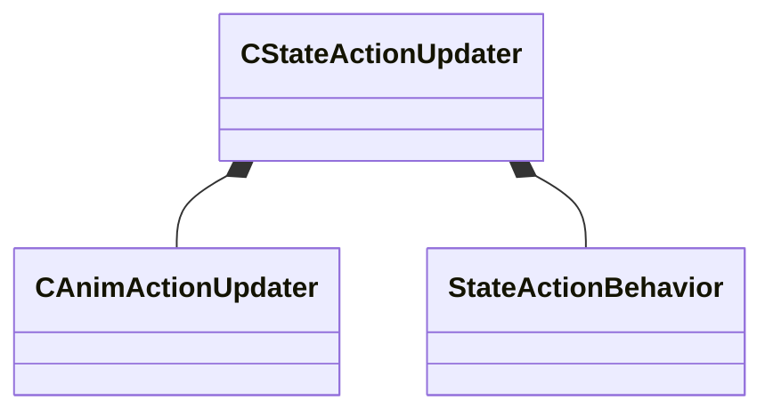

[Schemas](../../schemas.md) / [animgraphlib](../animgraphlib.md) / CStateActionUpdater

# CStateActionUpdater

**Kind:** class · **Size:** 16 bytes (`0x10`) · **Align:** 8 · **Module:** animgraphlib

**Relationships:**

## Memory layout

2 fields (2 declared here, 0 inherited). Offsets are absolute from the object base.

| Offset | Field | Type | From | Annotations |
|--------|-------|------|------|-------------|
| `0x0` | `m_pAction` | CSmartPtr< [CAnimActionUpdater](../animgraphlib/CAnimActionUpdater.md) > |  |  |
| `0x8` | `m_eBehavior` | [StateActionBehavior](../!GlobalTypes/StateActionBehavior.md) |  |  |

KV3 class defaults

<pre>{
	&quot;m_pAction&quot;: null,
	&quot;m_eBehavior&quot;: &quot;STATETAGBEHAVIOR_ACTIVE_WHILE_CURRENT&quot;
}</pre>

