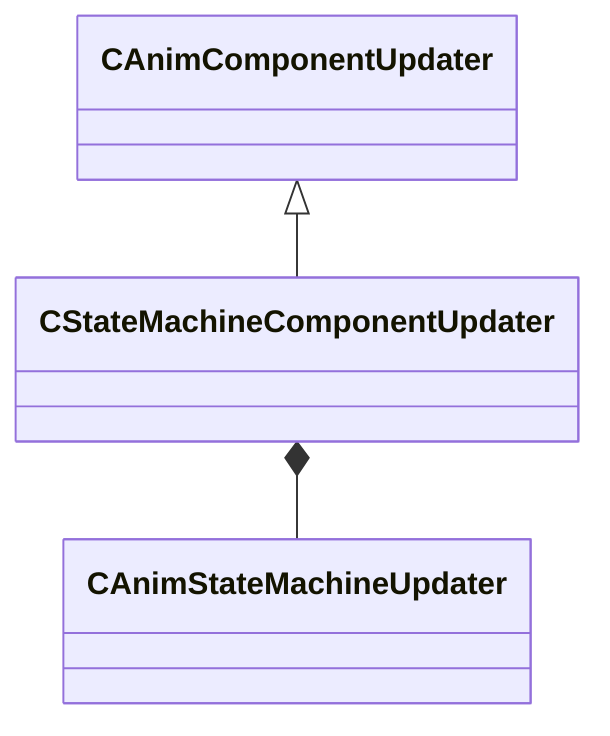

[Schemas](../../schemas.md) / [animgraphlib](../animgraphlib.md) / CStateMachineComponentUpdater

# CStateMachineComponentUpdater

**Kind:** class · **Size:** 136 bytes (`0x88`) · **Align:** 8 · **Module:** animgraphlib

**Inherits from:** [CAnimComponentUpdater](../animgraphlib/CAnimComponentUpdater.md)

**Relationships:**

## Memory layout

5 fields (1 declared here, 4 inherited). Offsets are absolute from the object base.

| Offset | Field | Type | From | Annotations |
|--------|-------|------|------|-------------|
| `0x18` | `m_name` | CUtlString | [CAnimComponentUpdater](../animgraphlib/CAnimComponentUpdater.md) |  |
| `0x20` | `m_id` | [AnimComponentID](../modellib/AnimComponentID.md) | [CAnimComponentUpdater](../animgraphlib/CAnimComponentUpdater.md) |  |
| `0x24` | `m_networkMode` | [AnimNodeNetworkMode](../animgraphlib/AnimNodeNetworkMode.md) | [CAnimComponentUpdater](../animgraphlib/CAnimComponentUpdater.md) |  |
| `0x28` | `m_bStartEnabled` | bool | [CAnimComponentUpdater](../animgraphlib/CAnimComponentUpdater.md) |  |
| `0x30` | `m_stateMachine` | [CAnimStateMachineUpdater](../animgraphlib/CAnimStateMachineUpdater.md) |  |  |

KV3 class defaults

<pre>{
	&quot;_class&quot;: &quot;CStateMachineComponentUpdater&quot;,
	&quot;m_name&quot;: &quot;State Machine&quot;,
	&quot;m_id&quot;:
	{
		&quot;m_id&quot;: &lt;HIDDEN FOR DIFF&gt;,
	},
	&quot;m_networkMode&quot;: &quot;ServerAuthoritative&quot;,
	&quot;m_bStartEnabled&quot;: false,
	&quot;m_stateMachine&quot;:
	{
		&quot;_class&quot;: &quot;CAnimStateMachineUpdater&quot;,
		&quot;m_states&quot;:
		[
		],
		&quot;m_transitions&quot;:
		[
		],
		&quot;m_startStateIndex&quot;: -1
	}
}</pre>

