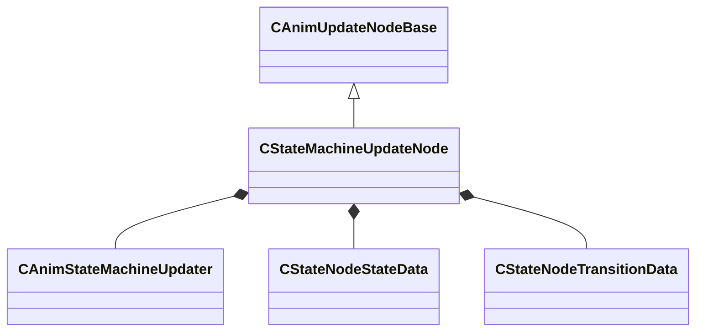

[Schemas](../../schemas.md) / [animgraphlib](../animgraphlib.md) / CStateMachineUpdateNode

# CStateMachineUpdateNode

**Kind:** class · **Size:** 256 bytes (`0x100`) · **Align:** 8 · **Module:** animgraphlib

**Inherits from:** [CAnimUpdateNodeBase](../animgraphlib/CAnimUpdateNodeBase.md)

**Relationships:**

## Memory layout

9 fields (6 declared here, 3 inherited). Offsets are absolute from the object base.

| Offset | Field | Type | From | Annotations |
|--------|-------|------|------|-------------|
| `0x18` | `m_nodePath` | [CAnimNodePath](../animgraphlib/CAnimNodePath.md) | [CAnimUpdateNodeBase](../animgraphlib/CAnimUpdateNodeBase.md) |  |
| `0x48` | `m_networkMode` | [AnimNodeNetworkMode](../!GlobalTypes/AnimNodeNetworkMode.md) | [CAnimUpdateNodeBase](../animgraphlib/CAnimUpdateNodeBase.md) |  |
| `0x50` | `m_name` | CUtlString | [CAnimUpdateNodeBase](../animgraphlib/CAnimUpdateNodeBase.md) |  |
| `0x70` | `m_stateMachine` | [CAnimStateMachineUpdater](../animgraphlib/CAnimStateMachineUpdater.md) |  |  |
| `0xc8` | `m_stateData` | CUtlVector< [CStateNodeStateData](../animgraphlib/CStateNodeStateData.md) > |  |  |
| `0xe0` | `m_transitionData` | CUtlVector< [CStateNodeTransitionData](../animgraphlib/CStateNodeTransitionData.md) > |  |  |
| `0xfc` | `m_bBlockWaningTags` | bool |  |  |
| `0xfd` | `m_bLockStateWhenWaning` | bool |  |  |
| `0xfe` | `m_bResetWhenActivated` | bool |  |  |

KV3 class defaults

<pre>{
	&quot;_class&quot;: &quot;CStateMachineUpdateNode&quot;,
	&quot;m_nodePath&quot;:
	{
		&quot;m_path&quot;:
		[
			{
				&quot;m_id&quot;: &lt;HIDDEN FOR DIFF&gt;,
			},
			{
				&quot;m_id&quot;: &lt;HIDDEN FOR DIFF&gt;,
			},
			{
				&quot;m_id&quot;: &lt;HIDDEN FOR DIFF&gt;,
			},
			{
				&quot;m_id&quot;: &lt;HIDDEN FOR DIFF&gt;,
			},
			{
				&quot;m_id&quot;: &lt;HIDDEN FOR DIFF&gt;,
			},
			{
				&quot;m_id&quot;: &lt;HIDDEN FOR DIFF&gt;,
			},
			{
				&quot;m_id&quot;: &lt;HIDDEN FOR DIFF&gt;,
			},
			{
				&quot;m_id&quot;: &lt;HIDDEN FOR DIFF&gt;,
			},
			{
				&quot;m_id&quot;: &lt;HIDDEN FOR DIFF&gt;,
			},
			{
				&quot;m_id&quot;: &lt;HIDDEN FOR DIFF&gt;,
			},
			{
				&quot;m_id&quot;: &lt;HIDDEN FOR DIFF&gt;,
			}
		],
		&quot;m_nCount&quot;: 0
	},
	&quot;m_networkMode&quot;: &quot;ServerAuthoritative&quot;,
	&quot;m_name&quot;: &quot;&quot;,
	&quot;m_stateMachine&quot;:
	{
		&quot;_class&quot;: &quot;CAnimStateMachineUpdater&quot;,
		&quot;m_states&quot;:
		[
		],
		&quot;m_transitions&quot;:
		[
		],
		&quot;m_startStateIndex&quot;: -1
	},
	&quot;m_stateData&quot;:
	[
	],
	&quot;m_transitionData&quot;:
	[
	],
	&quot;m_bBlockWaningTags&quot;: false,
	&quot;m_bLockStateWhenWaning&quot;: false,
	&quot;m_bResetWhenActivated&quot;: false
}</pre>

