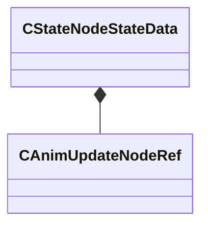

[Schemas](../../schemas.md) / [animgraphlib](../animgraphlib.md) / CStateNodeStateData

# CStateNodeStateData

> Source: **Build 25000182** · 2026-08-28 · `windows-x86_64` · schema `0.10.0`

**Kind:** class · **Size:** 24 bytes (`0x18`) · **Align:** 8 · **Module:** animgraphlib

**Relationships:**

## Memory layout

3 fields (3 declared here, 0 inherited). Offsets are absolute from the object base.

| Offset | Field | Type | From | Annotations |
|--------|-------|------|------|-------------|
| `0x0` bit 0 | `m_bExclusiveRootMotion` | bitfield:1 |  |  |
| `0x0` bit 1 | `m_bExclusiveRootMotionFirstFrame` | bitfield:1 |  |  |
| `0x0` | `m_pChild` | [CAnimUpdateNodeRef](../animgraphlib/CAnimUpdateNodeRef.md) |  |  |

KV3 class defaults

<pre>{
	&quot;m_pChild&quot;:
	{
		&quot;m_nodeIndex&quot;: -1
	},
	&quot;m_bExclusiveRootMotion&quot;: 0,
	&quot;m_bExclusiveRootMotionFirstFrame&quot;: 0
}</pre>

