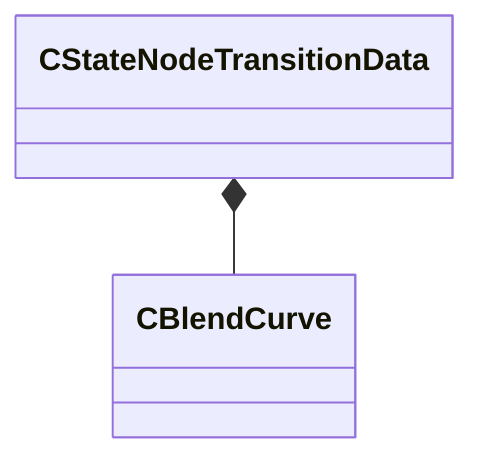

[Schemas](../../schemas.md) / [animgraphlib](../animgraphlib.md) / CStateNodeTransitionData

# CStateNodeTransitionData

**Kind:** class · **Size:** 28 bytes (`0x1c`) · **Align:** 4 · **Module:** animgraphlib

**Relationships:**

## Memory layout

5 fields (5 declared here, 0 inherited). Offsets are absolute from the object base.

| Offset | Field | Type | From | Annotations |
|--------|-------|------|------|-------------|
| `0x0` | `m_bReset` | bitfield:1 |  |  |
| `0x0` | `m_curve` | [CBlendCurve](../animgraphlib/CBlendCurve.md) |  |  |
| `0x0` | `m_resetCycleOption` | bitfield:3 |  |  |
| `0x8` | `m_blendDuration` | CAnimValue< float32 > |  |  |
| `0x10` | `m_resetCycleValue` | CAnimValue< float32 > |  |  |

KV3 class defaults

<pre>{
	&quot;m_curve&quot;:
	{
		&quot;m_flControlPoint1&quot;: 0.000000,
		&quot;m_flControlPoint2&quot;: 1.000000
	},
	&quot;m_blendDuration&quot;:
	{
		&quot;m_constValue&quot;: 0.000000,
		&quot;m_hParam&quot;:
		{
			&quot;m_type&quot;: &quot;ANIMPARAM_UNKNOWN&quot;,
			&quot;m_index&quot;: 255
		}
	},
	&quot;m_resetCycleValue&quot;:
	{
		&quot;m_constValue&quot;: 0.000000,
		&quot;m_hParam&quot;:
		{
			&quot;m_type&quot;: &quot;ANIMPARAM_UNKNOWN&quot;,
			&quot;m_index&quot;: 255
		}
	},
	&quot;m_bReset&quot;: 0,
	&quot;m_resetCycleOption&quot;: 0
}</pre>

