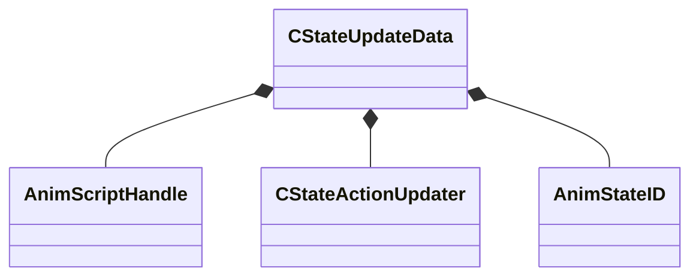

[Schemas](../../schemas.md) / [animgraphlib](../animgraphlib.md) / CStateUpdateData

# CStateUpdateData

**Kind:** class · **Size:** 72 bytes (`0x48`) · **Align:** 8 · **Module:** animgraphlib

**Relationships:**

## Memory layout

10 fields (10 declared here, 0 inherited). Offsets are absolute from the object base.

| Offset | Field | Type | From | Annotations |
|--------|-------|------|------|-------------|
| `0x0` | `m_bIsEndState` | bitfield:1 |  |  |
| `0x0` | `m_bIsPassthrough` | bitfield:1 |  |  |
| `0x0` | `m_bIsPassthroughRootMotion` | bitfield:1 |  |  |
| `0x0` | `m_bIsStartState` | bitfield:1 |  |  |
| `0x0` | `m_bPreEvaluatePassthroughTransitionPath` | bitfield:1 |  |  |
| `0x0` | `m_name` | CUtlString |  |  |
| `0x8` | `m_hScript` | [AnimScriptHandle](../modellib/AnimScriptHandle.md) |  |  |
| `0x10` | `m_transitionIndices` | CUtlVector< int32 > |  |  |
| `0x28` | `m_actions` | CUtlVector< [CStateActionUpdater](../animgraphlib/CStateActionUpdater.md) > |  |  |
| `0x40` | `m_stateID` | [AnimStateID](../modellib/AnimStateID.md) |  |  |

KV3 class defaults

<pre>{
	&quot;m_name&quot;: &quot;&quot;,
	&quot;m_hScript&quot;:
	{
		&quot;m_id&quot;: &lt;HIDDEN FOR DIFF&gt;,
	},
	&quot;m_transitionIndices&quot;:
	[
	],
	&quot;m_actions&quot;:
	[
	],
	&quot;m_stateID&quot;:
	{
		&quot;m_id&quot;: &lt;HIDDEN FOR DIFF&gt;,
	},
	&quot;m_bIsStartState&quot;: 0,
	&quot;m_bIsEndState&quot;: 0,
	&quot;m_bIsPassthrough&quot;: 0,
	&quot;m_bIsPassthroughRootMotion&quot;: 0,
	&quot;m_bPreEvaluatePassthroughTransitionPath&quot;: 0
}</pre>

