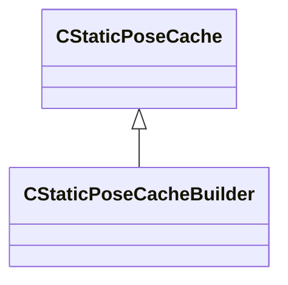

[Schemas](../../schemas.md) / [animgraphlib](../animgraphlib.md) / CStaticPoseCacheBuilder

# CStaticPoseCacheBuilder

**Kind:** class · **Size:** 56 bytes (`0x38`) · **Align:** 8 · **Module:** animgraphlib

**Inherits from:** [CStaticPoseCache](../animgraphlib/CStaticPoseCache.md)

**Relationships:**

## Memory layout

3 fields (0 declared here, 3 inherited). Offsets are absolute from the object base.

| Offset | Field | Type | From | Annotations |
|--------|-------|------|------|-------------|
| `0x10` | `m_poses` | CUtlVector< [CCachedPose](../animgraphlib/CCachedPose.md) > | [CStaticPoseCache](../animgraphlib/CStaticPoseCache.md) |  |
| `0x28` | `m_nBoneCount` | int32 | [CStaticPoseCache](../animgraphlib/CStaticPoseCache.md) |  |
| `0x2c` | `m_nMorphCount` | int32 | [CStaticPoseCache](../animgraphlib/CStaticPoseCache.md) |  |

KV3 class defaults

<pre>{
	&quot;_class&quot;: &quot;CStaticPoseCacheBuilder&quot;,
	&quot;m_poses&quot;:
	[
	],
	&quot;m_nBoneCount&quot;: 0,
	&quot;m_nMorphCount&quot;: 0
}</pre>

