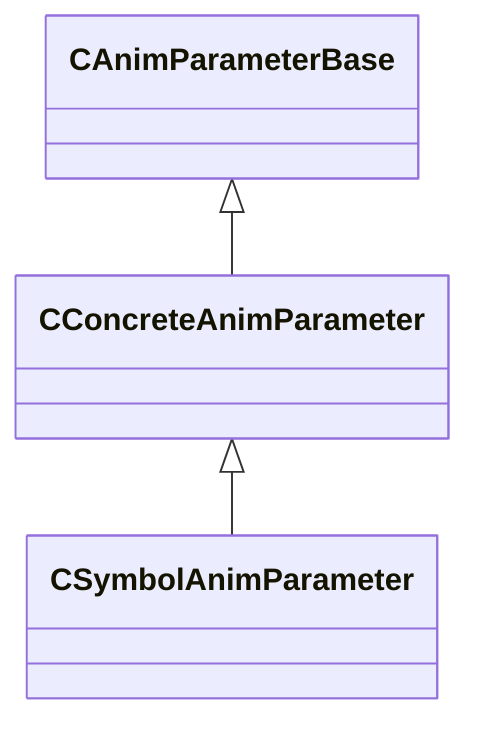

[Schemas](../../schemas.md) / [animgraphlib](../animgraphlib.md) / CSymbolAnimParameter

# CSymbolAnimParameter

**Kind:** class · **Size:** 136 bytes (`0x88`) · **Align:** 8 · **Module:** animgraphlib

**Inherits from:** [CConcreteAnimParameter](../animgraphlib/CConcreteAnimParameter.md)

**Metadata:** `MPropertyFriendlyName Symbol Parameter`

**Relationships:**

## Memory layout

14 fields (1 declared here, 13 inherited). Offsets are absolute from the object base.

| Offset | Field | Type | From | Annotations |
|--------|-------|------|------|-------------|
| `0x18` | `m_name` | CGlobalSymbol | [CAnimParameterBase](../animgraphlib/CAnimParameterBase.md) | `MPropertyFriendlyName Name` `MPropertySortPriority 100` |
| `0x20` | `m_sComment` | CUtlString | [CAnimParameterBase](../animgraphlib/CAnimParameterBase.md) | `MPropertyAttributeEditor TextBlock()` `MPropertyFriendlyName Comment` `MPropertySortPriority -100` |
| `0x28` | `m_group` | CUtlString | [CAnimParameterBase](../animgraphlib/CAnimParameterBase.md) | `MPropertyReadOnly` `MPropertySortPriority -90` |
| `0x30` | `m_id` | [AnimParamID](../modellib/AnimParamID.md) | [CAnimParameterBase](../animgraphlib/CAnimParameterBase.md) | `MPropertyReadOnly` `MPropertySortPriority -90` |
| `0x48` | `m_componentName` | CUtlString | [CAnimParameterBase](../animgraphlib/CAnimParameterBase.md) | `MPropertyAutoRebuildOnChange` `MPropertySuppressField` |
| `0x68` | `m_bNetworkingRequested` | bool | [CAnimParameterBase](../animgraphlib/CAnimParameterBase.md) | `MPropertySuppressField` |
| `0x69` | `m_bIsReferenced` | bool | [CAnimParameterBase](../animgraphlib/CAnimParameterBase.md) | `MPropertySuppressField` |
| `0x70` | `m_previewButton` | [AnimParamButton_t](../animgraphlib/AnimParamButton_t.md) | [CConcreteAnimParameter](../animgraphlib/CConcreteAnimParameter.md) | `MPropertyFriendlyName Preview Button` |
| `0x74` | `m_eNetworkSetting` | [AnimParamNetworkSetting](../animgraphlib/AnimParamNetworkSetting.md) | [CConcreteAnimParameter](../animgraphlib/CConcreteAnimParameter.md) | `MPropertyFriendlyName Network` |
| `0x78` | `m_bUseMostRecentValue` | bool | [CConcreteAnimParameter](../animgraphlib/CConcreteAnimParameter.md) | `MPropertyFriendlyName Force Latest Value` |
| `0x79` | `m_bAutoReset` | bool | [CConcreteAnimParameter](../animgraphlib/CConcreteAnimParameter.md) | `MPropertyFriendlyName Auto Reset` |
| `0x7a` | `m_bGameWritable` | bool | [CConcreteAnimParameter](../animgraphlib/CConcreteAnimParameter.md) | `MPropertyAttrStateCallback` `MPropertyFriendlyName Game Writable` `MPropertyGroupName +Permissions` |
| `0x7b` | `m_bGraphWritable` | bool | [CConcreteAnimParameter](../animgraphlib/CConcreteAnimParameter.md) | `MPropertyAttrStateCallback` `MPropertyFriendlyName Graph Writable` `MPropertyGroupName +Permissions` |
| `0x80` | `m_defaultValue` | CGlobalSymbol |  | `MPropertyFriendlyName Default Value` |

KV3 class defaults

<pre>{
	&quot;_class&quot;: &quot;CSymbolAnimParameter&quot;,
	&quot;m_name&quot;: &quot;Unnamed Parameter&quot;,
	&quot;m_sComment&quot;: &quot;&quot;,
	&quot;m_group&quot;: &quot;&quot;,
	&quot;m_id&quot;:
	{
		&quot;m_id&quot;: &lt;HIDDEN FOR DIFF&gt;,
	},
	&quot;m_componentName&quot;: &quot;&quot;,
	&quot;m_bNetworkingRequested&quot;: false,
	&quot;m_bIsReferenced&quot;: false,
	&quot;m_previewButton&quot;: &quot;ANIMPARAM_BUTTON_NONE&quot;,
	&quot;m_eNetworkSetting&quot;: &quot;Auto&quot;,
	&quot;m_bUseMostRecentValue&quot;: false,
	&quot;m_bAutoReset&quot;: false,
	&quot;m_bGameWritable&quot;: true,
	&quot;m_bGraphWritable&quot;: false,
	&quot;m_defaultValue&quot;: &quot;&quot;
}</pre>

