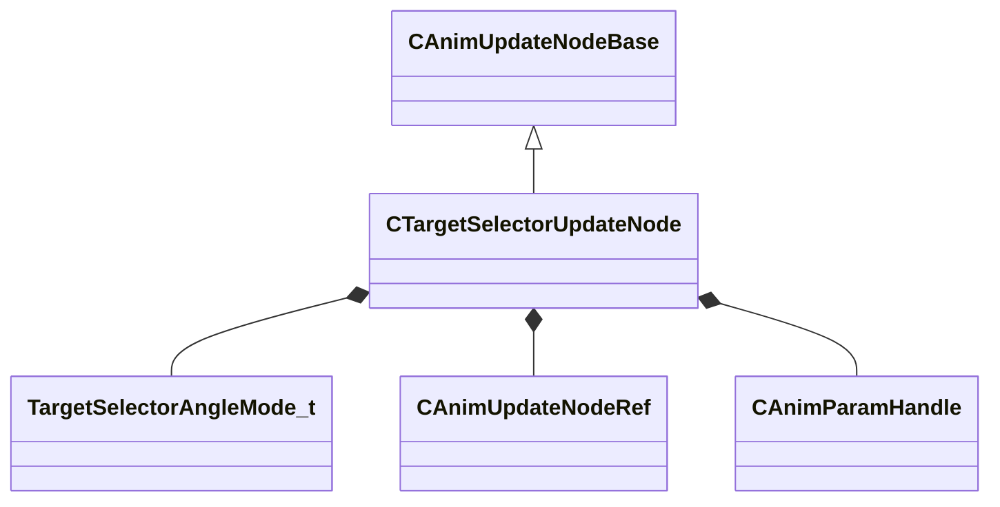

[Schemas](../../schemas.md) / [animgraphlib](../animgraphlib.md) / CTargetSelectorUpdateNode

# CTargetSelectorUpdateNode

**Kind:** class · **Size:** 160 bytes (`0xa0`) · **Align:** 8 · **Module:** animgraphlib

**Inherits from:** [CAnimUpdateNodeBase](../animgraphlib/CAnimUpdateNodeBase.md)

**Relationships:**

## Memory layout

13 fields (10 declared here, 3 inherited). Offsets are absolute from the object base.

| Offset | Field | Type | From | Annotations |
|--------|-------|------|------|-------------|
| `0x18` | `m_nodePath` | [CAnimNodePath](../animgraphlib/CAnimNodePath.md) | [CAnimUpdateNodeBase](../animgraphlib/CAnimUpdateNodeBase.md) |  |
| `0x48` | `m_networkMode` | [AnimNodeNetworkMode](../animgraphlib/AnimNodeNetworkMode.md) | [CAnimUpdateNodeBase](../animgraphlib/CAnimUpdateNodeBase.md) |  |
| `0x50` | `m_name` | CUtlString | [CAnimUpdateNodeBase](../animgraphlib/CAnimUpdateNodeBase.md) |  |
| `0x60` | `m_eAngleMode` | [TargetSelectorAngleMode_t](../animgraphlib/TargetSelectorAngleMode_t.md) |  |  |
| `0x68` | `m_children` | CUtlVector< [CAnimUpdateNodeRef](../animgraphlib/CAnimUpdateNodeRef.md) > |  |  |
| `0x84` | `m_hTargetPosition` | [CAnimParamHandle](../animgraphlib/CAnimParamHandle.md) |  |  |
| `0x86` | `m_hTargetFacePositionParameter` | [CAnimParamHandle](../animgraphlib/CAnimParamHandle.md) |  |  |
| `0x88` | `m_hMoveHeadingParameter` | [CAnimParamHandle](../animgraphlib/CAnimParamHandle.md) |  |  |
| `0x8a` | `m_hDesiredMoveHeadingParameter` | [CAnimParamHandle](../animgraphlib/CAnimParamHandle.md) |  |  |
| `0x8c` | `m_bTargetPositionIsWorldSpace` | bool |  |  |
| `0x8d` | `m_bTargetFacePositionIsWorldSpace` | bool |  |  |
| `0x8e` | `m_bEnablePhaseMatching` | bool |  |  |
| `0x90` | `m_flPhaseMatchingMaxRootMotionSkip` | float32 |  |  |

KV3 class defaults

<pre>{
	&quot;_class&quot;: &quot;CTargetSelectorUpdateNode&quot;,
	&quot;m_nodePath&quot;:
	{
		&quot;m_path&quot;:
		[
			{
				&quot;m_id&quot;: &lt;HIDDEN FOR DIFF&gt;,
			},
			{
				&quot;m_id&quot;: &lt;HIDDEN FOR DIFF&gt;,
			},
			{
				&quot;m_id&quot;: &lt;HIDDEN FOR DIFF&gt;,
			},
			{
				&quot;m_id&quot;: &lt;HIDDEN FOR DIFF&gt;,
			},
			{
				&quot;m_id&quot;: &lt;HIDDEN FOR DIFF&gt;,
			},
			{
				&quot;m_id&quot;: &lt;HIDDEN FOR DIFF&gt;,
			},
			{
				&quot;m_id&quot;: &lt;HIDDEN FOR DIFF&gt;,
			},
			{
				&quot;m_id&quot;: &lt;HIDDEN FOR DIFF&gt;,
			},
			{
				&quot;m_id&quot;: &lt;HIDDEN FOR DIFF&gt;,
			},
			{
				&quot;m_id&quot;: &lt;HIDDEN FOR DIFF&gt;,
			},
			{
				&quot;m_id&quot;: &lt;HIDDEN FOR DIFF&gt;,
			}
		],
		&quot;m_nCount&quot;: 0
	},
	&quot;m_networkMode&quot;: &quot;ServerAuthoritative&quot;,
	&quot;m_name&quot;: &quot;&quot;,
	&quot;m_eAngleMode&quot;: &quot;eFacingHeading&quot;,
	&quot;m_children&quot;:
	[
	],
	&quot;m_hTargetPosition&quot;:
	{
		&quot;m_type&quot;: &quot;ANIMPARAM_UNKNOWN&quot;,
		&quot;m_index&quot;: 255
	},
	&quot;m_hTargetFacePositionParameter&quot;:
	{
		&quot;m_type&quot;: &quot;ANIMPARAM_UNKNOWN&quot;,
		&quot;m_index&quot;: 255
	},
	&quot;m_hMoveHeadingParameter&quot;:
	{
		&quot;m_type&quot;: &quot;ANIMPARAM_UNKNOWN&quot;,
		&quot;m_index&quot;: 255
	},
	&quot;m_hDesiredMoveHeadingParameter&quot;:
	{
		&quot;m_type&quot;: &quot;ANIMPARAM_UNKNOWN&quot;,
		&quot;m_index&quot;: 255
	},
	&quot;m_bTargetPositionIsWorldSpace&quot;: false,
	&quot;m_bTargetFacePositionIsWorldSpace&quot;: false,
	&quot;m_bEnablePhaseMatching&quot;: false,
	&quot;m_flPhaseMatchingMaxRootMotionSkip&quot;: 0.400000
}</pre>

