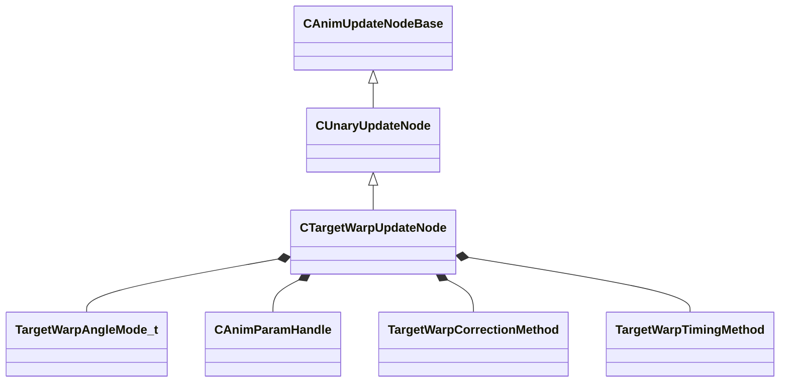

[Schemas](../../schemas.md) / [animgraphlib](../animgraphlib.md) / CTargetWarpUpdateNode

# CTargetWarpUpdateNode

**Kind:** class · **Size:** 152 bytes (`0x98`) · **Align:** 8 · **Module:** animgraphlib

**Inherits from:** [CUnaryUpdateNode](../animgraphlib/CUnaryUpdateNode.md)

**Relationships:**

## Memory layout

18 fields (14 declared here, 4 inherited). Offsets are absolute from the object base.

| Offset | Field | Type | From | Annotations |
|--------|-------|------|------|-------------|
| `0x18` | `m_nodePath` | [CAnimNodePath](../animgraphlib/CAnimNodePath.md) | [CAnimUpdateNodeBase](../animgraphlib/CAnimUpdateNodeBase.md) |  |
| `0x48` | `m_networkMode` | [AnimNodeNetworkMode](../animgraphlib/AnimNodeNetworkMode.md) | [CAnimUpdateNodeBase](../animgraphlib/CAnimUpdateNodeBase.md) |  |
| `0x50` | `m_name` | CUtlString | [CAnimUpdateNodeBase](../animgraphlib/CAnimUpdateNodeBase.md) |  |
| `0x60` | `m_pChildNode` | [CAnimUpdateNodeRef](../animgraphlib/CAnimUpdateNodeRef.md) | [CUnaryUpdateNode](../animgraphlib/CUnaryUpdateNode.md) |  |
| `0x74` | `m_eAngleMode` | [TargetWarpAngleMode_t](../animgraphlib/TargetWarpAngleMode_t.md) |  |  |
| `0x78` | `m_hTargetPositionParameter` | [CAnimParamHandle](../animgraphlib/CAnimParamHandle.md) |  |  |
| `0x7a` | `m_hTargetUpVectorParameter` | [CAnimParamHandle](../animgraphlib/CAnimParamHandle.md) |  |  |
| `0x7c` | `m_hTargetFacePositionParameter` | [CAnimParamHandle](../animgraphlib/CAnimParamHandle.md) |  |  |
| `0x7e` | `m_hMoveHeadingParameter` | [CAnimParamHandle](../animgraphlib/CAnimParamHandle.md) |  |  |
| `0x80` | `m_hDesiredMoveHeadingParameter` | [CAnimParamHandle](../animgraphlib/CAnimParamHandle.md) |  |  |
| `0x84` | `m_eCorrectionMethod` | [TargetWarpCorrectionMethod](../animgraphlib/TargetWarpCorrectionMethod.md) |  |  |
| `0x88` | `m_eTargetWarpTimingMethod` | [TargetWarpTimingMethod](../animgraphlib/TargetWarpTimingMethod.md) |  |  |
| `0x8c` | `m_bTargetFacePositionIsWorldSpace` | bool |  |  |
| `0x8d` | `m_bTargetPositionIsWorldSpace` | bool |  |  |
| `0x8e` | `m_bOnlyWarpWhenTagIsFound` | bool |  |  |
| `0x8f` | `m_bWarpOrientationDuringTranslation` | bool |  |  |
| `0x90` | `m_bWarpAroundCenter` | bool |  |  |
| `0x94` | `m_flMaxAngle` | float32 |  |  |

KV3 class defaults

<pre>{
	&quot;_class&quot;: &quot;CTargetWarpUpdateNode&quot;,
	&quot;m_nodePath&quot;:
	{
		&quot;m_path&quot;:
		[
			{
				&quot;m_id&quot;: &lt;HIDDEN FOR DIFF&gt;,
			},
			{
				&quot;m_id&quot;: &lt;HIDDEN FOR DIFF&gt;,
			},
			{
				&quot;m_id&quot;: &lt;HIDDEN FOR DIFF&gt;,
			},
			{
				&quot;m_id&quot;: &lt;HIDDEN FOR DIFF&gt;,
			},
			{
				&quot;m_id&quot;: &lt;HIDDEN FOR DIFF&gt;,
			},
			{
				&quot;m_id&quot;: &lt;HIDDEN FOR DIFF&gt;,
			},
			{
				&quot;m_id&quot;: &lt;HIDDEN FOR DIFF&gt;,
			},
			{
				&quot;m_id&quot;: &lt;HIDDEN FOR DIFF&gt;,
			},
			{
				&quot;m_id&quot;: &lt;HIDDEN FOR DIFF&gt;,
			},
			{
				&quot;m_id&quot;: &lt;HIDDEN FOR DIFF&gt;,
			},
			{
				&quot;m_id&quot;: &lt;HIDDEN FOR DIFF&gt;,
			}
		],
		&quot;m_nCount&quot;: 0
	},
	&quot;m_networkMode&quot;: &quot;ServerAuthoritative&quot;,
	&quot;m_name&quot;: &quot;&quot;,
	&quot;m_pChildNode&quot;:
	{
		&quot;m_nodeIndex&quot;: -1
	},
	&quot;m_eAngleMode&quot;: &quot;eFacingHeading&quot;,
	&quot;m_hTargetPositionParameter&quot;:
	{
		&quot;m_type&quot;: &quot;ANIMPARAM_UNKNOWN&quot;,
		&quot;m_index&quot;: 255
	},
	&quot;m_hTargetUpVectorParameter&quot;:
	{
		&quot;m_type&quot;: &quot;ANIMPARAM_UNKNOWN&quot;,
		&quot;m_index&quot;: 255
	},
	&quot;m_hTargetFacePositionParameter&quot;:
	{
		&quot;m_type&quot;: &quot;ANIMPARAM_UNKNOWN&quot;,
		&quot;m_index&quot;: 255
	},
	&quot;m_hMoveHeadingParameter&quot;:
	{
		&quot;m_type&quot;: &quot;ANIMPARAM_UNKNOWN&quot;,
		&quot;m_index&quot;: 255
	},
	&quot;m_hDesiredMoveHeadingParameter&quot;:
	{
		&quot;m_type&quot;: &quot;ANIMPARAM_UNKNOWN&quot;,
		&quot;m_index&quot;: 255
	},
	&quot;m_eCorrectionMethod&quot;: &quot;ScaleMotion&quot;,
	&quot;m_eTargetWarpTimingMethod&quot;: &quot;ReachDestinationOnRootMotionEnd&quot;,
	&quot;m_bTargetFacePositionIsWorldSpace&quot;: false,
	&quot;m_bTargetPositionIsWorldSpace&quot;: false,
	&quot;m_bOnlyWarpWhenTagIsFound&quot;: false,
	&quot;m_bWarpOrientationDuringTranslation&quot;: false,
	&quot;m_bWarpAroundCenter&quot;: false,
	&quot;m_flMaxAngle&quot;: 180.000000
}</pre>

