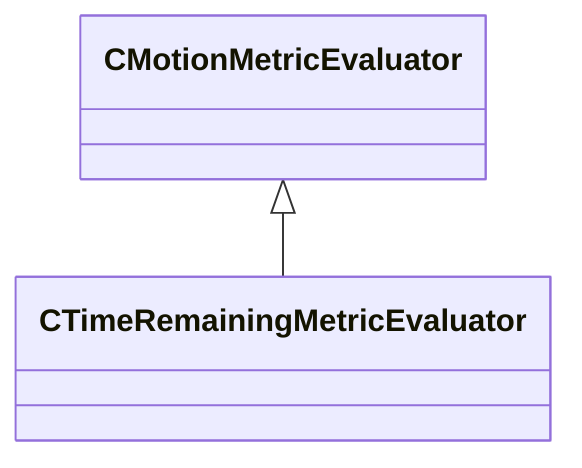

[Schemas](../../schemas.md) / [animgraphlib](../animgraphlib.md) / CTimeRemainingMetricEvaluator

# CTimeRemainingMetricEvaluator

**Kind:** class · **Size:** 96 bytes (`0x60`) · **Align:** 8 · **Module:** animgraphlib

**Inherits from:** [CMotionMetricEvaluator](../animgraphlib/CMotionMetricEvaluator.md)

**Relationships:**

## Memory layout

8 fields (4 declared here, 4 inherited). Offsets are absolute from the object base.

| Offset | Field | Type | From | Annotations |
|--------|-------|------|------|-------------|
| `0x18` | `m_means` | CUtlVector< float32 > | [CMotionMetricEvaluator](../animgraphlib/CMotionMetricEvaluator.md) |  |
| `0x30` | `m_standardDeviations` | CUtlVector< float32 > | [CMotionMetricEvaluator](../animgraphlib/CMotionMetricEvaluator.md) |  |
| `0x48` | `m_flWeight` | float32 | [CMotionMetricEvaluator](../animgraphlib/CMotionMetricEvaluator.md) |  |
| `0x4c` | `m_nDimensionStartIndex` | int32 | [CMotionMetricEvaluator](../animgraphlib/CMotionMetricEvaluator.md) |  |
| `0x50` | `m_bMatchByTimeRemaining` | bool |  |  |
| `0x54` | `m_flMaxTimeRemaining` | float32 |  |  |
| `0x58` | `m_bFilterByTimeRemaining` | bool |  |  |
| `0x5c` | `m_flMinTimeRemaining` | float32 |  |  |

KV3 class defaults

<pre>{
	&quot;_class&quot;: &quot;CTimeRemainingMetricEvaluator&quot;,
	&quot;m_means&quot;:
	[
	],
	&quot;m_standardDeviations&quot;:
	[
	],
	&quot;m_flWeight&quot;: 0.000000,
	&quot;m_nDimensionStartIndex&quot;: -1,
	&quot;m_bMatchByTimeRemaining&quot;: false,
	&quot;m_flMaxTimeRemaining&quot;: 0.000000,
	&quot;m_bFilterByTimeRemaining&quot;: false,
	&quot;m_flMinTimeRemaining&quot;: 0.000000
}</pre>

