[Schemas](../../schemas.md) / [animgraphlib](../animgraphlib.md) / CUnaryUpdateNode

# CUnaryUpdateNode

**Kind:** class · **Size:** 112 bytes (`0x70`) · **Align:** 8 · **Module:** animgraphlib

**Inherits from:** [CAnimUpdateNodeBase](../animgraphlib/CAnimUpdateNodeBase.md)

**Derived by:** [CAimCameraUpdateNode](../animgraphlib/CAimCameraUpdateNode.md), [CAimMatrixUpdateNode](../animgraphlib/CAimMatrixUpdateNode.md), [CChoreoUpdateNode](../animgraphlib/CChoreoUpdateNode.md), [CCycleControlUpdateNode](../animgraphlib/CCycleControlUpdateNode.md), [CDirectPlaybackUpdateNode](../animgraphlib/CDirectPlaybackUpdateNode.md), [CFollowAttachmentUpdateNode](../animgraphlib/CFollowAttachmentUpdateNode.md), [CFollowPathUpdateNode](../animgraphlib/CFollowPathUpdateNode.md), [CFollowTargetUpdateNode](../animgraphlib/CFollowTargetUpdateNode.md), [CFootAdjustmentUpdateNode](../animgraphlib/CFootAdjustmentUpdateNode.md), [CFootLockUpdateNode](../animgraphlib/CFootLockUpdateNode.md), [CFootPinningUpdateNode](../animgraphlib/CFootPinningUpdateNode.md), [CFootStepTriggerUpdateNode](../animgraphlib/CFootStepTriggerUpdateNode.md), [CHitReactUpdateNode](../animgraphlib/CHitReactUpdateNode.md), [CJiggleBoneUpdateNode](../animgraphlib/CJiggleBoneUpdateNode.md), [CLookAtUpdateNode](../animgraphlib/CLookAtUpdateNode.md), [CMoverUpdateNode](../animgraphlib/CMoverUpdateNode.md), [COrientationWarpUpdateNode](../animgraphlib/COrientationWarpUpdateNode.md), [CPathHelperUpdateNode](../animgraphlib/CPathHelperUpdateNode.md), [CRagdollUpdateNode](../animgraphlib/CRagdollUpdateNode.md), [CRootUpdateNode](../animgraphlib/CRootUpdateNode.md), [CSlowDownOnSlopesUpdateNode](../animgraphlib/CSlowDownOnSlopesUpdateNode.md), [CSolveIKChainUpdateNode](../animgraphlib/CSolveIKChainUpdateNode.md), [CSpeedScaleUpdateNode](../animgraphlib/CSpeedScaleUpdateNode.md), [CStanceOverrideUpdateNode](../animgraphlib/CStanceOverrideUpdateNode.md), [CStanceScaleUpdateNode](../animgraphlib/CStanceScaleUpdateNode.md), [CStopAtGoalUpdateNode](../animgraphlib/CStopAtGoalUpdateNode.md), [CTargetWarpUpdateNode](../animgraphlib/CTargetWarpUpdateNode.md), [CTurnHelperUpdateNode](../animgraphlib/CTurnHelperUpdateNode.md), [CTwoBoneIKUpdateNode](../animgraphlib/CTwoBoneIKUpdateNode.md), [CWayPointHelperUpdateNode](../animgraphlib/CWayPointHelperUpdateNode.md)

**Relationships:**

```mermaid
classDiagram
    CAnimUpdateNodeBase <|-- CUnaryUpdateNode
    CUnaryUpdateNode <|-- CAimCameraUpdateNode
    CUnaryUpdateNode <|-- CAimMatrixUpdateNode
    CUnaryUpdateNode <|-- CChoreoUpdateNode
    CUnaryUpdateNode <|-- CCycleControlUpdateNode
    CUnaryUpdateNode <|-- CDirectPlaybackUpdateNode
    CUnaryUpdateNode <|-- CFollowAttachmentUpdateNode
    CUnaryUpdateNode <|-- CFollowPathUpdateNode
    CUnaryUpdateNode <|-- CFollowTargetUpdateNode
    CUnaryUpdateNode <|-- CFootAdjustmentUpdateNode
    CUnaryUpdateNode <|-- CFootLockUpdateNode
    CUnaryUpdateNode <|-- CFootPinningUpdateNode
    CUnaryUpdateNode <|-- CFootStepTriggerUpdateNode
    CUnaryUpdateNode <|-- CHitReactUpdateNode
    CUnaryUpdateNode <|-- CJiggleBoneUpdateNode
    CUnaryUpdateNode <|-- CLookAtUpdateNode
    CUnaryUpdateNode <|-- CMoverUpdateNode
    CUnaryUpdateNode <|-- COrientationWarpUpdateNode
    CUnaryUpdateNode <|-- CPathHelperUpdateNode
    CUnaryUpdateNode <|-- CRagdollUpdateNode
    CUnaryUpdateNode <|-- CRootUpdateNode
    CUnaryUpdateNode <|-- CSlowDownOnSlopesUpdateNode
    CUnaryUpdateNode <|-- CSolveIKChainUpdateNode
    CUnaryUpdateNode <|-- CSpeedScaleUpdateNode
    CUnaryUpdateNode <|-- CStanceOverrideUpdateNode
    CUnaryUpdateNode <|-- CStanceScaleUpdateNode
    CUnaryUpdateNode <|-- CStopAtGoalUpdateNode
    CUnaryUpdateNode <|-- CTargetWarpUpdateNode
    CUnaryUpdateNode <|-- CTurnHelperUpdateNode
    CUnaryUpdateNode <|-- CTwoBoneIKUpdateNode
    CUnaryUpdateNode <|-- CWayPointHelperUpdateNode
    CUnaryUpdateNode *-- CAnimUpdateNodeRef
```

## Memory layout

4 fields (1 declared here, 3 inherited). Offsets are absolute from the object base.

| Offset | Field | Type | From | Annotations |
|--------|-------|------|------|-------------|
| `0x18` | `m_nodePath` | [CAnimNodePath](../animgraphlib/CAnimNodePath.md) | [CAnimUpdateNodeBase](../animgraphlib/CAnimUpdateNodeBase.md) |  |
| `0x48` | `m_networkMode` | [AnimNodeNetworkMode](../animgraphlib/AnimNodeNetworkMode.md) | [CAnimUpdateNodeBase](../animgraphlib/CAnimUpdateNodeBase.md) |  |
| `0x50` | `m_name` | CUtlString | [CAnimUpdateNodeBase](../animgraphlib/CAnimUpdateNodeBase.md) |  |
| `0x60` | `m_pChildNode` | [CAnimUpdateNodeRef](../animgraphlib/CAnimUpdateNodeRef.md) |  |  |

KV3 class defaults

<pre>{
	&quot;_class&quot;: &quot;CUnaryUpdateNode&quot;,
	&quot;m_nodePath&quot;:
	{
		&quot;m_path&quot;:
		[
			{
				&quot;m_id&quot;: &lt;HIDDEN FOR DIFF&gt;,
			},
			{
				&quot;m_id&quot;: &lt;HIDDEN FOR DIFF&gt;,
			},
			{
				&quot;m_id&quot;: &lt;HIDDEN FOR DIFF&gt;,
			},
			{
				&quot;m_id&quot;: &lt;HIDDEN FOR DIFF&gt;,
			},
			{
				&quot;m_id&quot;: &lt;HIDDEN FOR DIFF&gt;,
			},
			{
				&quot;m_id&quot;: &lt;HIDDEN FOR DIFF&gt;,
			},
			{
				&quot;m_id&quot;: &lt;HIDDEN FOR DIFF&gt;,
			},
			{
				&quot;m_id&quot;: &lt;HIDDEN FOR DIFF&gt;,
			},
			{
				&quot;m_id&quot;: &lt;HIDDEN FOR DIFF&gt;,
			},
			{
				&quot;m_id&quot;: &lt;HIDDEN FOR DIFF&gt;,
			},
			{
				&quot;m_id&quot;: &lt;HIDDEN FOR DIFF&gt;,
			}
		],
		&quot;m_nCount&quot;: 0
	},
	&quot;m_networkMode&quot;: &quot;ServerAuthoritative&quot;,
	&quot;m_name&quot;: &quot;&quot;,
	&quot;m_pChildNode&quot;:
	{
		&quot;m_nodeIndex&quot;: -1
	}
}</pre>

