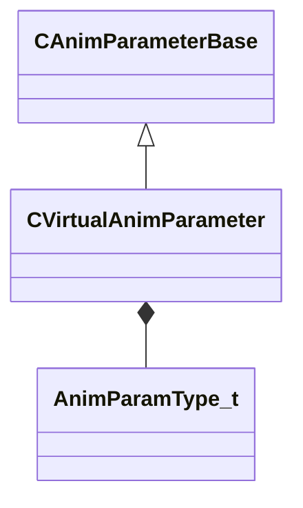

[Schemas](../../schemas.md) / [animgraphlib](../animgraphlib.md) / CVirtualAnimParameter

# CVirtualAnimParameter

> Source: **Build 25000182** · 2026-08-28 · `windows-x86_64` · schema `0.10.0`

**Kind:** class · **Size:** 128 bytes (`0x80`) · **Align:** 8 · **Module:** animgraphlib

**Inherits from:** [CAnimParameterBase](../animgraphlib/CAnimParameterBase.md)

**Relationships:**

## Memory layout

9 fields (2 declared here, 7 inherited). Offsets are absolute from the object base.

| Offset | Field | Type | From | Annotations |
|--------|-------|------|------|-------------|
| `0x18` | `m_name` | CGlobalSymbol | [CAnimParameterBase](../animgraphlib/CAnimParameterBase.md) | `MPropertyFriendlyName Name` `MPropertySortPriority 100` |
| `0x20` | `m_sComment` | CUtlString | [CAnimParameterBase](../animgraphlib/CAnimParameterBase.md) | `MPropertyAttributeEditor TextBlock()` `MPropertyFriendlyName Comment` `MPropertySortPriority -100` |
| `0x28` | `m_group` | CUtlString | [CAnimParameterBase](../animgraphlib/CAnimParameterBase.md) | `MPropertyReadOnly` `MPropertySortPriority -90` |
| `0x30` | `m_id` | [AnimParamID](../modellib/AnimParamID.md) | [CAnimParameterBase](../animgraphlib/CAnimParameterBase.md) | `MPropertyReadOnly` `MPropertySortPriority -90` |
| `0x48` | `m_componentName` | CUtlString | [CAnimParameterBase](../animgraphlib/CAnimParameterBase.md) | `MPropertyAutoRebuildOnChange` `MPropertySuppressField` |
| `0x68` | `m_bNetworkingRequested` | bool | [CAnimParameterBase](../animgraphlib/CAnimParameterBase.md) | `MPropertySuppressField` |
| `0x69` | `m_bIsReferenced` | bool | [CAnimParameterBase](../animgraphlib/CAnimParameterBase.md) | `MPropertySuppressField` |
| `0x70` | `m_expressionString` | CUtlString |  |  |
| `0x78` | `m_eParamType` | [AnimParamType_t](../animgraphlib/AnimParamType_t.md) |  |  |

KV3 class defaults

<pre>{
	&quot;_class&quot;: &quot;CVirtualAnimParameter&quot;,
	&quot;m_name&quot;: &quot;Unnamed Parameter&quot;,
	&quot;m_sComment&quot;: &quot;&quot;,
	&quot;m_group&quot;: &quot;&quot;,
	&quot;m_id&quot;:
	{
		&quot;m_id&quot;: &lt;HIDDEN FOR DIFF&gt;,
	},
	&quot;m_componentName&quot;: &quot;&quot;,
	&quot;m_bNetworkingRequested&quot;: false,
	&quot;m_bIsReferenced&quot;: false,
	&quot;m_expressionString&quot;: &quot;&quot;,
	&quot;m_eParamType&quot;: &quot;ANIMPARAM_FLOAT&quot;
}</pre>

