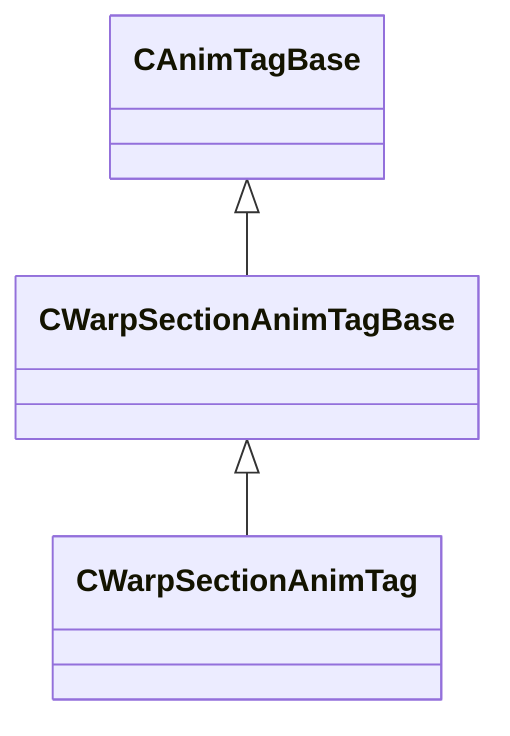

[Schemas](../../schemas.md) / [animgraphlib](../animgraphlib.md) / CWarpSectionAnimTag

# CWarpSectionAnimTag

**Kind:** class · **Size:** 88 bytes (`0x58`) · **Align:** 8 · **Module:** animgraphlib

**Inherits from:** [CWarpSectionAnimTagBase](../animgraphlib/CWarpSectionAnimTagBase.md)

**Metadata:** `MPropertyFriendlyName Warp Section Tag`

**Relationships:**

## Memory layout

7 fields (2 declared here, 5 inherited). Offsets are absolute from the object base.

| Offset | Field | Type | From | Annotations |
|--------|-------|------|------|-------------|
| `0x18` | `m_name` | CGlobalSymbol | [CAnimTagBase](../animgraphlib/CAnimTagBase.md) | `MPropertyFriendlyName Name` `MPropertySortPriority 100` |
| `0x20` | `m_sComment` | CUtlString | [CAnimTagBase](../animgraphlib/CAnimTagBase.md) | `MPropertyAttributeEditor TextBlock()` `MPropertyFriendlyName Comment` `MPropertySortPriority -100` |
| `0x28` | `m_group` | CGlobalSymbol | [CAnimTagBase](../animgraphlib/CAnimTagBase.md) | `MPropertySuppressField` |
| `0x30` | `m_tagID` | [AnimTagID](../modellib/AnimTagID.md) | [CAnimTagBase](../animgraphlib/CAnimTagBase.md) | `MPropertySuppressField` |
| `0x48` | `m_bIsReferenced` | bool | [CAnimTagBase](../animgraphlib/CAnimTagBase.md) | `MPropertySuppressField` |
| `0x50` | `m_bWarpPosition` | bool |  | `MPropertyFriendlyName Warp Position` |
| `0x51` | `m_bWarpOrientation` | bool |  | `MPropertyFriendlyName Warp Orientation` |

KV3 class defaults

<pre>{
	&quot;_class&quot;: &quot;CWarpSectionAnimTag&quot;,
	&quot;m_name&quot;: &quot;Unnamed Tag&quot;,
	&quot;m_sComment&quot;: &quot;&quot;,
	&quot;m_group&quot;: &quot;&quot;,
	&quot;m_tagID&quot;:
	{
		&quot;m_id&quot;: &lt;HIDDEN FOR DIFF&gt;,
	},
	&quot;m_bIsReferenced&quot;: false,
	&quot;m_bWarpPosition&quot;: true,
	&quot;m_bWarpOrientation&quot;: true
}</pre>

