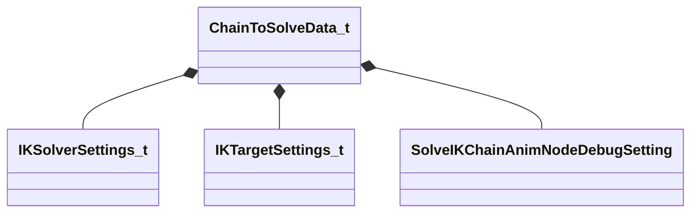

[Schemas](../../schemas.md) / [animgraphlib](../animgraphlib.md) / ChainToSolveData_t

# ChainToSolveData_t

> Source: **Build 25000182** · 2026-08-28 · `windows-x86_64` · schema `0.10.0`

**Kind:** class · **Size:** 80 bytes (`0x50`) · **Align:** 16 · **Module:** animgraphlib

**Relationships:**

## Memory layout

6 fields (6 declared here, 0 inherited). Offsets are absolute from the object base.

| Offset | Field | Type | From | Annotations |
|--------|-------|------|------|-------------|
| `0x0` | `m_nChainIndex` | int32 |  |  |
| `0x4` | `m_SolverSettings` | [IKSolverSettings_t](../animgraphlib/IKSolverSettings_t.md) |  |  |
| `0x10` | `m_TargetSettings` | [IKTargetSettings_t](../animgraphlib/IKTargetSettings_t.md) |  |  |
| `0x38` | `m_DebugSetting` | [SolveIKChainAnimNodeDebugSetting](../animgraphlib/SolveIKChainAnimNodeDebugSetting.md) |  |  |
| `0x3c` | `m_flDebugNormalizedValue` | float32 |  |  |
| `0x40` | `m_vDebugOffset` | VectorAligned |  |  |

KV3 class defaults

<pre>{
	&quot;m_nChainIndex&quot;: -1,
	&quot;m_SolverSettings&quot;:
	{
		&quot;m_SolverType&quot;: &quot;IKSOLVER_TwoBone&quot;,
		&quot;m_nNumIterations&quot;: 6,
		&quot;m_EndEffectorRotationFixUpMode&quot;: &quot;MatchTargetOrientation&quot;
	},
	&quot;m_TargetSettings&quot;:
	{
		&quot;m_TargetSource&quot;: &quot;Bone&quot;,
		&quot;m_Bone&quot;:
		{
			&quot;m_Name&quot;: &quot;&quot;
		},
		&quot;m_AnimgraphParameterNamePosition&quot;:
		{
			&quot;m_id&quot;: &lt;HIDDEN FOR DIFF&gt;,
		},
		&quot;m_AnimgraphParameterNameOrientation&quot;:
		{
			&quot;m_id&quot;: &lt;HIDDEN FOR DIFF&gt;,
		},
		&quot;m_TargetCoordSystem&quot;: &quot;World Space&quot;
	},
	&quot;m_DebugSetting&quot;: &quot;SOLVEIKCHAINANIMNODEDEBUGSETTING_None&quot;,
	&quot;m_flDebugNormalizedValue&quot;: 1.000000,
	&quot;m_vDebugOffset&quot;:
	[
		0.000000,
		0.000000,
		0.000000
	]
}</pre>

