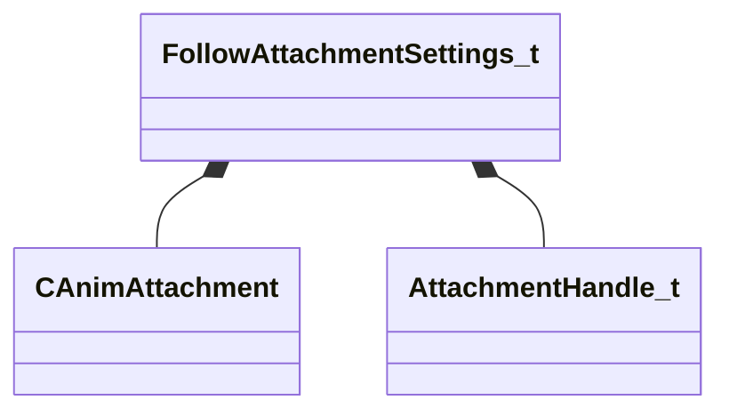

[Schemas](../../schemas.md) / [animgraphlib](../animgraphlib.md) / FollowAttachmentSettings_t

# FollowAttachmentSettings_t

**Kind:** class · **Size:** 144 bytes (`0x90`) · **Align:** 16 · **Module:** animgraphlib

**Relationships:**

## Memory layout

5 fields (5 declared here, 0 inherited). Offsets are absolute from the object base.

| Offset | Field | Type | From | Annotations |
|--------|-------|------|------|-------------|
| `0x0` | `m_attachment` | [CAnimAttachment](../modellib/CAnimAttachment.md) |  |  |
| `0x80` | `m_boneIndex` | int32 |  |  |
| `0x84` | `m_attachmentHandle` | [AttachmentHandle_t](../modellib/AttachmentHandle_t.md) |  |  |
| `0x85` | `m_bMatchTranslation` | bool |  |  |
| `0x86` | `m_bMatchRotation` | bool |  |  |

KV3 class defaults

<pre>{
	&quot;m_attachment&quot;:
	{
		&quot;m_influenceRotations&quot;:
		[
			[
				0.000000,
				0.000000,
				0.000000,
				0.000000
			],
			[
				0.000000,
				0.000000,
				0.000000,
				0.000000
			],
			[
				0.000000,
				0.000000,
				0.000000,
				0.000000
			]
		],
		&quot;m_influenceOffsets&quot;:
		[
			[
				0.000000,
				0.000000,
				0.000000
			],
			[
				0.000000,
				0.000000,
				0.000000
			],
			[
				0.000000,
				0.000000,
				0.000000
			]
		],
		&quot;m_influenceIndices&quot;:
		[
			0,
			0,
			0
		],
		&quot;m_influenceWeights&quot;:
		[
			0.000000,
			0.000000,
			0.000000
		],
		&quot;m_numInfluences&quot;: 0
	},
	&quot;m_boneIndex&quot;: -1,
	&quot;m_attachmentHandle&quot;: 0,
	&quot;m_bMatchTranslation&quot;: false,
	&quot;m_bMatchRotation&quot;: false
}</pre>

