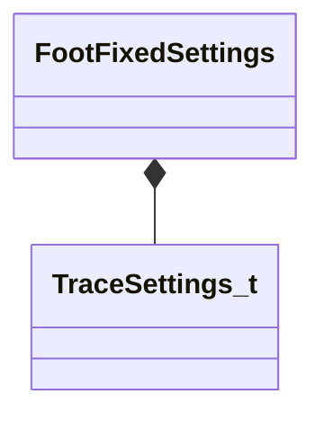

[Schemas](../../schemas.md) / [animgraphlib](../animgraphlib.md) / FootFixedSettings

# FootFixedSettings

> Source: **Build 25000182** · 2026-08-28 · `windows-x86_64` · schema `0.10.0`

**Kind:** class · **Size:** 64 bytes (`0x40`) · **Align:** 16 · **Module:** animgraphlib

**Relationships:**

## Memory layout

10 fields (10 declared here, 0 inherited). Offsets are absolute from the object base.

| Offset | Field | Type | From | Annotations |
|--------|-------|------|------|-------------|
| `0x0` | `m_traceSettings` | [TraceSettings_t](../animgraphlib/TraceSettings_t.md) |  |  |
| `0x10` | `m_vFootBaseBindPosePositionMS` | VectorAligned |  |  |
| `0x20` | `m_flFootBaseLength` | float32 |  |  |
| `0x24` | `m_flMaxRotationLeft` | float32 |  |  |
| `0x28` | `m_flMaxRotationRight` | float32 |  |  |
| `0x2c` | `m_footstepLandedTagIndex` | int32 |  |  |
| `0x30` | `m_bEnableTracing` | bool |  |  |
| `0x34` | `m_flTraceAngleBlend` | float32 |  |  |
| `0x38` | `m_nDisableTagIndex` | int32 |  |  |
| `0x3c` | `m_nFootIndex` | int32 |  |  |

KV3 class defaults

<pre>{
	&quot;m_traceSettings&quot;:
	{
		&quot;m_flTraceHeight&quot;: 40.000000,
		&quot;m_flTraceRadius&quot;: 4.000000
	},
	&quot;m_vFootBaseBindPosePositionMS&quot;:
	[
		0.000000,
		0.000000,
		0.000000
	],
	&quot;m_flFootBaseLength&quot;: 0.000000,
	&quot;m_flMaxRotationLeft&quot;: 90.000000,
	&quot;m_flMaxRotationRight&quot;: 90.000000,
	&quot;m_footstepLandedTagIndex&quot;: -1,
	&quot;m_bEnableTracing&quot;: true,
	&quot;m_flTraceAngleBlend&quot;: 0.000000,
	&quot;m_nDisableTagIndex&quot;: -1,
	&quot;m_nFootIndex&quot;: -1
}</pre>

