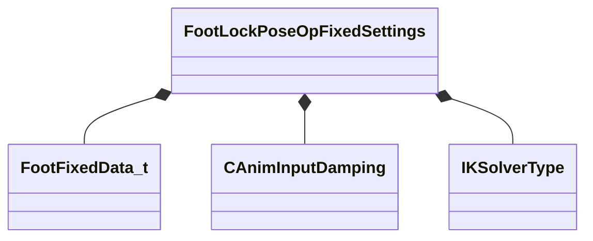

[Schemas](../../schemas.md) / [animgraphlib](../animgraphlib.md) / FootLockPoseOpFixedSettings

# FootLockPoseOpFixedSettings

**Kind:** class · **Size:** 104 bytes (`0x68`) · **Align:** 8 · **Module:** animgraphlib

**Relationships:**

## Memory layout

18 fields (18 declared here, 0 inherited). Offsets are absolute from the object base.

| Offset | Field | Type | From | Annotations |
|--------|-------|------|------|-------------|
| `0x0` | `m_footInfo` | CUtlVector< [FootFixedData_t](../animgraphlib/FootFixedData_t.md) > |  |  |
| `0x18` | `m_hipDampingSettings` | [CAnimInputDamping](../animgraphlib/CAnimInputDamping.md) |  |  |
| `0x30` | `m_nHipBoneIndex` | int32 |  |  |
| `0x34` | `m_ikSolverType` | [IKSolverType](../!GlobalTypes/IKSolverType.md) |  |  |
| `0x38` | `m_bApplyTilt` | bool |  |  |
| `0x39` | `m_bApplyHipDrop` | bool |  |  |
| `0x3a` | `m_bAlwaysUseFallbackHinge` | bool |  |  |
| `0x3b` | `m_bApplyFootRotationLimits` | bool |  |  |
| `0x3c` | `m_bApplyLegTwistLimits` | bool |  |  |
| `0x40` | `m_flMaxFootHeight` | float32 |  |  |
| `0x44` | `m_flExtensionScale` | float32 |  |  |
| `0x48` | `m_flMaxLegTwist` | float32 |  |  |
| `0x4c` | `m_bEnableLockBreaking` | bool |  |  |
| `0x50` | `m_flLockBreakTolerance` | float32 |  |  |
| `0x54` | `m_flLockBlendTime` | float32 |  |  |
| `0x58` | `m_bEnableStretching` | bool |  |  |
| `0x5c` | `m_flMaxStretchAmount` | float32 |  |  |
| `0x60` | `m_flStretchExtensionScale` | float32 |  |  |

KV3 class defaults

<pre>{
	&quot;m_footInfo&quot;:
	[
	],
	&quot;m_hipDampingSettings&quot;:
	{
		&quot;_class&quot;: &quot;CAnimInputDamping&quot;,
		&quot;m_speedFunction&quot;: &quot;NoDamping&quot;,
		&quot;m_fSpeedScale&quot;: 1.000000,
		&quot;m_fFallingSpeedScale&quot;: 1.000000
	},
	&quot;m_nHipBoneIndex&quot;: -1,
	&quot;m_ikSolverType&quot;: &quot;IKSOLVER_TwoBone&quot;,
	&quot;m_bApplyTilt&quot;: false,
	&quot;m_bApplyHipDrop&quot;: false,
	&quot;m_bAlwaysUseFallbackHinge&quot;: false,
	&quot;m_bApplyFootRotationLimits&quot;: false,
	&quot;m_bApplyLegTwistLimits&quot;: false,
	&quot;m_flMaxFootHeight&quot;: -12.000000,
	&quot;m_flExtensionScale&quot;: 0.700000,
	&quot;m_flMaxLegTwist&quot;: 180.000000,
	&quot;m_bEnableLockBreaking&quot;: false,
	&quot;m_flLockBreakTolerance&quot;: 0.200000,
	&quot;m_flLockBlendTime&quot;: 0.200000,
	&quot;m_bEnableStretching&quot;: false,
	&quot;m_flMaxStretchAmount&quot;: 2.000000,
	&quot;m_flStretchExtensionScale&quot;: 0.998000
}</pre>

