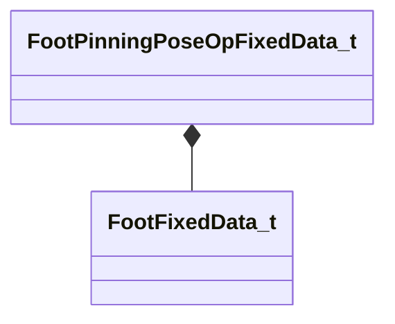

[Schemas](../../schemas.md) / [animgraphlib](../animgraphlib.md) / FootPinningPoseOpFixedData_t

# FootPinningPoseOpFixedData_t

> Source: **Build 25000182** · 2026-08-28 · `windows-x86_64` · schema `0.10.0`

**Kind:** class · **Size:** 48 bytes (`0x30`) · **Align:** 8 · **Module:** animgraphlib

**Relationships:**

## Memory layout

7 fields (7 declared here, 0 inherited). Offsets are absolute from the object base.

| Offset | Field | Type | From | Annotations |
|--------|-------|------|------|-------------|
| `0x0` | `m_footInfo` | CUtlVector< [FootFixedData_t](../animgraphlib/FootFixedData_t.md) > |  |  |
| `0x18` | `m_flBlendTime` | float32 |  |  |
| `0x1c` | `m_flLockBreakDistance` | float32 |  |  |
| `0x20` | `m_flMaxLegTwist` | float32 |  |  |
| `0x24` | `m_nHipBoneIndex` | int32 |  |  |
| `0x28` | `m_bApplyLegTwistLimits` | bool |  |  |
| `0x29` | `m_bApplyFootRotationLimits` | bool |  |  |

KV3 class defaults

<pre>{
	&quot;m_footInfo&quot;:
	[
	],
	&quot;m_flBlendTime&quot;: 0.000000,
	&quot;m_flLockBreakDistance&quot;: 0.000000,
	&quot;m_flMaxLegTwist&quot;: 25.000000,
	&quot;m_nHipBoneIndex&quot;: -1,
	&quot;m_bApplyLegTwistLimits&quot;: false,
	&quot;m_bApplyFootRotationLimits&quot;: false
}</pre>

