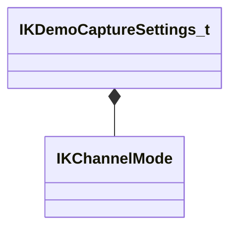

[Schemas](../../schemas.md) / [animgraphlib](../animgraphlib.md) / IKDemoCaptureSettings_t

# IKDemoCaptureSettings_t

> Source: **Build 25000182** · 2026-08-28 · `windows-x86_64` · schema `0.10.0`

**Kind:** class · **Size:** 40 bytes (`0x28`) · **Align:** 8 · **Module:** animgraphlib

**Relationships:**

## Memory layout

5 fields (5 declared here, 0 inherited). Offsets are absolute from the object base.

| Offset | Field | Type | From | Annotations |
|--------|-------|------|------|-------------|
| `0x0` | `m_parentBoneName` | CUtlString |  | `MPropertyAttributeChoiceName Bone` `MPropertyFriendlyName Target Parent` |
| `0x8` | `m_eMode` | [IKChannelMode](../animgraphlib/IKChannelMode.md) |  | `MPropertyAutoRebuildOnChange` `MPropertyFriendlyName Solver Mode` |
| `0x10` | `m_ikChainName` | CUtlString |  | `MPropertyAttrStateCallback` `MPropertyAttributeChoiceName IKChain` `MPropertyFriendlyName IK Chain` |
| `0x18` | `m_oneBoneStart` | CUtlString |  | `MPropertyAttrStateCallback` `MPropertyAttributeChoiceName Bone` `MPropertyFriendlyName Start Bone` |
| `0x20` | `m_oneBoneEnd` | CUtlString |  | `MPropertyAttrStateCallback` `MPropertyAttributeChoiceName Bone` `MPropertyFriendlyName End Bone` |

KV3 class defaults

<pre>{
	&quot;m_parentBoneName&quot;: &quot;&quot;,
	&quot;m_eMode&quot;: &quot;TwoBone&quot;,
	&quot;m_ikChainName&quot;: &quot;&quot;,
	&quot;m_oneBoneStart&quot;: &quot;&quot;,
	&quot;m_oneBoneEnd&quot;: &quot;&quot;
}</pre>

