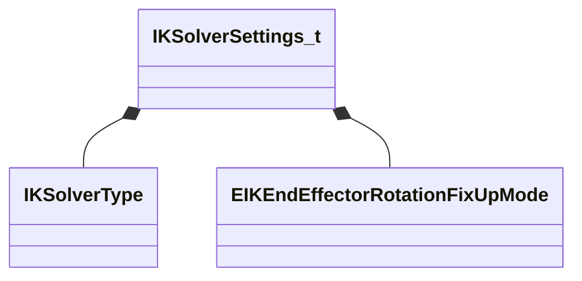

[Schemas](../../schemas.md) / [animgraphlib](../animgraphlib.md) / IKSolverSettings_t

# IKSolverSettings_t

> Source: **Build 25000182** · 2026-08-28 · `windows-x86_64` · schema `0.10.0`

**Kind:** class · **Size:** 12 bytes (`0xc`) · **Align:** n/a (unspecified) · **Module:** animgraphlib

**Relationships:**

## Memory layout

3 fields (3 declared here, 0 inherited). Offsets are absolute from the object base.

| Offset | Field | Type | From | Annotations |
|--------|-------|------|------|-------------|
| `0x0` | `m_SolverType` | [IKSolverType](../animgraphlib/IKSolverType.md) |  | `MPropertyAutoRebuildOnChange` `MPropertyFriendlyName Solver Type` |
| `0x4` | `m_nNumIterations` | int32 |  | `MPropertyAttrStateCallback` `MPropertyFriendlyName Num Iterations` |
| `0x8` | `m_EndEffectorRotationFixUpMode` | [EIKEndEffectorRotationFixUpMode](../animgraphlib/EIKEndEffectorRotationFixUpMode.md) |  | `MPropertyFriendlyName End Effector Rotation Behaviour` |
