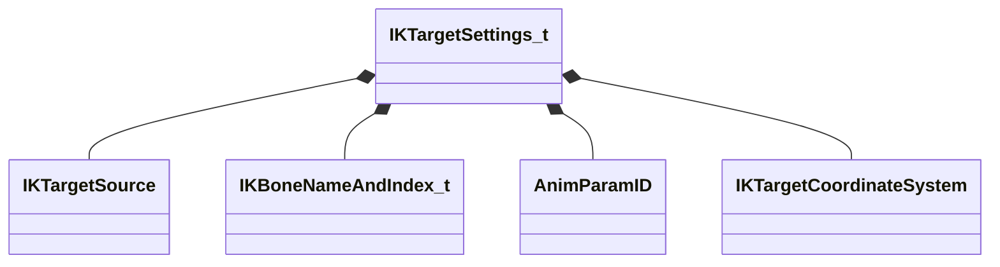

[Schemas](../../schemas.md) / [animgraphlib](../animgraphlib.md) / IKTargetSettings_t

# IKTargetSettings_t

**Kind:** class · **Size:** 40 bytes (`0x28`) · **Align:** 255 · **Module:** animgraphlib

**Relationships:**

## Memory layout

5 fields (5 declared here, 0 inherited). Offsets are absolute from the object base.

| Offset | Field | Type | From | Annotations |
|--------|-------|------|------|-------------|
| `0x0` | `m_TargetSource` | [IKTargetSource](../animgraphlib/IKTargetSource.md) |  | `MPropertyAutoRebuildOnChange` `MPropertyFriendlyName Target Source` |
| `0x8` | `m_Bone` | [IKBoneNameAndIndex_t](../animgraphlib/IKBoneNameAndIndex_t.md) |  | `MPropertyAttrStateCallback` `MPropertyFriendlyName Bone` |
| `0x18` | `m_AnimgraphParameterNamePosition` | [AnimParamID](../modellib/AnimParamID.md) |  | `MPropertyAttrStateCallback` `MPropertyAttributeChoiceName VectorParameter` `MPropertyFriendlyName Animgraph Position Parameter` |
| `0x1c` | `m_AnimgraphParameterNameOrientation` | [AnimParamID](../modellib/AnimParamID.md) |  | `MPropertyAttrStateCallback` `MPropertyAttributeChoiceName QuaternionParameter` `MPropertyFriendlyName Animgraph Orientation Parameter` |
| `0x20` | `m_TargetCoordSystem` | [IKTargetCoordinateSystem](../animgraphlib/IKTargetCoordinateSystem.md) |  | `MPropertyAttrStateCallback` `MPropertyFriendlyName Target Coords` |
