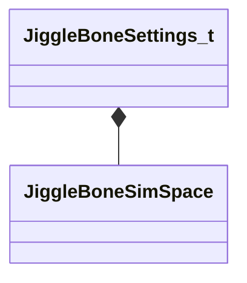

[Schemas](../../schemas.md) / [animgraphlib](../animgraphlib.md) / JiggleBoneSettings_t

# JiggleBoneSettings_t

> Source: **Build 25000182** · 2026-08-28 · `windows-x86_64` · schema `0.10.0`

**Kind:** class · **Size:** 44 bytes (`0x2c`) · **Align:** 4 · **Module:** animgraphlib

**Relationships:**

## Memory layout

7 fields (7 declared here, 0 inherited). Offsets are absolute from the object base.

| Offset | Field | Type | From | Annotations |
|--------|-------|------|------|-------------|
| `0x0` | `m_nBoneIndex` | int32 |  |  |
| `0x4` | `m_flSpringStrength` | float32 |  |  |
| `0x8` | `m_flMaxTimeStep` | float32 |  |  |
| `0xc` | `m_flDamping` | float32 |  |  |
| `0x10` | `m_vBoundsMaxLS` | Vector |  |  |
| `0x1c` | `m_vBoundsMinLS` | Vector |  |  |
| `0x28` | `m_eSimSpace` | [JiggleBoneSimSpace](../animgraphlib/JiggleBoneSimSpace.md) |  |  |

KV3 class defaults

<pre>{
	&quot;m_nBoneIndex&quot;: 0,
	&quot;m_flSpringStrength&quot;: 0.000000,
	&quot;m_flMaxTimeStep&quot;: 0.000000,
	&quot;m_flDamping&quot;: 0.000000,
	&quot;m_vBoundsMaxLS&quot;:
	[
		0.000000,
		0.000000,
		0.000000
	],
	&quot;m_vBoundsMinLS&quot;:
	[
		0.000000,
		0.000000,
		0.000000
	],
	&quot;m_eSimSpace&quot;: &quot;SimSpace_Local&quot;
}</pre>

