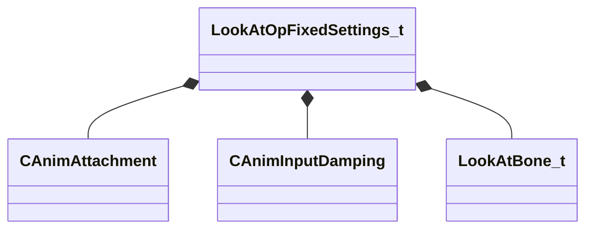

[Schemas](../../schemas.md) / [animgraphlib](../animgraphlib.md) / LookAtOpFixedSettings_t

# LookAtOpFixedSettings_t

> Source: **Build 25000182** · 2026-08-28 · `windows-x86_64` · schema `0.10.0`

**Kind:** class · **Size:** 208 bytes (`0xd0`) · **Align:** 16 · **Module:** animgraphlib

**Relationships:**

## Memory layout

11 fields (11 declared here, 0 inherited). Offsets are absolute from the object base.

| Offset | Field | Type | From | Annotations |
|--------|-------|------|------|-------------|
| `0x0` | `m_attachment` | [CAnimAttachment](../modellib/CAnimAttachment.md) |  |  |
| `0x80` | `m_damping` | [CAnimInputDamping](../animgraphlib/CAnimInputDamping.md) |  |  |
| `0x98` | `m_bones` | CUtlVector< [LookAtBone_t](../animgraphlib/LookAtBone_t.md) > |  |  |
| `0xb0` | `m_flYawLimit` | float32 |  |  |
| `0xb4` | `m_flPitchLimit` | float32 |  |  |
| `0xb8` | `m_flHysteresisInnerAngle` | float32 |  |  |
| `0xbc` | `m_flHysteresisOuterAngle` | float32 |  |  |
| `0xc0` | `m_bRotateYawForward` | bool |  |  |
| `0xc1` | `m_bMaintainUpDirection` | bool |  |  |
| `0xc2` | `m_bTargetIsPosition` | bool |  |  |
| `0xc3` | `m_bUseHysteresis` | bool |  |  |

KV3 class defaults

<pre>{
	&quot;m_attachment&quot;:
	{
		&quot;m_influenceRotations&quot;:
		[
			[
				0.000000,
				0.000000,
				0.000000,
				0.000000
			],
			[
				0.000000,
				0.000000,
				0.000000,
				0.000000
			],
			[
				0.000000,
				0.000000,
				0.000000,
				0.000000
			]
		],
		&quot;m_influenceOffsets&quot;:
		[
			[
				0.000000,
				0.000000,
				0.000000
			],
			[
				0.000000,
				0.000000,
				0.000000
			],
			[
				0.000000,
				0.000000,
				0.000000
			]
		],
		&quot;m_influenceIndices&quot;:
		[
			0,
			0,
			0
		],
		&quot;m_influenceWeights&quot;:
		[
			0.000000,
			0.000000,
			0.000000
		],
		&quot;m_numInfluences&quot;: 0
	},
	&quot;m_damping&quot;:
	{
		&quot;_class&quot;: &quot;CAnimInputDamping&quot;,
		&quot;m_speedFunction&quot;: &quot;NoDamping&quot;,
		&quot;m_fSpeedScale&quot;: 1.000000,
		&quot;m_fFallingSpeedScale&quot;: 1.000000
	},
	&quot;m_bones&quot;:
	[
	],
	&quot;m_flYawLimit&quot;: 45.000000,
	&quot;m_flPitchLimit&quot;: 45.000000,
	&quot;m_flHysteresisInnerAngle&quot;: 1.000000,
	&quot;m_flHysteresisOuterAngle&quot;: 20.000000,
	&quot;m_bRotateYawForward&quot;: true,
	&quot;m_bMaintainUpDirection&quot;: false,
	&quot;m_bTargetIsPosition&quot;: true,
	&quot;m_bUseHysteresis&quot;: false
}</pre>

