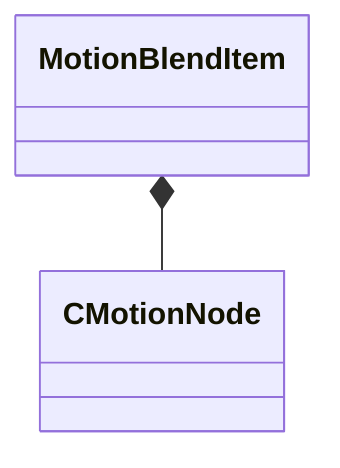

[Schemas](../../schemas.md) / [animgraphlib](../animgraphlib.md) / MotionBlendItem

# MotionBlendItem

> Source: **Build 25000182** · 2026-08-28 · `windows-x86_64` · schema `0.10.0`

**Kind:** class · **Size:** 16 bytes (`0x10`) · **Align:** 8 · **Module:** animgraphlib

**Relationships:**

## Memory layout

2 fields (2 declared here, 0 inherited). Offsets are absolute from the object base.

| Offset | Field | Type | From | Annotations |
|--------|-------|------|------|-------------|
| `0x0` | `m_pChild` | CSmartPtr< [CMotionNode](../animgraphlib/CMotionNode.md) > |  |  |
| `0x8` | `m_flKeyValue` | float32 |  |  |

KV3 class defaults

<pre>{
	&quot;m_pChild&quot;: null,
	&quot;m_flKeyValue&quot;: 0.000000
}</pre>

