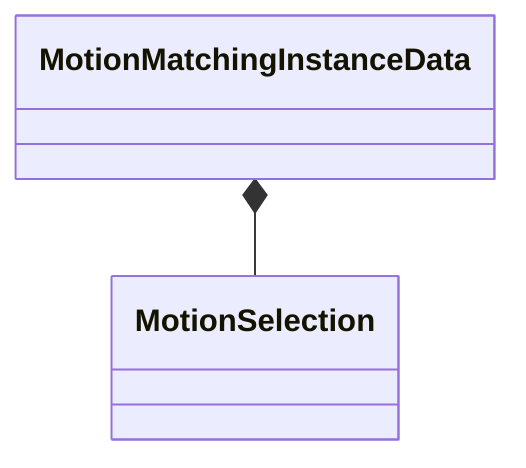

[Schemas](../../schemas.md) / [animgraphlib](../animgraphlib.md) / MotionMatchingInstanceData

# MotionMatchingInstanceData

> Source: **Build 25000182** · 2026-08-28 · `windows-x86_64` · schema `0.10.0`

**Kind:** class · **Size:** 288 bytes (`0x120`) · **Align:** 16 · **Module:** animgraphlib

**Relationships:**

## Memory layout

2 fields (2 declared here, 0 inherited). Offsets are absolute from the object base.

| Offset | Field | Type | From | Annotations |
|--------|-------|------|------|-------------|
| `0x2c` | `m_currentSelection` | [MotionSelection](../animgraphlib/MotionSelection.md) |  |  |
| `0x84` | `m_previousSelection` | [MotionSelection](../animgraphlib/MotionSelection.md) |  |  |

KV3 class defaults

<pre>{
	&quot;m_currentSelection&quot;:
	{
		&quot;m_nConfigIndex&quot;:
		{
			&quot;m_index&quot;: 4294967295
		},
		&quot;m_flCycleZeroTime&quot;: 0.000000,
		&quot;m_flPlaybackSpeed&quot;: 1.000000,
		&quot;m_flStartTime&quot;: 0.000000,
		&quot;m_nSample&quot;: -1
	},
	&quot;m_previousSelection&quot;:
	{
		&quot;m_nConfigIndex&quot;:
		{
			&quot;m_index&quot;: 4294967295
		},
		&quot;m_flCycleZeroTime&quot;: 0.000000,
		&quot;m_flPlaybackSpeed&quot;: 1.000000,
		&quot;m_flStartTime&quot;: 0.000000,
		&quot;m_nSample&quot;: -1
	}
}</pre>

