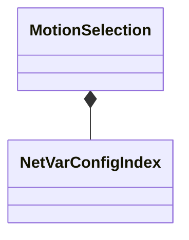

[Schemas](../../schemas.md) / [animgraphlib](../animgraphlib.md) / MotionSelection

# MotionSelection

> Source: **Build 25000182** · 2026-08-28 · `windows-x86_64` · schema `0.10.0`

**Kind:** class · **Size:** 88 bytes (`0x58`) · **Align:** 4 · **Module:** animgraphlib

**Relationships:**

## Memory layout

5 fields (5 declared here, 0 inherited). Offsets are absolute from the object base.

| Offset | Field | Type | From | Annotations |
|--------|-------|------|------|-------------|
| `0x24` | `m_nConfigIndex` | [NetVarConfigIndex](../animgraphlib/NetVarConfigIndex.md) |  |  |
| `0x30` | `m_flCycleZeroTime` | CAnimNetVar< float32 > |  |  |
| `0x3c` | `m_flPlaybackSpeed` | CAnimNetVar< float32 > |  |  |
| `0x48` | `m_flStartTime` | CAnimNetVar< float32 > |  |  |
| `0x54` | `m_nSample` | int32 |  |  |

KV3 class defaults

<pre>{
	&quot;m_nConfigIndex&quot;:
	{
		&quot;m_index&quot;: 4294967295
	},
	&quot;m_flCycleZeroTime&quot;: 0.000000,
	&quot;m_flPlaybackSpeed&quot;: 1.000000,
	&quot;m_flStartTime&quot;: 0.000000,
	&quot;m_nSample&quot;: -1
}</pre>

