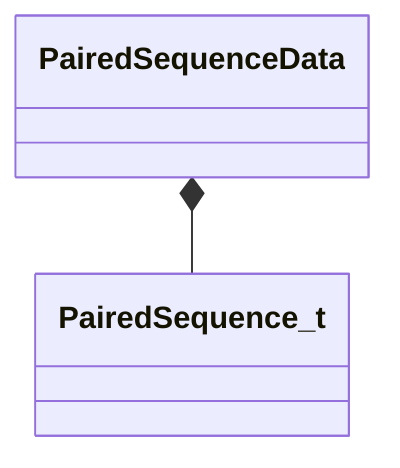

[Schemas](../../schemas.md) / [animgraphlib](../animgraphlib.md) / PairedSequenceData

# PairedSequenceData

**Kind:** class · **Size:** 256 bytes (`0x100`) · **Align:** 8 · **Module:** animgraphlib

**Relationships:**

## Memory layout

1 fields (1 declared here, 0 inherited). Offsets are absolute from the object base.

| Offset | Field | Type | From | Annotations |
|--------|-------|------|------|-------------|
| `0x0` | `m_vecPairedSequences` | [PairedSequence_t](../animgraphlib/PairedSequence_t.md)[8] |  |  |

KV3 class defaults

<pre>{
	&quot;m_vecPairedSequences&quot;:
	[
		{
			&quot;m_sRole&quot;: &quot;&quot;,
			&quot;m_sSequenceName&quot;: &quot;&quot;,
			&quot;m_hSequence&quot;: 0
		},
		{
			&quot;m_sRole&quot;: &quot;&quot;,
			&quot;m_sSequenceName&quot;: &quot;&quot;,
			&quot;m_hSequence&quot;: 0
		},
		{
			&quot;m_sRole&quot;: &quot;&quot;,
			&quot;m_sSequenceName&quot;: &quot;&quot;,
			&quot;m_hSequence&quot;: 0
		},
		{
			&quot;m_sRole&quot;: &quot;&quot;,
			&quot;m_sSequenceName&quot;: &quot;&quot;,
			&quot;m_hSequence&quot;: 0
		},
		{
			&quot;m_sRole&quot;: &quot;&quot;,
			&quot;m_sSequenceName&quot;: &quot;&quot;,
			&quot;m_hSequence&quot;: 0
		},
		{
			&quot;m_sRole&quot;: &quot;&quot;,
			&quot;m_sSequenceName&quot;: &quot;&quot;,
			&quot;m_hSequence&quot;: 0
		},
		{
			&quot;m_sRole&quot;: &quot;&quot;,
			&quot;m_sSequenceName&quot;: &quot;&quot;,
			&quot;m_hSequence&quot;: 0
		},
		{
			&quot;m_sRole&quot;: &quot;&quot;,
			&quot;m_sSequenceName&quot;: &quot;&quot;,
			&quot;m_hSequence&quot;: 0
		}
	]
}</pre>

