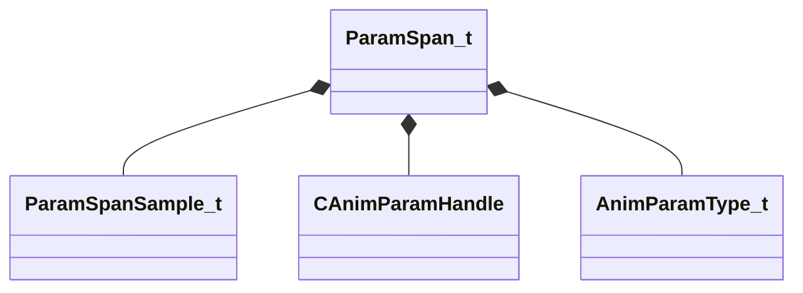

[Schemas](../../schemas.md) / [animgraphlib](../animgraphlib.md) / ParamSpan_t

# ParamSpan_t

> Source: **Build 25000182** · 2026-08-28 · `windows-x86_64` · schema `0.10.0`

**Kind:** class · **Size:** 40 bytes (`0x28`) · **Align:** 8 · **Module:** animgraphlib

**Relationships:**

## Memory layout

5 fields (5 declared here, 0 inherited). Offsets are absolute from the object base.

| Offset | Field | Type | From | Annotations |
|--------|-------|------|------|-------------|
| `0x0` | `m_samples` | CUtlVector< [ParamSpanSample_t](../animgraphlib/ParamSpanSample_t.md) > |  |  |
| `0x18` | `m_hParam` | [CAnimParamHandle](../animgraphlib/CAnimParamHandle.md) |  |  |
| `0x1a` | `m_eParamType` | [AnimParamType_t](../animgraphlib/AnimParamType_t.md) |  |  |
| `0x1c` | `m_flStartCycle` | float32 |  |  |
| `0x20` | `m_flEndCycle` | float32 |  |  |

KV3 class defaults

<pre>{
	&quot;m_samples&quot;:
	[
	],
	&quot;m_hParam&quot;:
	{
		&quot;m_type&quot;: &quot;ANIMPARAM_UNKNOWN&quot;,
		&quot;m_index&quot;: 255
	},
	&quot;m_eParamType&quot;: &quot;ANIMPARAM_UNKNOWN&quot;,
	&quot;m_flStartCycle&quot;: 0.000000,
	&quot;m_flEndCycle&quot;: 0.000000
}</pre>

