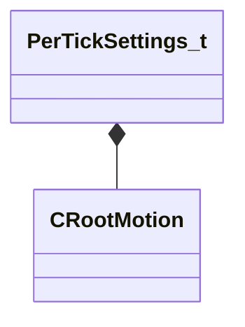

[Schemas](../../schemas.md) / [animgraphlib](../animgraphlib.md) / PerTickSettings_t

# PerTickSettings_t

> Source: **Build 25000182** · 2026-08-28 · `windows-x86_64` · schema `0.10.0`

**Kind:** class · **Size:** 1728 bytes (`0x6c0`) · **Align:** 16 · **Module:** animgraphlib

**Relationships:**

## Memory layout

12 fields (12 declared here, 0 inherited). Offsets are absolute from the object base.

| Offset | Field | Type | From | Annotations |
|--------|-------|------|------|-------------|
| `0x0` | `m_startingLocalToWorld` | CTransform |  |  |
| `0x20` | `m_prevLocalToWorld` | CTransform |  |  |
| `0x40` | `m_finalLocalToWorld` | CTransform |  |  |
| `0x60` | `m_rootMotion` | [CRootMotion](../animgraphlib/CRootMotion.md) |  |  |
| `0x69c` | `m_updateID` | int32 |  |  |
| `0x6a4` | `m_flLastTimeStep` | float32 |  |  |
| `0x6a8` | `m_flPrevAnimTime` | float32 |  |  |
| `0x6ac` | `m_flNextAnimTime` | float32 |  |  |
| `0x6b4` | `m_bAwaken` | bool |  |  |
| `0x6b5` | `m_bTeleported` | bool |  |  |
| `0x6b6` | `m_bIsClient` | bool |  |  |
| `0x6b7` | `m_bIsPredicted` | bool |  |  |

KV3 class defaults

<pre>{
	&quot;m_startingLocalToWorld&quot;:
	[
		0.000000,
		0.000000,
		0.000000,
		1.000000,
		0.000000,
		0.000000,
		0.000000,
		1.000000
	],
	&quot;m_prevLocalToWorld&quot;:
	[
		0.000000,
		0.000000,
		0.000000,
		1.000000,
		0.000000,
		0.000000,
		0.000000,
		1.000000
	],
	&quot;m_finalLocalToWorld&quot;:
	[
		0.000000,
		0.000000,
		0.000000,
		1.000000,
		0.000000,
		0.000000,
		0.000000,
		1.000000
	],
	&quot;m_rootMotion&quot;:
	{
		&quot;m_deltaTransform&quot;:
		{
			&quot;m_iszName&quot;:
			[
				0.000000,
				0.000000,
				0.000000
			],
			&quot;m_iszValue&quot;:
			{
				&quot;m_angle&quot;: 0.000000
			}
		},
		&quot;m_vVelocityMS&quot;:
		[
			0.000000,
			0.000000,
			0.000000
		],
		&quot;m_vUpOverride&quot;:
		[
			0.000000,
			0.000000,
			0.000000
		]
	},
	&quot;m_updateID&quot;: -1,
	&quot;m_flLastTimeStep&quot;: 0.000000,
	&quot;m_flPrevAnimTime&quot;: 0.000000,
	&quot;m_flNextAnimTime&quot;: 0.000000,
	&quot;m_bAwaken&quot;: false,
	&quot;m_bTeleported&quot;: false,
	&quot;m_bIsClient&quot;: false,
	&quot;m_bIsPredicted&quot;: false
}</pre>

