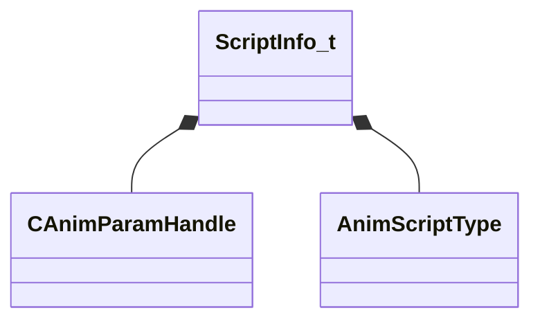

[Schemas](../../schemas.md) / [animgraphlib](../animgraphlib.md) / ScriptInfo_t

# ScriptInfo_t

> Source: **Build 25000182** · 2026-08-28 · `windows-x86_64` · schema `0.10.0`

**Kind:** class · **Size:** 88 bytes (`0x58`) · **Align:** 8 · **Module:** animgraphlib

**Relationships:**

## Memory layout

5 fields (5 declared here, 0 inherited). Offsets are absolute from the object base.

| Offset | Field | Type | From | Annotations |
|--------|-------|------|------|-------------|
| `0x0` | `m_code` | CUtlString |  |  |
| `0x8` | `m_paramsModified` | CUtlVector< [CAnimParamHandle](../animgraphlib/CAnimParamHandle.md) > |  |  |
| `0x20` | `m_proxyReadParams` | CUtlVector< int32 > |  |  |
| `0x38` | `m_proxyWriteParams` | CUtlVector< int32 > |  |  |
| `0x50` | `m_eScriptType` | [AnimScriptType](../animgraphlib/AnimScriptType.md) |  |  |

KV3 class defaults

<pre>{
	&quot;m_code&quot;: &quot;&quot;,
	&quot;m_paramsModified&quot;:
	[
	],
	&quot;m_proxyReadParams&quot;:
	[
	],
	&quot;m_proxyWriteParams&quot;:
	[
	],
	&quot;m_eScriptType&quot;: &quot;ANIMSCRIPT_TYPE_INVALID&quot;
}</pre>

