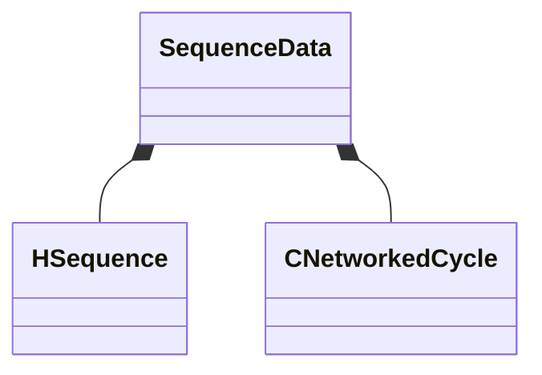

[Schemas](../../schemas.md) / [animgraphlib](../animgraphlib.md) / SequenceData

# SequenceData

> Source: **Build 25000182** · 2026-08-28 · `windows-x86_64` · schema `0.10.0`

**Kind:** class · **Size:** 56 bytes (`0x38`) · **Align:** 4 · **Module:** animgraphlib

**Relationships:**

## Memory layout

2 fields (2 declared here, 0 inherited). Offsets are absolute from the object base.

| Offset | Field | Type | From | Annotations |
|--------|-------|------|------|-------------|
| `0x0` | `m_hSequence` | [HSequence](../animationsystem/HSequence.md) |  |  |
| `0x4` | `m_cycle` | [CNetworkedCycle](../animgraphlib/CNetworkedCycle.md) |  |  |

KV3 class defaults

<pre>{
	&quot;m_hSequence&quot;: -1,
	&quot;m_cycle&quot;:
	{
		&quot;m_flCycleUnclamped&quot;: 0.000000,
		&quot;m_flPrevCycleUnclamped&quot;: 0.000000,
		&quot;m_flCyclesPerSecond&quot;: 1.000000,
		&quot;m_flCycleZeroTime&quot;: 0.000000,
		&quot;m_resetCount&quot;: 0
	}
}</pre>

