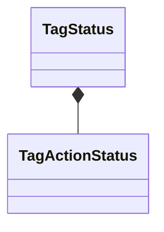

[Schemas](../../schemas.md) / [animgraphlib](../animgraphlib.md) / TagStatus

# TagStatus

> Source: **Build 25000182** · 2026-08-28 · `windows-x86_64` · schema `0.10.0`

**Kind:** class · **Size:** 8 bytes (`0x8`) · **Align:** 4 · **Module:** animgraphlib

**Relationships:**

## Memory layout

2 fields (2 declared here, 0 inherited). Offsets are absolute from the object base.

| Offset | Field | Type | From | Annotations |
|--------|-------|------|------|-------------|
| `0x0` | `m_TagStatus` | [TagActionStatus](../animgraphlib/TagActionStatus.md) |  |  |
| `0x4` | `m_flTagStartAnimTime` | float32 |  |  |

KV3 class defaults

<pre>{
	&quot;m_TagStatus&quot;: &quot;Inactive&quot;,
	&quot;m_flTagStartAnimTime&quot;: -1.000000
}</pre>

