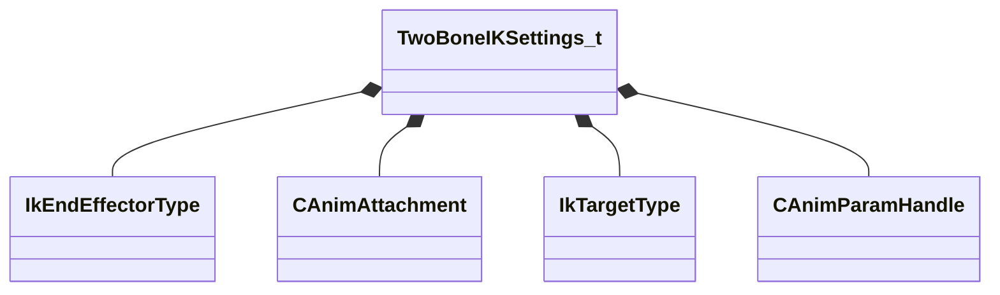

[Schemas](../../schemas.md) / [animgraphlib](../animgraphlib.md) / TwoBoneIKSettings_t

# TwoBoneIKSettings_t

**Kind:** class · **Size:** 352 bytes (`0x160`) · **Align:** 16 · **Module:** animgraphlib

**Relationships:**

## Memory layout

15 fields (15 declared here, 0 inherited). Offsets are absolute from the object base.

| Offset | Field | Type | From | Annotations |
|--------|-------|------|------|-------------|
| `0x0` | `m_endEffectorType` | [IkEndEffectorType](../animgraphlib/IkEndEffectorType.md) |  |  |
| `0x10` | `m_endEffectorAttachment` | [CAnimAttachment](../modellib/CAnimAttachment.md) |  |  |
| `0x90` | `m_targetType` | [IkTargetType](../animgraphlib/IkTargetType.md) |  |  |
| `0xa0` | `m_targetAttachment` | [CAnimAttachment](../modellib/CAnimAttachment.md) |  |  |
| `0x120` | `m_targetBoneIndex` | int32 |  |  |
| `0x124` | `m_hPositionParam` | [CAnimParamHandle](../animgraphlib/CAnimParamHandle.md) |  |  |
| `0x126` | `m_hRotationParam` | [CAnimParamHandle](../animgraphlib/CAnimParamHandle.md) |  |  |
| `0x128` | `m_bAlwaysUseFallbackHinge` | bool |  |  |
| `0x130` | `m_vLsFallbackHingeAxis` | VectorAligned |  |  |
| `0x140` | `m_nFixedBoneIndex` | int32 |  |  |
| `0x144` | `m_nMiddleBoneIndex` | int32 |  |  |
| `0x148` | `m_nEndBoneIndex` | int32 |  |  |
| `0x14c` | `m_bMatchTargetOrientation` | bool |  |  |
| `0x14d` | `m_bConstrainTwist` | bool |  |  |
| `0x150` | `m_flMaxTwist` | float32 |  |  |

KV3 class defaults

<pre>{
	&quot;m_endEffectorType&quot;: &quot;IkEndEffector_Bone&quot;,
	&quot;m_endEffectorAttachment&quot;:
	{
		&quot;m_influenceRotations&quot;:
		[
			[
				0.000000,
				0.000000,
				0.000000,
				0.000000
			],
			[
				0.000000,
				0.000000,
				0.000000,
				0.000000
			],
			[
				0.000000,
				0.000000,
				0.000000,
				0.000000
			]
		],
		&quot;m_influenceOffsets&quot;:
		[
			[
				0.000000,
				0.000000,
				0.000000
			],
			[
				0.000000,
				0.000000,
				0.000000
			],
			[
				0.000000,
				0.000000,
				0.000000
			]
		],
		&quot;m_influenceIndices&quot;:
		[
			0,
			0,
			0
		],
		&quot;m_influenceWeights&quot;:
		[
			0.000000,
			0.000000,
			0.000000
		],
		&quot;m_numInfluences&quot;: 0
	},
	&quot;m_targetType&quot;: &quot;IkTarget_Bone&quot;,
	&quot;m_targetAttachment&quot;:
	{
		&quot;m_influenceRotations&quot;:
		[
			[
				0.000000,
				0.000000,
				0.000000,
				0.000000
			],
			[
				0.000000,
				0.000000,
				0.000000,
				0.000000
			],
			[
				0.000000,
				0.000000,
				0.000000,
				0.000000
			]
		],
		&quot;m_influenceOffsets&quot;:
		[
			[
				0.000000,
				0.000000,
				0.000000
			],
			[
				0.000000,
				0.000000,
				0.000000
			],
			[
				0.000000,
				0.000000,
				0.000000
			]
		],
		&quot;m_influenceIndices&quot;:
		[
			0,
			0,
			0
		],
		&quot;m_influenceWeights&quot;:
		[
			0.000000,
			0.000000,
			0.000000
		],
		&quot;m_numInfluences&quot;: 0
	},
	&quot;m_targetBoneIndex&quot;: -1,
	&quot;m_hPositionParam&quot;:
	{
		&quot;m_type&quot;: &quot;ANIMPARAM_UNKNOWN&quot;,
		&quot;m_index&quot;: 255
	},
	&quot;m_hRotationParam&quot;:
	{
		&quot;m_type&quot;: &quot;ANIMPARAM_UNKNOWN&quot;,
		&quot;m_index&quot;: 255
	},
	&quot;m_bAlwaysUseFallbackHinge&quot;: false,
	&quot;m_vLsFallbackHingeAxis&quot;:
	[
		0.000000,
		1.000000,
		0.000000
	],
	&quot;m_nFixedBoneIndex&quot;: -1,
	&quot;m_nMiddleBoneIndex&quot;: -1,
	&quot;m_nEndBoneIndex&quot;: -1,
	&quot;m_bMatchTargetOrientation&quot;: false,
	&quot;m_bConstrainTwist&quot;: false,
	&quot;m_flMaxTwist&quot;: 15.000000
}</pre>

