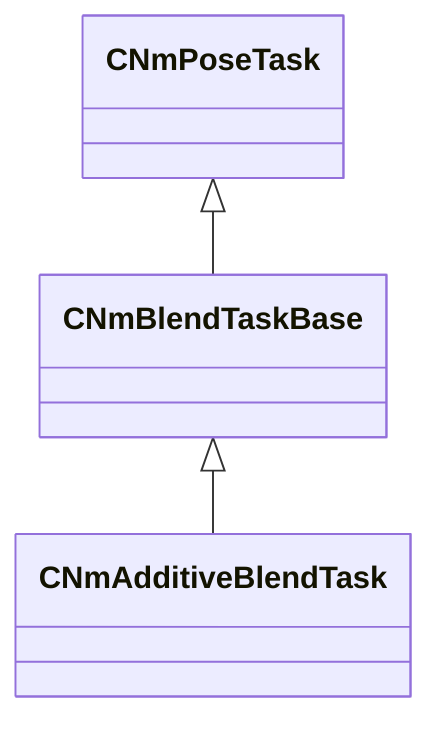
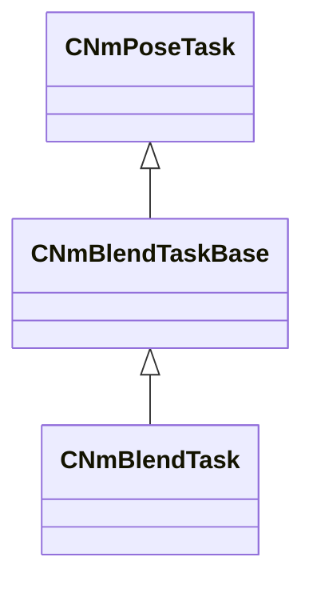
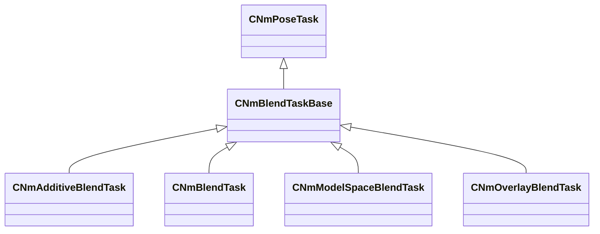
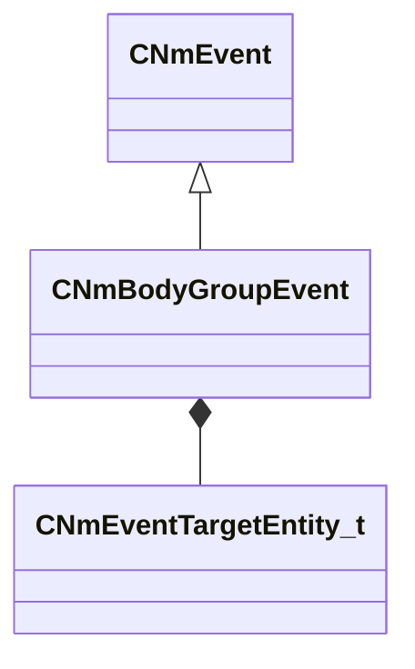
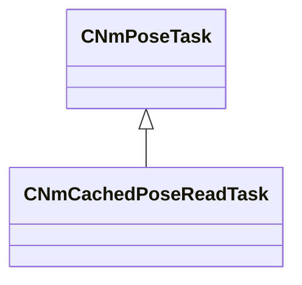
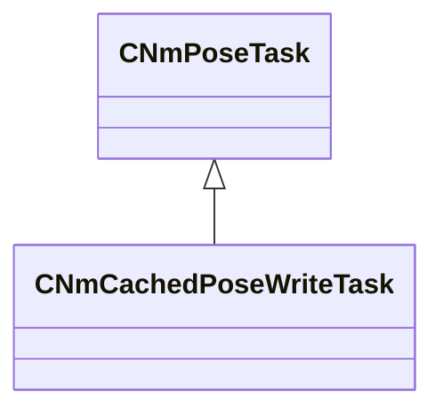

# Module: animlib

[📊 View UML Diagram](../diagrams/animlib.md)

| Name | Kind | Bases | Fields |
|------|------|-------|--------|
| [CNmAdditiveBlendTask](#cnmadditiveblendtask) | class | CNmBlendTaskBase | 0 |
| [CNmAndNode::CDefinition](#cnmandnodecdefinition) | class | CNmBoolValueNode::CDefinition | 1 |
| [CNmAnimationPoseNode::CDefinition](#cnmanimationposenodecdefinition) | class | CNmPoseNode::CDefinition | 5 |
| [CNmBitFlags](#cnmbitflags) | class |  | 1 |
| [CNmBlend1DNode::CDefinition](#cnmblend1dnodecdefinition) | class | CNmParameterizedBlendNode::CDefinition | 1 |
| [CNmBlend2DNode::CDefinition](#cnmblend2dnodecdefinition) | class | CNmPoseNode::CDefinition | 7 |
| [CNmBlendTask](#cnmblendtask) | class | CNmBlendTaskBase | 0 |
| [CNmBlendTaskBase](#cnmblendtaskbase) | class | CNmPoseTask | 0 |
| [CNmBodyGroupEvent](#cnmbodygroupevent) | class | CNmEvent | 3 |
| [CNmBoneMaskBlendNode::CDefinition](#cnmbonemaskblendnodecdefinition) | class | CNmBoneMaskValueNode::CDefinition | 3 |
| [CNmBoneMaskNode::CDefinition](#cnmbonemasknodecdefinition) | class | CNmBoneMaskValueNode::CDefinition | 1 |
| [CNmBoneMaskSelectorNode::CDefinition](#cnmbonemaskselectornodecdefinition) | class | CNmBoneMaskValueNode::CDefinition | 6 |
| [CNmBoneMaskSwitchNode::CDefinition](#cnmbonemaskswitchnodecdefinition) | class | CNmBoneMaskValueNode::CDefinition | 5 |
| [CNmBoneMaskValueNode::CDefinition](#cnmbonemaskvaluenodecdefinition) | class | CNmValueNode::CDefinition | 0 |
| [CNmBoneWeightList](#cnmboneweightlist) | class |  | 3 |
| [CNmBoolValueNode::CDefinition](#cnmboolvaluenodecdefinition) | class | CNmValueNode::CDefinition | 0 |
| [CNmCachedBoolNode::CDefinition](#cnmcachedboolnodecdefinition) | class | CNmBoolValueNode::CDefinition | 2 |
| [CNmCachedFloatNode::CDefinition](#cnmcachedfloatnodecdefinition) | class | CNmFloatValueNode::CDefinition | 2 |
| [CNmCachedIDNode::CDefinition](#cnmcachedidnodecdefinition) | class | CNmIDValueNode::CDefinition | 2 |
| [CNmCachedPoseReadTask](#cnmcachedposereadtask) | class | CNmPoseTask | 0 |
| [CNmCachedPoseWriteTask](#cnmcachedposewritetask) | class | CNmPoseTask | 0 |
| [CNmCachedTargetNode::CDefinition](#cnmcachedtargetnodecdefinition) | class | CNmTargetValueNode::CDefinition | 2 |
| [CNmCachedVectorNode::CDefinition](#cnmcachedvectornodecdefinition) | class | CNmVectorValueNode::CDefinition | 2 |
| [CNmChainLookatNode::CDefinition](#cnmchainlookatnodecdefinition) | class | CNmPassthroughNode::CDefinition | 9 |
| [CNmChainLookatTask](#cnmchainlookattask) | class | CNmPoseTask | 0 |
| [CNmClip](#cnmclip) | class |  | 13 |
| [CNmClip::ModelSpaceSamplingChainLink_t](#cnmclipmodelspacesamplingchainlink_t) | class |  | 3 |
| [CNmClipNode::CDefinition](#cnmclipnodecdefinition) | class | CNmClipReferenceNode::CDefinition | 8 |
| [CNmClipReferenceNode::CDefinition](#cnmclipreferencenodecdefinition) | class | CNmPoseNode::CDefinition | 0 |
| [CNmClipSelectorNode::CDefinition](#cnmclipselectornodecdefinition) | class | CNmClipReferenceNode::CDefinition | 2 |
| [CNmConstBoolNode::CDefinition](#cnmconstboolnodecdefinition) | class | CNmBoolValueNode::CDefinition | 1 |
| [CNmConstFloatNode::CDefinition](#cnmconstfloatnodecdefinition) | class | CNmFloatValueNode::CDefinition | 1 |
| [CNmConstIDNode::CDefinition](#cnmconstidnodecdefinition) | class | CNmIDValueNode::CDefinition | 1 |
| [CNmConstTargetNode::CDefinition](#cnmconsttargetnodecdefinition) | class | CNmTargetValueNode::CDefinition | 1 |
| [CNmConstVectorNode::CDefinition](#cnmconstvectornodecdefinition) | class | CNmVectorValueNode::CDefinition | 1 |
| [CNmControlParameterBoolNode::CDefinition](#cnmcontrolparameterboolnodecdefinition) | class | CNmBoolValueNode::CDefinition | 0 |
| [CNmControlParameterFloatNode::CDefinition](#cnmcontrolparameterfloatnodecdefinition) | class | CNmFloatValueNode::CDefinition | 0 |
| [CNmControlParameterIDNode::CDefinition](#cnmcontrolparameteridnodecdefinition) | class | CNmIDValueNode::CDefinition | 0 |
| [CNmControlParameterTargetNode::CDefinition](#cnmcontrolparametertargetnodecdefinition) | class | CNmTargetValueNode::CDefinition | 0 |
| [CNmControlParameterVectorNode::CDefinition](#cnmcontrolparametervectornodecdefinition) | class | CNmVectorValueNode::CDefinition | 0 |
| [CNmCurrentSyncEventIDNode::CDefinition](#cnmcurrentsynceventidnodecdefinition) | class | CNmIDValueNode::CDefinition | 1 |
| [CNmCurrentSyncEventNode::CDefinition](#cnmcurrentsynceventnodecdefinition) | class | CNmFloatValueNode::CDefinition | 2 |
| [CNmDurationScaleNode::CDefinition](#cnmdurationscalenodecdefinition) | class | CNmSpeedScaleBaseNode::CDefinition | 0 |
| [CNmEntityAttributeEventBase](#cnmentityattributeeventbase) | class | CNmEvent | 2 |
| [CNmEntityAttributeFloatEvent](#cnmentityattributefloatevent) | class | CNmEntityAttributeEventBase | 1 |
| [CNmEntityAttributeIntEvent](#cnmentityattributeintevent) | class | CNmEntityAttributeEventBase | 1 |
| [CNmEvent](#cnmevent) | class |  | 3 |
| [CNmExternalPoseNode::CDefinition](#cnmexternalposenodecdefinition) | class | CNmPoseNode::CDefinition | 1 |
| [CNmFixedWeightBoneMaskNode::CDefinition](#cnmfixedweightbonemasknodecdefinition) | class | CNmBoneMaskValueNode::CDefinition | 1 |
| [CNmFloatAngleMathNode::CDefinition](#cnmfloatanglemathnodecdefinition) | class | CNmFloatValueNode::CDefinition | 2 |
| [CNmFloatChannelData](#cnmfloatchanneldata) | class |  | 5 |
| [CNmFloatChannelData::ChannelSettings_t](#cnmfloatchanneldatachannelsettings_t) | class |  | 2 |
| [CNmFloatChannelSet_t](#cnmfloatchannelset_t) | class |  | 2 |
| [CNmFloatClampNode::CDefinition](#cnmfloatclampnodecdefinition) | class | CNmFloatValueNode::CDefinition | 2 |
| [CNmFloatComparisonNode::CDefinition](#cnmfloatcomparisonnodecdefinition) | class | CNmBoolValueNode::CDefinition | 5 |
| [CNmFloatCurveEvent](#cnmfloatcurveevent) | class | CNmEvent | 2 |
| [CNmFloatCurveEventNode::CDefinition](#cnmfloatcurveeventnodecdefinition) | class | CNmFloatValueNode::CDefinition | 4 |
| [CNmFloatCurveNode::CDefinition](#cnmfloatcurvenodecdefinition) | class | CNmFloatValueNode::CDefinition | 2 |
| [CNmFloatEaseNode::CDefinition](#cnmfloateasenodecdefinition) | class | CNmFloatValueNode::CDefinition | 5 |
| [CNmFloatMathNode::CDefinition](#cnmfloatmathnodecdefinition) | class | CNmFloatValueNode::CDefinition | 6 |
| [CNmFloatRangeComparisonNode::CDefinition](#cnmfloatrangecomparisonnodecdefinition) | class | CNmBoolValueNode::CDefinition | 3 |
| [CNmFloatRemapNode::CDefinition](#cnmfloatremapnodecdefinition) | class | CNmFloatValueNode::CDefinition | 3 |
| [CNmFloatRemapNode::RemapRange_t](#cnmfloatremapnoderemaprange_t) | class |  | 2 |
| [CNmFloatSelectorNode::CDefinition](#cnmfloatselectornodecdefinition) | class | CNmFloatValueNode::CDefinition | 5 |
| [CNmFloatSpringNode::CDefinition](#cnmfloatspringnodecdefinition) | class | CNmFloatValueNode::CDefinition | 5 |
| [CNmFloatSwitchNode::CDefinition](#cnmfloatswitchnodecdefinition) | class | CNmFloatValueNode::CDefinition | 5 |
| [CNmFloatValueNode::CDefinition](#cnmfloatvaluenodecdefinition) | class | CNmValueNode::CDefinition | 0 |
| [CNmFollowBoneNode::CDefinition](#cnmfollowbonenodecdefinition) | class | CNmPassthroughNode::CDefinition | 4 |
| [CNmFollowBoneTask](#cnmfollowbonetask) | class | CNmPoseTask | 0 |
| [CNmFootEvent](#cnmfootevent) | class | CNmEvent | 1 |
| [CNmFootEventConditionNode::CDefinition](#cnmfooteventconditionnodecdefinition) | class | CNmBoolValueNode::CDefinition | 3 |
| [CNmFootIKNode::CDefinition](#cnmfootiknodecdefinition) | class | CNmPassthroughNode::CDefinition | 8 |
| [CNmFootIKTask](#cnmfootiktask) | class | CNmPoseTask | 12 |
| [CNmFootstepEventIDNode::CDefinition](#cnmfootstepeventidnodecdefinition) | class | CNmIDValueNode::CDefinition | 2 |
| [CNmFootstepEventPercentageThroughNode::CDefinition](#cnmfootstepeventpercentagethroughnodecdefinition) | class | CNmFloatValueNode::CDefinition | 3 |
| [CNmFrameSnapEvent](#cnmframesnapevent) | class | CNmEvent | 1 |
| [CNmGraphDefinition](#cnmgraphdefinition) | class |  | 14 |
| [CNmGraphDefinition::ExternalGraphSlot_t](#cnmgraphdefinitionexternalgraphslot_t) | class |  | 2 |
| [CNmGraphDefinition::ExternalPoseSlot_t](#cnmgraphdefinitionexternalposeslot_t) | class |  | 2 |
| [CNmGraphDefinition::ReferencedGraphSlot_t](#cnmgraphdefinitionreferencedgraphslot_t) | class |  | 2 |
| [CNmGraphEventConditionNode::CDefinition](#cnmgrapheventconditionnodecdefinition) | class | CNmBoolValueNode::CDefinition | 3 |
| [CNmGraphEventConditionNode::Condition_t](#cnmgrapheventconditionnodecondition_t) | class |  | 2 |
| [CNmGraphInstance](#cnmgraphinstance) | class |  | 0 |
| [CNmGraphNode::CDefinition](#cnmgraphnodecdefinition) | class |  | 1 |
| [CNmGraphVariationUserData](#cnmgraphvariationuserdata) | class |  | 0 |
| [CNmIDBasedClipSelectorNode::CDefinition](#cnmidbasedclipselectornodecdefinition) | class | CNmClipReferenceNode::CDefinition | 5 |
| [CNmIDBasedSelectorNode::CDefinition](#cnmidbasedselectornodecdefinition) | class | CNmPoseNode::CDefinition | 5 |
| [CNmIDComparisonNode::CDefinition](#cnmidcomparisonnodecdefinition) | class | CNmBoolValueNode::CDefinition | 3 |
| [CNmIDEvent](#cnmidevent) | class | CNmEvent | 2 |
| [CNmIDEventConditionNode::CDefinition](#cnmideventconditionnodecdefinition) | class | CNmBoolValueNode::CDefinition | 3 |
| [CNmIDEventNode::CDefinition](#cnmideventnodecdefinition) | class | CNmIDValueNode::CDefinition | 3 |
| [CNmIDEventPercentageThroughNode::CDefinition](#cnmideventpercentagethroughnodecdefinition) | class | CNmBoolValueNode::CDefinition | 3 |
| [CNmIDSelectorNode::CDefinition](#cnmidselectornodecdefinition) | class | CNmIDValueNode::CDefinition | 3 |
| [CNmIDSwitchNode::CDefinition](#cnmidswitchnodecdefinition) | class | CNmIDValueNode::CDefinition | 5 |
| [CNmIDToFloatNode::CDefinition](#cnmidtofloatnodecdefinition) | class | CNmFloatValueNode::CDefinition | 4 |
| [CNmIDValueNode::CDefinition](#cnmidvaluenodecdefinition) | class | CNmValueNode::CDefinition | 0 |
| [CNmIsExternalGraphSlotFilledNode::CDefinition](#cnmisexternalgraphslotfillednodecdefinition) | class | CNmBoolValueNode::CDefinition | 1 |
| [CNmIsExternalPoseSetNode::CDefinition](#cnmisexternalposesetnodecdefinition) | class | CNmBoolValueNode::CDefinition | 1 |
| [CNmIsInactiveBranchConditionNode::CDefinition](#cnmisinactivebranchconditionnodecdefinition) | class | CNmBoolValueNode::CDefinition | 0 |
| [CNmIsTargetSetNode::CDefinition](#cnmistargetsetnodecdefinition) | class | CNmBoolValueNode::CDefinition | 1 |
| [CNmLayerBlendNode::CDefinition](#cnmlayerblendnodecdefinition) | class | CNmPoseNode::CDefinition | 3 |
| [CNmLayerBlendNode::LayerDefinition_t](#cnmlayerblendnodelayerdefinition_t) | class |  | 8 |
| [CNmLegacyEvent](#cnmlegacyevent) | class | CNmEvent | 2 |
| [CNmMaterialAttributeEvent](#cnmmaterialattributeevent) | class | CNmEvent | 7 |
| [CNmModelSpaceBlendTask](#cnmmodelspaceblendtask) | class | CNmBlendTaskBase | 0 |
| [CNmNotNode::CDefinition](#cnmnotnodecdefinition) | class | CNmBoolValueNode::CDefinition | 1 |
| [CNmOrNode::CDefinition](#cnmornodecdefinition) | class | CNmBoolValueNode::CDefinition | 1 |
| [CNmOrientationWarpEvent](#cnmorientationwarpevent) | class | CNmEvent | 0 |
| [CNmOrientationWarpNode::CDefinition](#cnmorientationwarpnodecdefinition) | class | CNmPoseNode::CDefinition | 6 |
| [CNmOverlayBlendTask](#cnmoverlayblendtask) | class | CNmBlendTaskBase | 0 |
| [CNmParameterizedBlendNode::BlendRange_t](#cnmparameterizedblendnodeblendrange_t) | class |  | 3 |
| [CNmParameterizedBlendNode::CDefinition](#cnmparameterizedblendnodecdefinition) | class | CNmPoseNode::CDefinition | 3 |
| [CNmParameterizedBlendNode::Parameterization_t](#cnmparameterizedblendnodeparameterization_t) | class |  | 2 |
| [CNmParameterizedClipSelectorNode::CDefinition](#cnmparameterizedclipselectornodecdefinition) | class | CNmClipReferenceNode::CDefinition | 5 |
| [CNmParameterizedSelectorNode::CDefinition](#cnmparameterizedselectornodecdefinition) | class | CNmPoseNode::CDefinition | 5 |
| [CNmParticleEvent](#cnmparticleevent) | class | CNmEvent | 14 |
| [CNmPassthroughNode::CDefinition](#cnmpassthroughnodecdefinition) | class | CNmPoseNode::CDefinition | 1 |
| [CNmPoseNode::CDefinition](#cnmposenodecdefinition) | class | CNmGraphNode::CDefinition | 0 |
| [CNmPoseTask](#cnmposetask) | class |  | 0 |
| [CNmReferencePoseNode::CDefinition](#cnmreferenceposenodecdefinition) | class | CNmPoseNode::CDefinition | 0 |
| [CNmReferencePoseTask](#cnmreferenceposetask) | class | CNmPoseTask | 0 |
| [CNmReferencedGraphNode::CDefinition](#cnmreferencedgraphnodecdefinition) | class | CNmPoseNode::CDefinition | 2 |
| [CNmRootMotionData](#cnmrootmotiondata) | class |  | 5 |
| [CNmRootMotionEvent](#cnmrootmotionevent) | class | CNmEvent | 1 |
| [CNmRootMotionOverrideNode::CDefinition](#cnmrootmotionoverridenodecdefinition) | class | CNmPassthroughNode::CDefinition | 8 |
| [CNmSampleTask](#cnmsampletask) | class | CNmPoseTask | 0 |
| [CNmScaleNode::CDefinition](#cnmscalenodecdefinition) | class | CNmPassthroughNode::CDefinition | 2 |
| [CNmScaleTask](#cnmscaletask) | class | CNmPoseTask | 0 |
| [CNmSelectorNode::CDefinition](#cnmselectornodecdefinition) | class | CNmPoseNode::CDefinition | 2 |
| [CNmSkeleton](#cnmskeleton) | class |  | 10 |
| [CNmSkeleton::SecondarySkeleton_t](#cnmskeletonsecondaryskeleton_t) | class |  | 2 |
| [CNmSoundEvent](#cnmsoundevent) | class | CNmEvent | 7 |
| [CNmSpeedScaleBaseNode::CDefinition](#cnmspeedscalebasenodecdefinition) | class | CNmPassthroughNode::CDefinition | 2 |
| [CNmSpeedScaleNode::CDefinition](#cnmspeedscalenodecdefinition) | class | CNmSpeedScaleBaseNode::CDefinition | 0 |
| [CNmStateCompletedConditionNode::CDefinition](#cnmstatecompletedconditionnodecdefinition) | class | CNmBoolValueNode::CDefinition | 3 |
| [CNmStateMachineNode::CDefinition](#cnmstatemachinenodecdefinition) | class | CNmPoseNode::CDefinition | 2 |
| [CNmStateMachineNode::StateDefinition_t](#cnmstatemachinenodestatedefinition_t) | class |  | 3 |
| [CNmStateMachineNode::TransitionDefinition_t](#cnmstatemachinenodetransitiondefinition_t) | class |  | 4 |
| [CNmStateNode::CDefinition](#cnmstatenodecdefinition) | class | CNmPoseNode::CDefinition | 11 |
| [CNmStateNode::TimedEvent_t](#cnmstatenodetimedevent_t) | class |  | 3 |
| [CNmSyncEventIndexConditionNode::CDefinition](#cnmsynceventindexconditionnodecdefinition) | class | CNmBoolValueNode::CDefinition | 3 |
| [CNmSyncTrack](#cnmsynctrack) | class |  | 2 |
| [CNmSyncTrack::EventMarker_t](#cnmsynctrackeventmarker_t) | class |  | 2 |
| [CNmSyncTrack::Event_t](#cnmsynctrackevent_t) | class |  | 3 |
| [CNmTarget](#cnmtarget) | class |  | 6 |
| [CNmTargetInfoNode::CDefinition](#cnmtargetinfonodecdefinition) | class | CNmFloatValueNode::CDefinition | 3 |
| [CNmTargetOffsetNode::CDefinition](#cnmtargetoffsetnodecdefinition) | class | CNmTargetValueNode::CDefinition | 4 |
| [CNmTargetPointNode::CDefinition](#cnmtargetpointnodecdefinition) | class | CNmVectorValueNode::CDefinition | 2 |
| [CNmTargetSelectorNode::CDefinition](#cnmtargetselectornodecdefinition) | class | CNmClipReferenceNode::CDefinition | 6 |
| [CNmTargetValueNode::CDefinition](#cnmtargetvaluenodecdefinition) | class | CNmValueNode::CDefinition | 0 |
| [CNmTargetWarpEvent](#cnmtargetwarpevent) | class | CNmEvent | 2 |
| [CNmTargetWarpNode::CDefinition](#cnmtargetwarpnodecdefinition) | class | CNmPoseNode::CDefinition | 11 |
| [CNmTimeConditionNode::CDefinition](#cnmtimeconditionnodecdefinition) | class | CNmBoolValueNode::CDefinition | 5 |
| [CNmTransitionEvent](#cnmtransitionevent) | class | CNmEvent | 2 |
| [CNmTransitionEventConditionNode::CDefinition](#cnmtransitioneventconditionnodecdefinition) | class | CNmBoolValueNode::CDefinition | 4 |
| [CNmTransitionNode::CDefinition](#cnmtransitionnodecdefinition) | class | CNmPoseNode::CDefinition | 11 |
| [CNmTwoBoneIKNode::CDefinition](#cnmtwoboneiknodecdefinition) | class | CNmPassthroughNode::CDefinition | 7 |
| [CNmTwoBoneIKTask](#cnmtwoboneiktask) | class | CNmPoseTask | 10 |
| [CNmValueNode::CDefinition](#cnmvaluenodecdefinition) | class | CNmGraphNode::CDefinition | 0 |
| [CNmVectorCreateNode::CDefinition](#cnmvectorcreatenodecdefinition) | class | CNmVectorValueNode::CDefinition | 4 |
| [CNmVectorInfoNode::CDefinition](#cnmvectorinfonodecdefinition) | class | CNmFloatValueNode::CDefinition | 2 |
| [CNmVectorNegateNode::CDefinition](#cnmvectornegatenodecdefinition) | class | CNmVectorValueNode::CDefinition | 1 |
| [CNmVectorValueNode::CDefinition](#cnmvectorvaluenodecdefinition) | class | CNmValueNode::CDefinition | 0 |
| [CNmVelocityBasedSpeedScaleNode::CDefinition](#cnmvelocitybasedspeedscalenodecdefinition) | class | CNmSpeedScaleBaseNode::CDefinition | 0 |
| [CNmVelocityBlendNode::CDefinition](#cnmvelocityblendnodecdefinition) | class | CNmParameterizedBlendNode::CDefinition | 0 |
| [CNmVirtualParameterBoneMaskNode::CDefinition](#cnmvirtualparameterbonemasknodecdefinition) | class | CNmBoneMaskValueNode::CDefinition | 1 |
| [CNmVirtualParameterBoolNode::CDefinition](#cnmvirtualparameterboolnodecdefinition) | class | CNmBoolValueNode::CDefinition | 1 |
| [CNmVirtualParameterFloatNode::CDefinition](#cnmvirtualparameterfloatnodecdefinition) | class | CNmFloatValueNode::CDefinition | 1 |
| [CNmVirtualParameterIDNode::CDefinition](#cnmvirtualparameteridnodecdefinition) | class | CNmIDValueNode::CDefinition | 1 |
| [CNmVirtualParameterTargetNode::CDefinition](#cnmvirtualparametertargetnodecdefinition) | class | CNmTargetValueNode::CDefinition | 1 |
| [CNmVirtualParameterVectorNode::CDefinition](#cnmvirtualparametervectornodecdefinition) | class | CNmVectorValueNode::CDefinition | 1 |
| [CNmZeroPoseNode::CDefinition](#cnmzeroposenodecdefinition) | class | CNmPoseNode::CDefinition | 0 |
| [CNmZeroPoseTask](#cnmzeroposetask) | class | CNmPoseTask | 0 |
| [NmBoneMaskSetDefinition_t](#nmbonemasksetdefinition_t) | class |  | 3 |
| [NmCompressionSettings_t](#nmcompressionsettings_t) | class |  | 9 |
| [NmCompressionSettings_t::QuantizationRange_t](#nmcompressionsettings_tquantizationrange_t) | class |  | 2 |
| [NmFloatCurveCompressionSettings_t](#nmfloatcurvecompressionsettings_t) | class |  | 2 |
| [NmPercent_t](#nmpercent_t) | class |  | 1 |
| [NmSyncTrackTimeRange_t](#nmsynctracktimerange_t) | class |  | 2 |
| [NmSyncTrackTime_t](#nmsynctracktime_t) | class |  | 2 |

---

### CNmAdditiveBlendTask

**Inherits from:** [CNmBlendTaskBase](animlib.md#cnmblendtaskbase)

**Relationships:**

```mermaid
classDiagram
    CNmBlendTaskBase <|-- CNmAdditiveBlendTask
    CNmPoseTask <|-- CNmBlendTaskBase
```

### CNmAndNode::CDefinition

**Inherits from:** [CNmBoolValueNode::CDefinition](animlib.md#cnmboolvaluenodecdefinition)

**Metadata:** `MGetKV3ClassDefaults`

**Relationships:**

```mermaid
classDiagram
    "CNmBoolValueNode::CDefinition" <|-- "CNmAndNode::CDefinition"
    "CNmValueNode::CDefinition" <|-- "CNmBoolValueNode::CDefinition"
    "CNmGraphNode::CDefinition" <|-- "CNmValueNode::CDefinition"
```

**Fields:**

| Name | Type | Annotations |
|------|------|-------------|
| `m_conditionNodeIndices` | CUtlLeanVectorFixedGrowable< int16, 4 > |  |

### CNmAnimationPoseNode::CDefinition

**Inherits from:** [CNmPoseNode::CDefinition](animlib.md#cnmposenodecdefinition)

**Metadata:** `MGetKV3ClassDefaults`

**Relationships:**

```mermaid
classDiagram
    "CNmPoseNode::CDefinition" <|-- "CNmAnimationPoseNode::CDefinition"
    "CNmGraphNode::CDefinition" <|-- "CNmPoseNode::CDefinition"
```

**Fields:**

| Name | Type | Annotations |
|------|------|-------------|
| `m_nPoseTimeValueNodeIdx` | int16 |  |
| `m_nDataSlotIdx` | int16 |  |
| `m_inputTimeRemapRange` | Range_t |  |
| `m_flUserSpecifiedTime` | float32 |  |
| `m_bUseFramesAsInput` | bool |  |

### CNmBitFlags

**Metadata:** `MGetKV3ClassDefaults`

**Fields:**

| Name | Type | Annotations |
|------|------|-------------|
| `m_flags` | uint32 |  |

### CNmBlend1DNode::CDefinition

**Inherits from:** [CNmParameterizedBlendNode::CDefinition](animlib.md#cnmparameterizedblendnodecdefinition)

**Metadata:** `MGetKV3ClassDefaults`

**Relationships:**

```mermaid
classDiagram
    "CNmParameterizedBlendNode::CDefinition" <|-- "CNmBlend1DNode::CDefinition"
    "CNmPoseNode::CDefinition" <|-- "CNmParameterizedBlendNode::CDefinition"
    "CNmGraphNode::CDefinition" <|-- "CNmPoseNode::CDefinition"
```

**Fields:**

| Name | Type | Annotations |
|------|------|-------------|
| `m_parameterization` | CNmParameterizedBlendNode::Parameterization_t |  |

### CNmBlend2DNode::CDefinition

**Inherits from:** [CNmPoseNode::CDefinition](animlib.md#cnmposenodecdefinition)

**Metadata:** `MGetKV3ClassDefaults`

**Relationships:**

```mermaid
classDiagram
    "CNmPoseNode::CDefinition" <|-- "CNmBlend2DNode::CDefinition"
    "CNmGraphNode::CDefinition" <|-- "CNmPoseNode::CDefinition"
```

**Fields:**

| Name | Type | Annotations |
|------|------|-------------|
| `m_sourceNodeIndices` | CUtlLeanVectorFixedGrowable< int16, 5 > |  |
| `m_values` | CUtlLeanVectorFixedGrowable< Vector2D, 10 > |  |
| `m_indices` | CUtlLeanVectorFixedGrowable< uint8, 30 > |  |
| `m_hullIndices` | CUtlLeanVectorFixedGrowable< uint8, 10 > |  |
| `m_nInputParameterNodeIdx0` | int16 |  |
| `m_nInputParameterNodeIdx1` | int16 |  |
| `m_bAllowLooping` | bool |  |

### CNmBlendTask

**Inherits from:** [CNmBlendTaskBase](animlib.md#cnmblendtaskbase)

**Relationships:**

```mermaid
classDiagram
    CNmBlendTaskBase <|-- CNmBlendTask
    CNmPoseTask <|-- CNmBlendTaskBase
```

### CNmBlendTaskBase

**Inherits from:** [CNmPoseTask](animlib.md#cnmposetask)

**Derived by:** [CNmAdditiveBlendTask](animlib.md#cnmadditiveblendtask), [CNmBlendTask](animlib.md#cnmblendtask), [CNmModelSpaceBlendTask](animlib.md#cnmmodelspaceblendtask), [CNmOverlayBlendTask](animlib.md#cnmoverlayblendtask)

**Relationships:**

```mermaid
classDiagram
    CNmPoseTask <|-- CNmBlendTaskBase
    CNmBlendTaskBase <|-- CNmAdditiveBlendTask
    CNmBlendTaskBase <|-- CNmBlendTask
    CNmBlendTaskBase <|-- CNmModelSpaceBlendTask
    CNmBlendTaskBase <|-- CNmOverlayBlendTask
```

### CNmBodyGroupEvent

**Inherits from:** [CNmEvent](animlib.md#cnmevent)

**Metadata:** `MGetKV3ClassDefaults`

**Relationships:**

```mermaid
classDiagram
    CNmEvent <|-- CNmBodyGroupEvent
    CNmBodyGroupEvent *-- CNmEventTargetEntity_t
```

**Fields:**

| Name | Type | Annotations |
|------|------|-------------|
| `m_target` | [CNmEventTargetEntity_t](../schemas/!GlobalTypes.md#cnmeventtargetentity_t) |  |
| `m_groupName` | CUtlString |  |
| `m_nGroupValue` | int32 |  |

### CNmBoneMaskBlendNode::CDefinition

**Inherits from:** [CNmBoneMaskValueNode::CDefinition](animlib.md#cnmbonemaskvaluenodecdefinition)

**Metadata:** `MGetKV3ClassDefaults`

**Relationships:**

```mermaid
classDiagram
    "CNmBoneMaskValueNode::CDefinition" <|-- "CNmBoneMaskBlendNode::CDefinition"
    "CNmValueNode::CDefinition" <|-- "CNmBoneMaskValueNode::CDefinition"
    "CNmGraphNode::CDefinition" <|-- "CNmValueNode::CDefinition"
```

**Fields:**

| Name | Type | Annotations |
|------|------|-------------|
| `m_nSourceMaskNodeIdx` | int16 |  |
| `m_nTargetMaskNodeIdx` | int16 |  |
| `m_nBlendWeightValueNodeIdx` | int16 |  |

### CNmBoneMaskNode::CDefinition

**Inherits from:** [CNmBoneMaskValueNode::CDefinition](animlib.md#cnmbonemaskvaluenodecdefinition)

**Metadata:** `MGetKV3ClassDefaults`

**Relationships:**

```mermaid
classDiagram
    "CNmBoneMaskValueNode::CDefinition" <|-- "CNmBoneMaskNode::CDefinition"
    "CNmValueNode::CDefinition" <|-- "CNmBoneMaskValueNode::CDefinition"
    "CNmGraphNode::CDefinition" <|-- "CNmValueNode::CDefinition"
```

**Fields:**

| Name | Type | Annotations |
|------|------|-------------|
| `m_boneMaskID` | CGlobalSymbol |  |

### CNmBoneMaskSelectorNode::CDefinition

**Inherits from:** [CNmBoneMaskValueNode::CDefinition](animlib.md#cnmbonemaskvaluenodecdefinition)

**Metadata:** `MGetKV3ClassDefaults`

**Relationships:**

```mermaid
classDiagram
    "CNmBoneMaskValueNode::CDefinition" <|-- "CNmBoneMaskSelectorNode::CDefinition"
    "CNmValueNode::CDefinition" <|-- "CNmBoneMaskValueNode::CDefinition"
    "CNmGraphNode::CDefinition" <|-- "CNmValueNode::CDefinition"
```

**Fields:**

| Name | Type | Annotations |
|------|------|-------------|
| `m_defaultMaskNodeIdx` | int16 |  |
| `m_parameterValueNodeIdx` | int16 |  |
| `m_bSwitchDynamically` | bool |  |
| `m_maskNodeIndices` | CUtlLeanVectorFixedGrowable< int16, 8 > |  |
| `m_parameterValues` | CUtlLeanVectorFixedGrowable< CGlobalSymbol, 7 > |  |
| `m_flBlendTimeSeconds` | float32 |  |

### CNmBoneMaskSwitchNode::CDefinition

**Inherits from:** [CNmBoneMaskValueNode::CDefinition](animlib.md#cnmbonemaskvaluenodecdefinition)

**Metadata:** `MGetKV3ClassDefaults`

**Relationships:**

```mermaid
classDiagram
    "CNmBoneMaskValueNode::CDefinition" <|-- "CNmBoneMaskSwitchNode::CDefinition"
    "CNmValueNode::CDefinition" <|-- "CNmBoneMaskValueNode::CDefinition"
    "CNmGraphNode::CDefinition" <|-- "CNmValueNode::CDefinition"
```

**Fields:**

| Name | Type | Annotations |
|------|------|-------------|
| `m_nSwitchValueNodeIdx` | int16 |  |
| `m_nTrueValueNodeIdx` | int16 |  |
| `m_nFalseValueNodeIdx` | int16 |  |
| `m_flBlendTimeSeconds` | float32 |  |
| `m_bSwitchDynamically` | bool |  |

### CNmBoneMaskValueNode::CDefinition

**Inherits from:** [CNmValueNode::CDefinition](animlib.md#cnmvaluenodecdefinition)

**Derived by:** [CNmBoneMaskBlendNode::CDefinition](animlib.md#cnmbonemaskblendnodecdefinition), [CNmBoneMaskNode::CDefinition](animlib.md#cnmbonemasknodecdefinition), [CNmBoneMaskSelectorNode::CDefinition](animlib.md#cnmbonemaskselectornodecdefinition), [CNmBoneMaskSwitchNode::CDefinition](animlib.md#cnmbonemaskswitchnodecdefinition), [CNmFixedWeightBoneMaskNode::CDefinition](animlib.md#cnmfixedweightbonemasknodecdefinition), [CNmVirtualParameterBoneMaskNode::CDefinition](animlib.md#cnmvirtualparameterbonemasknodecdefinition)

**Relationships:**

```mermaid
classDiagram
    "CNmValueNode::CDefinition" <|-- "CNmBoneMaskValueNode::CDefinition"
    "CNmGraphNode::CDefinition" <|-- "CNmValueNode::CDefinition"
    "CNmBoneMaskValueNode::CDefinition" <|-- "CNmBoneMaskBlendNode::CDefinition"
    "CNmBoneMaskValueNode::CDefinition" <|-- "CNmBoneMaskNode::CDefinition"
    "CNmBoneMaskValueNode::CDefinition" <|-- "CNmBoneMaskSelectorNode::CDefinition"
    "CNmBoneMaskValueNode::CDefinition" <|-- "CNmBoneMaskSwitchNode::CDefinition"
    "CNmBoneMaskValueNode::CDefinition" <|-- "CNmFixedWeightBoneMaskNode::CDefinition"
    "CNmBoneMaskValueNode::CDefinition" <|-- "CNmVirtualParameterBoneMaskNode::CDefinition"
```

### CNmBoneWeightList

**Metadata:** `MGetKV3ClassDefaults`

**Fields:**

| Name | Type | Annotations |
|------|------|-------------|
| `m_skeletonName` | CResourceName |  |
| `m_boneIDs` | CUtlVector< CGlobalSymbol > |  |
| `m_weights` | CUtlVector< float32 > |  |

### CNmBoolValueNode::CDefinition

**Inherits from:** [CNmValueNode::CDefinition](animlib.md#cnmvaluenodecdefinition)

**Derived by:** [CNmAndNode::CDefinition](animlib.md#cnmandnodecdefinition), [CNmCachedBoolNode::CDefinition](animlib.md#cnmcachedboolnodecdefinition), [CNmConstBoolNode::CDefinition](animlib.md#cnmconstboolnodecdefinition), [CNmControlParameterBoolNode::CDefinition](animlib.md#cnmcontrolparameterboolnodecdefinition), [CNmFloatComparisonNode::CDefinition](animlib.md#cnmfloatcomparisonnodecdefinition), [CNmFloatRangeComparisonNode::CDefinition](animlib.md#cnmfloatrangecomparisonnodecdefinition), [CNmFootEventConditionNode::CDefinition](animlib.md#cnmfooteventconditionnodecdefinition), [CNmGraphEventConditionNode::CDefinition](animlib.md#cnmgrapheventconditionnodecdefinition), [CNmIDComparisonNode::CDefinition](animlib.md#cnmidcomparisonnodecdefinition), [CNmIDEventConditionNode::CDefinition](animlib.md#cnmideventconditionnodecdefinition), [CNmIDEventPercentageThroughNode::CDefinition](animlib.md#cnmideventpercentagethroughnodecdefinition), [CNmIsExternalGraphSlotFilledNode::CDefinition](animlib.md#cnmisexternalgraphslotfillednodecdefinition), [CNmIsExternalPoseSetNode::CDefinition](animlib.md#cnmisexternalposesetnodecdefinition), [CNmIsInactiveBranchConditionNode::CDefinition](animlib.md#cnmisinactivebranchconditionnodecdefinition), [CNmIsTargetSetNode::CDefinition](animlib.md#cnmistargetsetnodecdefinition), [CNmNotNode::CDefinition](animlib.md#cnmnotnodecdefinition), [CNmOrNode::CDefinition](animlib.md#cnmornodecdefinition), [CNmStateCompletedConditionNode::CDefinition](animlib.md#cnmstatecompletedconditionnodecdefinition), [CNmSyncEventIndexConditionNode::CDefinition](animlib.md#cnmsynceventindexconditionnodecdefinition), [CNmTimeConditionNode::CDefinition](animlib.md#cnmtimeconditionnodecdefinition), [CNmTransitionEventConditionNode::CDefinition](animlib.md#cnmtransitioneventconditionnodecdefinition), [CNmVirtualParameterBoolNode::CDefinition](animlib.md#cnmvirtualparameterboolnodecdefinition)

**Relationships:**

```mermaid
classDiagram
    "CNmValueNode::CDefinition" <|-- "CNmBoolValueNode::CDefinition"
    "CNmGraphNode::CDefinition" <|-- "CNmValueNode::CDefinition"
    "CNmBoolValueNode::CDefinition" <|-- "CNmAndNode::CDefinition"
    "CNmBoolValueNode::CDefinition" <|-- "CNmCachedBoolNode::CDefinition"
    "CNmBoolValueNode::CDefinition" <|-- "CNmConstBoolNode::CDefinition"
    "CNmBoolValueNode::CDefinition" <|-- "CNmControlParameterBoolNode::CDefinition"
    "CNmBoolValueNode::CDefinition" <|-- "CNmFloatComparisonNode::CDefinition"
    "CNmBoolValueNode::CDefinition" <|-- "CNmFloatRangeComparisonNode::CDefinition"
    "CNmBoolValueNode::CDefinition" <|-- "CNmFootEventConditionNode::CDefinition"
    "CNmBoolValueNode::CDefinition" <|-- "CNmGraphEventConditionNode::CDefinition"
    "CNmBoolValueNode::CDefinition" <|-- "CNmIDComparisonNode::CDefinition"
    "CNmBoolValueNode::CDefinition" <|-- "CNmIDEventConditionNode::CDefinition"
    "CNmBoolValueNode::CDefinition" <|-- "CNmIDEventPercentageThroughNode::CDefinition"
    "CNmBoolValueNode::CDefinition" <|-- "CNmIsExternalGraphSlotFilledNode::CDefinition"
    "CNmBoolValueNode::CDefinition" <|-- "CNmIsExternalPoseSetNode::CDefinition"
    "CNmBoolValueNode::CDefinition" <|-- "CNmIsInactiveBranchConditionNode::CDefinition"
    "CNmBoolValueNode::CDefinition" <|-- "CNmIsTargetSetNode::CDefinition"
    "CNmBoolValueNode::CDefinition" <|-- "CNmNotNode::CDefinition"
    "CNmBoolValueNode::CDefinition" <|-- "CNmOrNode::CDefinition"
    "CNmBoolValueNode::CDefinition" <|-- "CNmStateCompletedConditionNode::CDefinition"
    "CNmBoolValueNode::CDefinition" <|-- "CNmSyncEventIndexConditionNode::CDefinition"
    "CNmBoolValueNode::CDefinition" <|-- "CNmTimeConditionNode::CDefinition"
    "CNmBoolValueNode::CDefinition" <|-- "CNmTransitionEventConditionNode::CDefinition"
    "CNmBoolValueNode::CDefinition" <|-- "CNmVirtualParameterBoolNode::CDefinition"
```

### CNmCachedBoolNode::CDefinition

**Inherits from:** [CNmBoolValueNode::CDefinition](animlib.md#cnmboolvaluenodecdefinition)

**Metadata:** `MGetKV3ClassDefaults`

**Relationships:**

```mermaid
classDiagram
    "CNmBoolValueNode::CDefinition" <|-- "CNmCachedBoolNode::CDefinition"
    "CNmValueNode::CDefinition" <|-- "CNmBoolValueNode::CDefinition"
    "CNmGraphNode::CDefinition" <|-- "CNmValueNode::CDefinition"
    "CNmCachedBoolNode::CDefinition" *-- NmCachedValueMode_t
```

**Fields:**

| Name | Type | Annotations |
|------|------|-------------|
| `m_nInputValueNodeIdx` | int16 |  |
| `m_mode` | [NmCachedValueMode_t](../schemas/!GlobalTypes.md#nmcachedvaluemode_t) |  |

### CNmCachedFloatNode::CDefinition

**Inherits from:** [CNmFloatValueNode::CDefinition](animlib.md#cnmfloatvaluenodecdefinition)

**Metadata:** `MGetKV3ClassDefaults`

**Relationships:**

```mermaid
classDiagram
    "CNmFloatValueNode::CDefinition" <|-- "CNmCachedFloatNode::CDefinition"
    "CNmValueNode::CDefinition" <|-- "CNmFloatValueNode::CDefinition"
    "CNmGraphNode::CDefinition" <|-- "CNmValueNode::CDefinition"
    "CNmCachedFloatNode::CDefinition" *-- NmCachedValueMode_t
```

**Fields:**

| Name | Type | Annotations |
|------|------|-------------|
| `m_nInputValueNodeIdx` | int16 |  |
| `m_mode` | [NmCachedValueMode_t](../schemas/!GlobalTypes.md#nmcachedvaluemode_t) |  |

### CNmCachedIDNode::CDefinition

**Inherits from:** [CNmIDValueNode::CDefinition](animlib.md#cnmidvaluenodecdefinition)

**Metadata:** `MGetKV3ClassDefaults`

**Relationships:**

```mermaid
classDiagram
    "CNmIDValueNode::CDefinition" <|-- "CNmCachedIDNode::CDefinition"
    "CNmValueNode::CDefinition" <|-- "CNmIDValueNode::CDefinition"
    "CNmGraphNode::CDefinition" <|-- "CNmValueNode::CDefinition"
    "CNmCachedIDNode::CDefinition" *-- NmCachedValueMode_t
```

**Fields:**

| Name | Type | Annotations |
|------|------|-------------|
| `m_nInputValueNodeIdx` | int16 |  |
| `m_mode` | [NmCachedValueMode_t](../schemas/!GlobalTypes.md#nmcachedvaluemode_t) |  |

### CNmCachedPoseReadTask

**Inherits from:** [CNmPoseTask](animlib.md#cnmposetask)

**Relationships:**

```mermaid
classDiagram
    CNmPoseTask <|-- CNmCachedPoseReadTask
```

### CNmCachedPoseWriteTask

**Inherits from:** [CNmPoseTask](animlib.md#cnmposetask)

**Relationships:**

```mermaid
classDiagram
    CNmPoseTask <|-- CNmCachedPoseWriteTask
```

### CNmCachedTargetNode::CDefinition

**Inherits from:** [CNmTargetValueNode::CDefinition](animlib.md#cnmtargetvaluenodecdefinition)

**Metadata:** `MGetKV3ClassDefaults`

**Relationships:**

```mermaid
classDiagram
    "CNmTargetValueNode::CDefinition" <|-- "CNmCachedTargetNode::CDefinition"
    "CNmValueNode::CDefinition" <|-- "CNmTargetValueNode::CDefinition"
    "CNmGraphNode::CDefinition" <|-- "CNmValueNode::CDefinition"
    "CNmCachedTargetNode::CDefinition" *-- NmCachedValueMode_t
```

**Fields:**

| Name | Type | Annotations |
|------|------|-------------|
| `m_nInputValueNodeIdx` | int16 |  |
| `m_mode` | [NmCachedValueMode_t](../schemas/!GlobalTypes.md#nmcachedvaluemode_t) |  |

### CNmCachedVectorNode::CDefinition

**Inherits from:** [CNmVectorValueNode::CDefinition](animlib.md#cnmvectorvaluenodecdefinition)

**Metadata:** `MGetKV3ClassDefaults`

**Relationships:**

```mermaid
classDiagram
    "CNmVectorValueNode::CDefinition" <|-- "CNmCachedVectorNode::CDefinition"
    "CNmValueNode::CDefinition" <|-- "CNmVectorValueNode::CDefinition"
    "CNmGraphNode::CDefinition" <|-- "CNmValueNode::CDefinition"
    "CNmCachedVectorNode::CDefinition" *-- NmCachedValueMode_t
```

**Fields:**

| Name | Type | Annotations |
|------|------|-------------|
| `m_nInputValueNodeIdx` | int16 |  |
| `m_mode` | [NmCachedValueMode_t](../schemas/!GlobalTypes.md#nmcachedvaluemode_t) |  |

### CNmChainLookatNode::CDefinition

**Inherits from:** [CNmPassthroughNode::CDefinition](animlib.md#cnmpassthroughnodecdefinition)

**Metadata:** `MGetKV3ClassDefaults`

**Relationships:**

```mermaid
classDiagram
    "CNmPassthroughNode::CDefinition" <|-- "CNmChainLookatNode::CDefinition"
    "CNmPoseNode::CDefinition" <|-- "CNmPassthroughNode::CDefinition"
    "CNmGraphNode::CDefinition" <|-- "CNmPoseNode::CDefinition"
```

**Fields:**

| Name | Type | Annotations |
|------|------|-------------|
| `m_endEffectorBoneID` | CGlobalSymbol |  |
| `m_endEffectorForwardAxis` | Vector |  |
| `m_endEffectorOffset` | Vector |  |
| `m_nLookatTargetNodeIdx` | int16 |  |
| `m_nEnabledNodeIdx` | int16 |  |
| `m_flBlendTimeSeconds` | float32 |  |
| `m_chainWeights` | CUtlVectorFixedGrowable< float32, 5 > |  |
| `m_nChainLength` | uint8 |  |
| `m_bIsTargetInWorldSpace` | bool |  |

### CNmChainLookatTask

**Inherits from:** [CNmPoseTask](animlib.md#cnmposetask)

**Relationships:**

```mermaid
classDiagram
    CNmPoseTask <|-- CNmChainLookatTask
```

### CNmClip

**Metadata:** `MGetKV3ClassDefaults`

**Relationships:**

```mermaid
classDiagram
    CNmClip *-- InfoForResourceTypeCNmSkeleton
    CNmClip *-- NmCompressionSettings_t
    CNmClip --> CNmFloatChannelData
    CNmClip *-- CNmSyncTrack
    CNmClip *-- CNmRootMotionData
```

**Fields:**

| Name | Type | Annotations |
|------|------|-------------|
| `m_skeleton` | CStrongHandle< [InfoForResourceTypeCNmSkeleton](../schemas/resourcesystem.md#infoforresourcetypecnmskeleton) > |  |
| `m_nNumFrames` | uint32 |  |
| `m_flDuration` | float32 |  |
| `m_compressedPoseData` | CUtlBinaryBlock |  |
| `m_trackCompressionSettings` | CUtlVector< [NmCompressionSettings_t](../schemas/animlib.md#nmcompressionsettings_t) > |  |
| `m_compressedPoseOffsets` | CUtlVector< uint32 > |  |
| `m_secondaryAnimations` | CUtlVectorFixedGrowable< [CNmClip](../schemas/animlib.md#cnmclip)*, 1 > |  |
| `m_floatChannelData` | CUtlVectorFixedGrowable< [CNmFloatChannelData](../schemas/animlib.md#cnmfloatchanneldata)*, 2 > |  |
| `m_syncTrack` | [CNmSyncTrack](../schemas/animlib.md#cnmsynctrack) |  |
| `m_rootMotion` | [CNmRootMotionData](../schemas/animlib.md#cnmrootmotiondata) |  |
| `m_bIsAdditive` | bool |  |
| `m_modelSpaceSamplingChain` | CUtlVector< [CNmClip](../schemas/animlib.md#cnmclip)::ModelSpaceSamplingChainLink_t > |  |
| `m_modelSpaceBoneSamplingIndices` | CUtlVector< int32 > |  |

### CNmClip::ModelSpaceSamplingChainLink_t

**Metadata:** `MGetKV3ClassDefaults`

**Fields:**

| Name | Type | Annotations |
|------|------|-------------|
| `m_nBoneIdx` | int32 |  |
| `m_nParentBoneIdx` | int32 |  |
| `m_nParentChainLinkIdx` | int32 |  |

### CNmClipNode::CDefinition

**Inherits from:** [CNmClipReferenceNode::CDefinition](animlib.md#cnmclipreferencenodecdefinition)

**Metadata:** `MGetKV3ClassDefaults`

**Relationships:**

```mermaid
classDiagram
    "CNmClipReferenceNode::CDefinition" <|-- "CNmClipNode::CDefinition"
    "CNmPoseNode::CDefinition" <|-- "CNmClipReferenceNode::CDefinition"
    "CNmGraphNode::CDefinition" <|-- "CNmPoseNode::CDefinition"
```

**Fields:**

| Name | Type | Annotations |
|------|------|-------------|
| `m_nPlayInReverseValueNodeIdx` | int16 |  |
| `m_nResetTimeValueNodeIdx` | int16 |  |
| `m_bSampleRootMotion` | bool |  |
| `m_bAllowLooping` | bool |  |
| `m_nDataSlotIdx` | int16 |  |
| `m_graphEvents` | CUtlVectorFixedGrowable< CGlobalSymbol, 2 > |  |
| `m_flSpeedMultiplier` | float32 |  |
| `m_nStartSyncEventOffset` | int32 |  |

### CNmClipReferenceNode::CDefinition

**Inherits from:** [CNmPoseNode::CDefinition](animlib.md#cnmposenodecdefinition)

**Derived by:** [CNmClipNode::CDefinition](animlib.md#cnmclipnodecdefinition), [CNmClipSelectorNode::CDefinition](animlib.md#cnmclipselectornodecdefinition), [CNmIDBasedClipSelectorNode::CDefinition](animlib.md#cnmidbasedclipselectornodecdefinition), [CNmParameterizedClipSelectorNode::CDefinition](animlib.md#cnmparameterizedclipselectornodecdefinition), [CNmTargetSelectorNode::CDefinition](animlib.md#cnmtargetselectornodecdefinition)

**Metadata:** `MGetKV3ClassDefaults`

**Relationships:**

```mermaid
classDiagram
    "CNmPoseNode::CDefinition" <|-- "CNmClipReferenceNode::CDefinition"
    "CNmGraphNode::CDefinition" <|-- "CNmPoseNode::CDefinition"
    "CNmClipReferenceNode::CDefinition" <|-- "CNmClipNode::CDefinition"
    "CNmClipReferenceNode::CDefinition" <|-- "CNmClipSelectorNode::CDefinition"
    "CNmClipReferenceNode::CDefinition" <|-- "CNmIDBasedClipSelectorNode::CDefinition"
    "CNmClipReferenceNode::CDefinition" <|-- "CNmParameterizedClipSelectorNode::CDefinition"
    "CNmClipReferenceNode::CDefinition" <|-- "CNmTargetSelectorNode::CDefinition"
```

### CNmClipSelectorNode::CDefinition

**Inherits from:** [CNmClipReferenceNode::CDefinition](animlib.md#cnmclipreferencenodecdefinition)

**Metadata:** `MGetKV3ClassDefaults`

**Relationships:**

```mermaid
classDiagram
    "CNmClipReferenceNode::CDefinition" <|-- "CNmClipSelectorNode::CDefinition"
    "CNmPoseNode::CDefinition" <|-- "CNmClipReferenceNode::CDefinition"
    "CNmGraphNode::CDefinition" <|-- "CNmPoseNode::CDefinition"
```

**Fields:**

| Name | Type | Annotations |
|------|------|-------------|
| `m_optionNodeIndices` | CUtlLeanVectorFixedGrowable< int16, 8 > |  |
| `m_conditionNodeIndices` | CUtlLeanVectorFixedGrowable< int16, 8 > |  |

### CNmConstBoolNode::CDefinition

**Inherits from:** [CNmBoolValueNode::CDefinition](animlib.md#cnmboolvaluenodecdefinition)

**Metadata:** `MGetKV3ClassDefaults`

**Relationships:**

```mermaid
classDiagram
    "CNmBoolValueNode::CDefinition" <|-- "CNmConstBoolNode::CDefinition"
    "CNmValueNode::CDefinition" <|-- "CNmBoolValueNode::CDefinition"
    "CNmGraphNode::CDefinition" <|-- "CNmValueNode::CDefinition"
```

**Fields:**

| Name | Type | Annotations |
|------|------|-------------|
| `m_bValue` | bool |  |

### CNmConstFloatNode::CDefinition

**Inherits from:** [CNmFloatValueNode::CDefinition](animlib.md#cnmfloatvaluenodecdefinition)

**Metadata:** `MGetKV3ClassDefaults`

**Relationships:**

```mermaid
classDiagram
    "CNmFloatValueNode::CDefinition" <|-- "CNmConstFloatNode::CDefinition"
    "CNmValueNode::CDefinition" <|-- "CNmFloatValueNode::CDefinition"
    "CNmGraphNode::CDefinition" <|-- "CNmValueNode::CDefinition"
```

**Fields:**

| Name | Type | Annotations |
|------|------|-------------|
| `m_flValue` | float32 |  |

### CNmConstIDNode::CDefinition

**Inherits from:** [CNmIDValueNode::CDefinition](animlib.md#cnmidvaluenodecdefinition)

**Metadata:** `MGetKV3ClassDefaults`

**Relationships:**

```mermaid
classDiagram
    "CNmIDValueNode::CDefinition" <|-- "CNmConstIDNode::CDefinition"
    "CNmValueNode::CDefinition" <|-- "CNmIDValueNode::CDefinition"
    "CNmGraphNode::CDefinition" <|-- "CNmValueNode::CDefinition"
```

**Fields:**

| Name | Type | Annotations |
|------|------|-------------|
| `m_value` | CGlobalSymbol |  |

### CNmConstTargetNode::CDefinition

**Inherits from:** [CNmTargetValueNode::CDefinition](animlib.md#cnmtargetvaluenodecdefinition)

**Metadata:** `MGetKV3ClassDefaults`

**Relationships:**

```mermaid
classDiagram
    "CNmTargetValueNode::CDefinition" <|-- "CNmConstTargetNode::CDefinition"
    "CNmValueNode::CDefinition" <|-- "CNmTargetValueNode::CDefinition"
    "CNmGraphNode::CDefinition" <|-- "CNmValueNode::CDefinition"
    "CNmConstTargetNode::CDefinition" *-- CNmTarget
```

**Fields:**

| Name | Type | Annotations |
|------|------|-------------|
| `m_value` | [CNmTarget](../schemas/animlib.md#cnmtarget) |  |

### CNmConstVectorNode::CDefinition

**Inherits from:** [CNmVectorValueNode::CDefinition](animlib.md#cnmvectorvaluenodecdefinition)

**Metadata:** `MGetKV3ClassDefaults`

**Relationships:**

```mermaid
classDiagram
    "CNmVectorValueNode::CDefinition" <|-- "CNmConstVectorNode::CDefinition"
    "CNmValueNode::CDefinition" <|-- "CNmVectorValueNode::CDefinition"
    "CNmGraphNode::CDefinition" <|-- "CNmValueNode::CDefinition"
```

**Fields:**

| Name | Type | Annotations |
|------|------|-------------|
| `m_value` | Vector |  |

### CNmControlParameterBoolNode::CDefinition

**Inherits from:** [CNmBoolValueNode::CDefinition](animlib.md#cnmboolvaluenodecdefinition)

**Metadata:** `MGetKV3ClassDefaults`

**Relationships:**

```mermaid
classDiagram
    "CNmBoolValueNode::CDefinition" <|-- "CNmControlParameterBoolNode::CDefinition"
    "CNmValueNode::CDefinition" <|-- "CNmBoolValueNode::CDefinition"
    "CNmGraphNode::CDefinition" <|-- "CNmValueNode::CDefinition"
```

### CNmControlParameterFloatNode::CDefinition

**Inherits from:** [CNmFloatValueNode::CDefinition](animlib.md#cnmfloatvaluenodecdefinition)

**Metadata:** `MGetKV3ClassDefaults`

**Relationships:**

```mermaid
classDiagram
    "CNmFloatValueNode::CDefinition" <|-- "CNmControlParameterFloatNode::CDefinition"
    "CNmValueNode::CDefinition" <|-- "CNmFloatValueNode::CDefinition"
    "CNmGraphNode::CDefinition" <|-- "CNmValueNode::CDefinition"
```

### CNmControlParameterIDNode::CDefinition

**Inherits from:** [CNmIDValueNode::CDefinition](animlib.md#cnmidvaluenodecdefinition)

**Metadata:** `MGetKV3ClassDefaults`

**Relationships:**

```mermaid
classDiagram
    "CNmIDValueNode::CDefinition" <|-- "CNmControlParameterIDNode::CDefinition"
    "CNmValueNode::CDefinition" <|-- "CNmIDValueNode::CDefinition"
    "CNmGraphNode::CDefinition" <|-- "CNmValueNode::CDefinition"
```

### CNmControlParameterTargetNode::CDefinition

**Inherits from:** [CNmTargetValueNode::CDefinition](animlib.md#cnmtargetvaluenodecdefinition)

**Metadata:** `MGetKV3ClassDefaults`

**Relationships:**

```mermaid
classDiagram
    "CNmTargetValueNode::CDefinition" <|-- "CNmControlParameterTargetNode::CDefinition"
    "CNmValueNode::CDefinition" <|-- "CNmTargetValueNode::CDefinition"
    "CNmGraphNode::CDefinition" <|-- "CNmValueNode::CDefinition"
```

### CNmControlParameterVectorNode::CDefinition

**Inherits from:** [CNmVectorValueNode::CDefinition](animlib.md#cnmvectorvaluenodecdefinition)

**Metadata:** `MGetKV3ClassDefaults`

**Relationships:**

```mermaid
classDiagram
    "CNmVectorValueNode::CDefinition" <|-- "CNmControlParameterVectorNode::CDefinition"
    "CNmValueNode::CDefinition" <|-- "CNmVectorValueNode::CDefinition"
    "CNmGraphNode::CDefinition" <|-- "CNmValueNode::CDefinition"
```

### CNmCurrentSyncEventIDNode::CDefinition

**Inherits from:** [CNmIDValueNode::CDefinition](animlib.md#cnmidvaluenodecdefinition)

**Metadata:** `MGetKV3ClassDefaults`

**Relationships:**

```mermaid
classDiagram
    "CNmIDValueNode::CDefinition" <|-- "CNmCurrentSyncEventIDNode::CDefinition"
    "CNmValueNode::CDefinition" <|-- "CNmIDValueNode::CDefinition"
    "CNmGraphNode::CDefinition" <|-- "CNmValueNode::CDefinition"
```

**Fields:**

| Name | Type | Annotations |
|------|------|-------------|
| `m_nSourceStateNodeIdx` | int16 |  |

### CNmCurrentSyncEventNode::CDefinition

**Inherits from:** [CNmFloatValueNode::CDefinition](animlib.md#cnmfloatvaluenodecdefinition)

**Metadata:** `MGetKV3ClassDefaults`

**Relationships:**

```mermaid
classDiagram
    "CNmFloatValueNode::CDefinition" <|-- "CNmCurrentSyncEventNode::CDefinition"
    "CNmValueNode::CDefinition" <|-- "CNmFloatValueNode::CDefinition"
    "CNmGraphNode::CDefinition" <|-- "CNmValueNode::CDefinition"
```

**Fields:**

| Name | Type | Annotations |
|------|------|-------------|
| `m_nSourceStateNodeIdx` | int16 |  |
| `m_infoType` | CNmCurrentSyncEventNode::InfoType_t |  |

### CNmDurationScaleNode::CDefinition

**Inherits from:** [CNmSpeedScaleBaseNode::CDefinition](animlib.md#cnmspeedscalebasenodecdefinition)

**Metadata:** `MGetKV3ClassDefaults`

**Relationships:**

```mermaid
classDiagram
    "CNmSpeedScaleBaseNode::CDefinition" <|-- "CNmDurationScaleNode::CDefinition"
    "CNmPassthroughNode::CDefinition" <|-- "CNmSpeedScaleBaseNode::CDefinition"
    "CNmPoseNode::CDefinition" <|-- "CNmPassthroughNode::CDefinition"
    "CNmGraphNode::CDefinition" <|-- "CNmPoseNode::CDefinition"
```

### CNmEntityAttributeEventBase

**Inherits from:** [CNmEvent](animlib.md#cnmevent)

**Derived by:** [CNmEntityAttributeFloatEvent](animlib.md#cnmentityattributefloatevent), [CNmEntityAttributeIntEvent](animlib.md#cnmentityattributeintevent)

**Metadata:** `MGetKV3ClassDefaults`

**Relationships:**

```mermaid
classDiagram
    CNmEvent <|-- CNmEntityAttributeEventBase
    CNmEntityAttributeEventBase <|-- CNmEntityAttributeFloatEvent
    CNmEntityAttributeEventBase <|-- CNmEntityAttributeIntEvent
    CNmEntityAttributeEventBase *-- CNmEventTargetEntity_t
```

**Fields:**

| Name | Type | Annotations |
|------|------|-------------|
| `m_target` | [CNmEventTargetEntity_t](../schemas/!GlobalTypes.md#cnmeventtargetentity_t) |  |
| `m_attributeName` | CUtlString |  |

### CNmEntityAttributeFloatEvent

**Inherits from:** [CNmEntityAttributeEventBase](animlib.md#cnmentityattributeeventbase)

**Metadata:** `MGetKV3ClassDefaults`

**Relationships:**

```mermaid
classDiagram
    CNmEntityAttributeEventBase <|-- CNmEntityAttributeFloatEvent
    CNmEvent <|-- CNmEntityAttributeEventBase
```

**Fields:**

| Name | Type | Annotations |
|------|------|-------------|
| `m_FloatValue` | CPiecewiseCurve |  |

### CNmEntityAttributeIntEvent

**Inherits from:** [CNmEntityAttributeEventBase](animlib.md#cnmentityattributeeventbase)

**Metadata:** `MGetKV3ClassDefaults`

**Relationships:**

```mermaid
classDiagram
    CNmEntityAttributeEventBase <|-- CNmEntityAttributeIntEvent
    CNmEvent <|-- CNmEntityAttributeEventBase
```

**Fields:**

| Name | Type | Annotations |
|------|------|-------------|
| `m_nIntValue` | int32 |  |

### CNmEvent

**Derived by:** [CNmBodyGroupEvent](animlib.md#cnmbodygroupevent), [CNmEntityAttributeEventBase](animlib.md#cnmentityattributeeventbase), [CNmFloatCurveEvent](animlib.md#cnmfloatcurveevent), [CNmFootEvent](animlib.md#cnmfootevent), [CNmFrameSnapEvent](animlib.md#cnmframesnapevent), [CNmIDEvent](animlib.md#cnmidevent), [CNmLegacyEvent](animlib.md#cnmlegacyevent), [CNmMaterialAttributeEvent](animlib.md#cnmmaterialattributeevent), [CNmOrientationWarpEvent](animlib.md#cnmorientationwarpevent), [CNmParticleEvent](animlib.md#cnmparticleevent), [CNmRootMotionEvent](animlib.md#cnmrootmotionevent), [CNmSoundEvent](animlib.md#cnmsoundevent), [CNmTargetWarpEvent](animlib.md#cnmtargetwarpevent), [CNmTransitionEvent](animlib.md#cnmtransitionevent)

**Metadata:** `MGetKV3ClassDefaults`

**Relationships:**

```mermaid
classDiagram
    CNmEvent <|-- CNmBodyGroupEvent
    CNmEvent <|-- CNmEntityAttributeEventBase
    CNmEvent <|-- CNmFloatCurveEvent
    CNmEvent <|-- CNmFootEvent
    CNmEvent <|-- CNmFrameSnapEvent
    CNmEvent <|-- CNmIDEvent
    CNmEvent <|-- CNmLegacyEvent
    CNmEvent <|-- CNmMaterialAttributeEvent
    CNmEvent <|-- CNmOrientationWarpEvent
    CNmEvent <|-- CNmParticleEvent
    CNmEvent <|-- CNmRootMotionEvent
    CNmEvent <|-- CNmSoundEvent
    CNmEvent <|-- CNmTargetWarpEvent
    CNmEvent <|-- CNmTransitionEvent
    CNmEvent *-- NmPercent_t
```

**Fields:**

| Name | Type | Annotations |
|------|------|-------------|
| `m_flStartTime` | [NmPercent_t](../schemas/animlib.md#nmpercent_t) |  |
| `m_flDuration` | [NmPercent_t](../schemas/animlib.md#nmpercent_t) |  |
| `m_syncID` | CGlobalSymbol |  |

### CNmExternalPoseNode::CDefinition

**Inherits from:** [CNmPoseNode::CDefinition](animlib.md#cnmposenodecdefinition)

**Metadata:** `MGetKV3ClassDefaults`

**Relationships:**

```mermaid
classDiagram
    "CNmPoseNode::CDefinition" <|-- "CNmExternalPoseNode::CDefinition"
    "CNmGraphNode::CDefinition" <|-- "CNmPoseNode::CDefinition"
```

**Fields:**

| Name | Type | Annotations |
|------|------|-------------|
| `m_bShouldSampleRootMotion` | bool |  |

### CNmFixedWeightBoneMaskNode::CDefinition

**Inherits from:** [CNmBoneMaskValueNode::CDefinition](animlib.md#cnmbonemaskvaluenodecdefinition)

**Metadata:** `MGetKV3ClassDefaults`

**Relationships:**

```mermaid
classDiagram
    "CNmBoneMaskValueNode::CDefinition" <|-- "CNmFixedWeightBoneMaskNode::CDefinition"
    "CNmValueNode::CDefinition" <|-- "CNmBoneMaskValueNode::CDefinition"
    "CNmGraphNode::CDefinition" <|-- "CNmValueNode::CDefinition"
```

**Fields:**

| Name | Type | Annotations |
|------|------|-------------|
| `m_flBoneWeight` | float32 |  |

### CNmFloatAngleMathNode::CDefinition

**Inherits from:** [CNmFloatValueNode::CDefinition](animlib.md#cnmfloatvaluenodecdefinition)

**Metadata:** `MGetKV3ClassDefaults`

**Relationships:**

```mermaid
classDiagram
    "CNmFloatValueNode::CDefinition" <|-- "CNmFloatAngleMathNode::CDefinition"
    "CNmValueNode::CDefinition" <|-- "CNmFloatValueNode::CDefinition"
    "CNmGraphNode::CDefinition" <|-- "CNmValueNode::CDefinition"
```

**Fields:**

| Name | Type | Annotations |
|------|------|-------------|
| `m_nInputValueNodeIdx` | int16 |  |
| `m_operation` | CNmFloatAngleMathNode::Operation_t |  |

### CNmFloatChannelData

**Metadata:** `MGetKV3ClassDefaults`

**Relationships:**

```mermaid
classDiagram
    CNmFloatChannelData *-- InfoForResourceTypeCNmSkeleton
```

**Fields:**

| Name | Type | Annotations |
|------|------|-------------|
| `m_skeleton` | CStrongHandle< [InfoForResourceTypeCNmSkeleton](../schemas/resourcesystem.md#infoforresourcetypecnmskeleton) > |  |
| `m_setID` | CGlobalSymbol |  |
| `m_channelSettings` | CUtlVector< [CNmFloatChannelData](../schemas/animlib.md#cnmfloatchanneldata)::ChannelSettings_t > |  |
| `m_compressedData` | CUtlVector< uint16 > |  |
| `m_compressedOffsets` | CUtlVector< uint32 > |  |

### CNmFloatChannelData::ChannelSettings_t

**Metadata:** `MGetKV3ClassDefaults`

**Relationships:**

```mermaid
classDiagram
    "CNmFloatChannelData::ChannelSettings_t" *-- NmCompressionSettings_t
```

**Fields:**

| Name | Type | Annotations |
|------|------|-------------|
| `m_range` | [NmCompressionSettings_t](../schemas/animlib.md#nmcompressionsettings_t)::QuantizationRange_t |  |
| `m_bIsStatic` | bool |  |

### CNmFloatChannelSet_t

**Metadata:** `MGetKV3ClassDefaults`

**Fields:**

| Name | Type | Annotations |
|------|------|-------------|
| `m_ID` | CGlobalSymbol |  |
| `m_channelIDs` | CUtlLeanVector< CGlobalSymbol > |  |

### CNmFloatClampNode::CDefinition

**Inherits from:** [CNmFloatValueNode::CDefinition](animlib.md#cnmfloatvaluenodecdefinition)

**Metadata:** `MGetKV3ClassDefaults`

**Relationships:**

```mermaid
classDiagram
    "CNmFloatValueNode::CDefinition" <|-- "CNmFloatClampNode::CDefinition"
    "CNmValueNode::CDefinition" <|-- "CNmFloatValueNode::CDefinition"
    "CNmGraphNode::CDefinition" <|-- "CNmValueNode::CDefinition"
```

**Fields:**

| Name | Type | Annotations |
|------|------|-------------|
| `m_nInputValueNodeIdx` | int16 |  |
| `m_clampRange` | Range_t |  |

### CNmFloatComparisonNode::CDefinition

**Inherits from:** [CNmBoolValueNode::CDefinition](animlib.md#cnmboolvaluenodecdefinition)

**Metadata:** `MGetKV3ClassDefaults`

**Relationships:**

```mermaid
classDiagram
    "CNmBoolValueNode::CDefinition" <|-- "CNmFloatComparisonNode::CDefinition"
    "CNmValueNode::CDefinition" <|-- "CNmBoolValueNode::CDefinition"
    "CNmGraphNode::CDefinition" <|-- "CNmValueNode::CDefinition"
    "CNmFloatComparisonNode::CDefinition" *-- Comparison_t
```

**Fields:**

| Name | Type | Annotations |
|------|------|-------------|
| `m_nInputValueNodeIdx` | int16 |  |
| `m_nComparandValueNodeIdx` | int16 |  |
| `m_comparison` | CNmFloatComparisonNode::[Comparison_t](../schemas/!GlobalTypes.md#comparison_t) |  |
| `m_flEpsilon` | float32 |  |
| `m_flComparisonValue` | float32 |  |

### CNmFloatCurveEvent

**Inherits from:** [CNmEvent](animlib.md#cnmevent)

**Metadata:** `MGetKV3ClassDefaults`

**Relationships:**

```mermaid
classDiagram
    CNmEvent <|-- CNmFloatCurveEvent
```

**Fields:**

| Name | Type | Annotations |
|------|------|-------------|
| `m_ID` | CGlobalSymbol |  |
| `m_curve` | CPiecewiseCurve |  |

### CNmFloatCurveEventNode::CDefinition

**Inherits from:** [CNmFloatValueNode::CDefinition](animlib.md#cnmfloatvaluenodecdefinition)

**Metadata:** `MGetKV3ClassDefaults`

**Relationships:**

```mermaid
classDiagram
    "CNmFloatValueNode::CDefinition" <|-- "CNmFloatCurveEventNode::CDefinition"
    "CNmValueNode::CDefinition" <|-- "CNmFloatValueNode::CDefinition"
    "CNmGraphNode::CDefinition" <|-- "CNmValueNode::CDefinition"
    "CNmFloatCurveEventNode::CDefinition" *-- CNmBitFlags
```

**Fields:**

| Name | Type | Annotations |
|------|------|-------------|
| `m_eventID` | CGlobalSymbol |  |
| `m_nDefaultNodeIdx` | int16 |  |
| `m_flDefaultValue` | float32 |  |
| `m_eventConditionRules` | [CNmBitFlags](../schemas/animlib.md#cnmbitflags) |  |

### CNmFloatCurveNode::CDefinition

**Inherits from:** [CNmFloatValueNode::CDefinition](animlib.md#cnmfloatvaluenodecdefinition)

**Metadata:** `MGetKV3ClassDefaults`

**Relationships:**

```mermaid
classDiagram
    "CNmFloatValueNode::CDefinition" <|-- "CNmFloatCurveNode::CDefinition"
    "CNmValueNode::CDefinition" <|-- "CNmFloatValueNode::CDefinition"
    "CNmGraphNode::CDefinition" <|-- "CNmValueNode::CDefinition"
```

**Fields:**

| Name | Type | Annotations |
|------|------|-------------|
| `m_nInputValueNodeIdx` | int16 |  |
| `m_curve` | CPiecewiseCurve |  |

### CNmFloatEaseNode::CDefinition

**Inherits from:** [CNmFloatValueNode::CDefinition](animlib.md#cnmfloatvaluenodecdefinition)

**Metadata:** `MGetKV3ClassDefaults`

**Relationships:**

```mermaid
classDiagram
    "CNmFloatValueNode::CDefinition" <|-- "CNmFloatEaseNode::CDefinition"
    "CNmValueNode::CDefinition" <|-- "CNmFloatValueNode::CDefinition"
    "CNmGraphNode::CDefinition" <|-- "CNmValueNode::CDefinition"
    "CNmFloatEaseNode::CDefinition" *-- NmEasingOperation_t
```

**Fields:**

| Name | Type | Annotations |
|------|------|-------------|
| `m_flEaseTime` | float32 |  |
| `m_flStartValue` | float32 |  |
| `m_nInputValueNodeIdx` | int16 |  |
| `m_easingOp` | [NmEasingOperation_t](../schemas/!GlobalTypes.md#nmeasingoperation_t) |  |
| `m_bUseStartValue` | bool |  |

### CNmFloatMathNode::CDefinition

**Inherits from:** [CNmFloatValueNode::CDefinition](animlib.md#cnmfloatvaluenodecdefinition)

**Metadata:** `MGetKV3ClassDefaults`

**Relationships:**

```mermaid
classDiagram
    "CNmFloatValueNode::CDefinition" <|-- "CNmFloatMathNode::CDefinition"
    "CNmValueNode::CDefinition" <|-- "CNmFloatValueNode::CDefinition"
    "CNmGraphNode::CDefinition" <|-- "CNmValueNode::CDefinition"
```

**Fields:**

| Name | Type | Annotations |
|------|------|-------------|
| `m_nInputValueNodeIdxA` | int16 |  |
| `m_nInputValueNodeIdxB` | int16 |  |
| `m_bReturnAbsoluteResult` | bool |  |
| `m_bReturnNegatedResult` | bool |  |
| `m_operator` | CNmFloatMathNode::Operator_t |  |
| `m_flValueB` | float32 |  |

### CNmFloatRangeComparisonNode::CDefinition

**Inherits from:** [CNmBoolValueNode::CDefinition](animlib.md#cnmboolvaluenodecdefinition)

**Metadata:** `MGetKV3ClassDefaults`

**Relationships:**

```mermaid
classDiagram
    "CNmBoolValueNode::CDefinition" <|-- "CNmFloatRangeComparisonNode::CDefinition"
    "CNmValueNode::CDefinition" <|-- "CNmBoolValueNode::CDefinition"
    "CNmGraphNode::CDefinition" <|-- "CNmValueNode::CDefinition"
```

**Fields:**

| Name | Type | Annotations |
|------|------|-------------|
| `m_range` | Range_t |  |
| `m_nInputValueNodeIdx` | int16 |  |
| `m_bIsInclusiveCheck` | bool |  |

### CNmFloatRemapNode::CDefinition

**Inherits from:** [CNmFloatValueNode::CDefinition](animlib.md#cnmfloatvaluenodecdefinition)

**Metadata:** `MGetKV3ClassDefaults`

**Relationships:**

```mermaid
classDiagram
    "CNmFloatValueNode::CDefinition" <|-- "CNmFloatRemapNode::CDefinition"
    "CNmValueNode::CDefinition" <|-- "CNmFloatValueNode::CDefinition"
    "CNmGraphNode::CDefinition" <|-- "CNmValueNode::CDefinition"
```

**Fields:**

| Name | Type | Annotations |
|------|------|-------------|
| `m_nInputValueNodeIdx` | int16 |  |
| `m_inputRange` | CNmFloatRemapNode::RemapRange_t |  |
| `m_outputRange` | CNmFloatRemapNode::RemapRange_t |  |

### CNmFloatRemapNode::RemapRange_t

**Metadata:** `MGetKV3ClassDefaults`

**Fields:**

| Name | Type | Annotations |
|------|------|-------------|
| `m_flBegin` | float32 |  |
| `m_flEnd` | float32 |  |

### CNmFloatSelectorNode::CDefinition

**Inherits from:** [CNmFloatValueNode::CDefinition](animlib.md#cnmfloatvaluenodecdefinition)

**Metadata:** `MGetKV3ClassDefaults`

**Relationships:**

```mermaid
classDiagram
    "CNmFloatValueNode::CDefinition" <|-- "CNmFloatSelectorNode::CDefinition"
    "CNmValueNode::CDefinition" <|-- "CNmFloatValueNode::CDefinition"
    "CNmGraphNode::CDefinition" <|-- "CNmValueNode::CDefinition"
    "CNmFloatSelectorNode::CDefinition" *-- NmEasingOperation_t
```

**Fields:**

| Name | Type | Annotations |
|------|------|-------------|
| `m_conditionNodeIndices` | CUtlLeanVectorFixedGrowable< int16, 5 > |  |
| `m_values` | CUtlLeanVectorFixedGrowable< float32, 5 > |  |
| `m_flDefaultValue` | float32 |  |
| `m_flEaseTime` | float32 |  |
| `m_easingOp` | [NmEasingOperation_t](../schemas/!GlobalTypes.md#nmeasingoperation_t) |  |

### CNmFloatSpringNode::CDefinition

**Inherits from:** [CNmFloatValueNode::CDefinition](animlib.md#cnmfloatvaluenodecdefinition)

**Metadata:** `MGetKV3ClassDefaults`

**Relationships:**

```mermaid
classDiagram
    "CNmFloatValueNode::CDefinition" <|-- "CNmFloatSpringNode::CDefinition"
    "CNmValueNode::CDefinition" <|-- "CNmFloatValueNode::CDefinition"
    "CNmGraphNode::CDefinition" <|-- "CNmValueNode::CDefinition"
```

**Fields:**

| Name | Type | Annotations |
|------|------|-------------|
| `m_flStartValue` | float32 |  |
| `m_flHertz` | float32 |  |
| `m_flDampingRatio` | float32 |  |
| `m_nInputValueNodeIdx` | int16 |  |
| `m_bUseStartValue` | bool |  |

### CNmFloatSwitchNode::CDefinition

**Inherits from:** [CNmFloatValueNode::CDefinition](animlib.md#cnmfloatvaluenodecdefinition)

**Metadata:** `MGetKV3ClassDefaults`

**Relationships:**

```mermaid
classDiagram
    "CNmFloatValueNode::CDefinition" <|-- "CNmFloatSwitchNode::CDefinition"
    "CNmValueNode::CDefinition" <|-- "CNmFloatValueNode::CDefinition"
    "CNmGraphNode::CDefinition" <|-- "CNmValueNode::CDefinition"
```

**Fields:**

| Name | Type | Annotations |
|------|------|-------------|
| `m_nSwitchValueNodeIdx` | int16 |  |
| `m_nTrueValueNodeIdx` | int16 |  |
| `m_nFalseValueNodeIdx` | int16 |  |
| `m_flFalseValue` | float32 |  |
| `m_flTrueValue` | float32 |  |

### CNmFloatValueNode::CDefinition

**Inherits from:** [CNmValueNode::CDefinition](animlib.md#cnmvaluenodecdefinition)

**Derived by:** [CNmCachedFloatNode::CDefinition](animlib.md#cnmcachedfloatnodecdefinition), [CNmConstFloatNode::CDefinition](animlib.md#cnmconstfloatnodecdefinition), [CNmControlParameterFloatNode::CDefinition](animlib.md#cnmcontrolparameterfloatnodecdefinition), [CNmCurrentSyncEventNode::CDefinition](animlib.md#cnmcurrentsynceventnodecdefinition), [CNmFloatAngleMathNode::CDefinition](animlib.md#cnmfloatanglemathnodecdefinition), [CNmFloatClampNode::CDefinition](animlib.md#cnmfloatclampnodecdefinition), [CNmFloatCurveEventNode::CDefinition](animlib.md#cnmfloatcurveeventnodecdefinition), [CNmFloatCurveNode::CDefinition](animlib.md#cnmfloatcurvenodecdefinition), [CNmFloatEaseNode::CDefinition](animlib.md#cnmfloateasenodecdefinition), [CNmFloatMathNode::CDefinition](animlib.md#cnmfloatmathnodecdefinition), [CNmFloatRemapNode::CDefinition](animlib.md#cnmfloatremapnodecdefinition), [CNmFloatSelectorNode::CDefinition](animlib.md#cnmfloatselectornodecdefinition), [CNmFloatSpringNode::CDefinition](animlib.md#cnmfloatspringnodecdefinition), [CNmFloatSwitchNode::CDefinition](animlib.md#cnmfloatswitchnodecdefinition), [CNmFootstepEventPercentageThroughNode::CDefinition](animlib.md#cnmfootstepeventpercentagethroughnodecdefinition), [CNmIDToFloatNode::CDefinition](animlib.md#cnmidtofloatnodecdefinition), [CNmTargetInfoNode::CDefinition](animlib.md#cnmtargetinfonodecdefinition), [CNmVectorInfoNode::CDefinition](animlib.md#cnmvectorinfonodecdefinition), [CNmVirtualParameterFloatNode::CDefinition](animlib.md#cnmvirtualparameterfloatnodecdefinition)

**Relationships:**

```mermaid
classDiagram
    "CNmValueNode::CDefinition" <|-- "CNmFloatValueNode::CDefinition"
    "CNmGraphNode::CDefinition" <|-- "CNmValueNode::CDefinition"
    "CNmFloatValueNode::CDefinition" <|-- "CNmCachedFloatNode::CDefinition"
    "CNmFloatValueNode::CDefinition" <|-- "CNmConstFloatNode::CDefinition"
    "CNmFloatValueNode::CDefinition" <|-- "CNmControlParameterFloatNode::CDefinition"
    "CNmFloatValueNode::CDefinition" <|-- "CNmCurrentSyncEventNode::CDefinition"
    "CNmFloatValueNode::CDefinition" <|-- "CNmFloatAngleMathNode::CDefinition"
    "CNmFloatValueNode::CDefinition" <|-- "CNmFloatClampNode::CDefinition"
    "CNmFloatValueNode::CDefinition" <|-- "CNmFloatCurveEventNode::CDefinition"
    "CNmFloatValueNode::CDefinition" <|-- "CNmFloatCurveNode::CDefinition"
    "CNmFloatValueNode::CDefinition" <|-- "CNmFloatEaseNode::CDefinition"
    "CNmFloatValueNode::CDefinition" <|-- "CNmFloatMathNode::CDefinition"
    "CNmFloatValueNode::CDefinition" <|-- "CNmFloatRemapNode::CDefinition"
    "CNmFloatValueNode::CDefinition" <|-- "CNmFloatSelectorNode::CDefinition"
    "CNmFloatValueNode::CDefinition" <|-- "CNmFloatSpringNode::CDefinition"
    "CNmFloatValueNode::CDefinition" <|-- "CNmFloatSwitchNode::CDefinition"
    "CNmFloatValueNode::CDefinition" <|-- "CNmFootstepEventPercentageThroughNode::CDefinition"
    "CNmFloatValueNode::CDefinition" <|-- "CNmIDToFloatNode::CDefinition"
    "CNmFloatValueNode::CDefinition" <|-- "CNmTargetInfoNode::CDefinition"
    "CNmFloatValueNode::CDefinition" <|-- "CNmVectorInfoNode::CDefinition"
    "CNmFloatValueNode::CDefinition" <|-- "CNmVirtualParameterFloatNode::CDefinition"
```

### CNmFollowBoneNode::CDefinition

**Inherits from:** [CNmPassthroughNode::CDefinition](animlib.md#cnmpassthroughnodecdefinition)

**Metadata:** `MGetKV3ClassDefaults`

**Relationships:**

```mermaid
classDiagram
    "CNmPassthroughNode::CDefinition" <|-- "CNmFollowBoneNode::CDefinition"
    "CNmPoseNode::CDefinition" <|-- "CNmPassthroughNode::CDefinition"
    "CNmGraphNode::CDefinition" <|-- "CNmPoseNode::CDefinition"
    "CNmFollowBoneNode::CDefinition" *-- NmFollowBoneMode_t
```

**Fields:**

| Name | Type | Annotations |
|------|------|-------------|
| `m_bone` | CGlobalSymbol |  |
| `m_followTargetBone` | CGlobalSymbol |  |
| `m_nEnabledNodeIdx` | int16 |  |
| `m_mode` | [NmFollowBoneMode_t](../schemas/!GlobalTypes.md#nmfollowbonemode_t) |  |

### CNmFollowBoneTask

**Inherits from:** [CNmPoseTask](animlib.md#cnmposetask)

**Relationships:**

```mermaid
classDiagram
    CNmPoseTask <|-- CNmFollowBoneTask
```

### CNmFootEvent

**Inherits from:** [CNmEvent](animlib.md#cnmevent)

**Metadata:** `MGetKV3ClassDefaults`

**Relationships:**

```mermaid
classDiagram
    CNmEvent <|-- CNmFootEvent
    CNmFootEvent *-- NmFootPhase_t
```

**Fields:**

| Name | Type | Annotations |
|------|------|-------------|
| `m_phase` | [NmFootPhase_t](../schemas/!GlobalTypes.md#nmfootphase_t) |  |

### CNmFootEventConditionNode::CDefinition

**Inherits from:** [CNmBoolValueNode::CDefinition](animlib.md#cnmboolvaluenodecdefinition)

**Metadata:** `MGetKV3ClassDefaults`

**Relationships:**

```mermaid
classDiagram
    "CNmBoolValueNode::CDefinition" <|-- "CNmFootEventConditionNode::CDefinition"
    "CNmValueNode::CDefinition" <|-- "CNmBoolValueNode::CDefinition"
    "CNmGraphNode::CDefinition" <|-- "CNmValueNode::CDefinition"
    "CNmFootEventConditionNode::CDefinition" *-- NmFootPhaseCondition_t
    "CNmFootEventConditionNode::CDefinition" *-- CNmBitFlags
```

**Fields:**

| Name | Type | Annotations |
|------|------|-------------|
| `m_nSourceStateNodeIdx` | int16 |  |
| `m_phaseCondition` | [NmFootPhaseCondition_t](../schemas/!GlobalTypes.md#nmfootphasecondition_t) |  |
| `m_eventConditionRules` | [CNmBitFlags](../schemas/animlib.md#cnmbitflags) |  |

### CNmFootIKNode::CDefinition

**Inherits from:** [CNmPassthroughNode::CDefinition](animlib.md#cnmpassthroughnodecdefinition)

**Metadata:** `MGetKV3ClassDefaults`

**Relationships:**

```mermaid
classDiagram
    "CNmPassthroughNode::CDefinition" <|-- "CNmFootIKNode::CDefinition"
    "CNmPoseNode::CDefinition" <|-- "CNmPassthroughNode::CDefinition"
    "CNmGraphNode::CDefinition" <|-- "CNmPoseNode::CDefinition"
    "CNmFootIKNode::CDefinition" *-- NmIKBlendMode_t
```

**Fields:**

| Name | Type | Annotations |
|------|------|-------------|
| `m_leftEffectorBoneID` | CGlobalSymbol |  |
| `m_rightEffectorBoneID` | CGlobalSymbol |  |
| `m_nLeftTargetNodeIdx` | int16 |  |
| `m_nRightTargetNodeIdx` | int16 |  |
| `m_nEnabledNodeIdx` | int16 |  |
| `m_flBlendTimeSeconds` | float32 |  |
| `m_blendMode` | [NmIKBlendMode_t](../schemas/!GlobalTypes.md#nmikblendmode_t) |  |
| `m_bIsTargetInWorldSpace` | bool |  |

### CNmFootIKTask

**Inherits from:** [CNmPoseTask](animlib.md#cnmposetask)

**Relationships:**

```mermaid
classDiagram
    CNmPoseTask <|-- CNmFootIKTask
    CNmFootIKTask *-- CNmTarget
    CNmFootIKTask *-- NmIKBlendMode_t
```

**Fields:**

| Name | Type | Annotations |
|------|------|-------------|
| `m_nLeftEffectorBoneIdx` | int32 |  |
| `m_nRightEffectorBoneIdx` | int32 |  |
| `m_leftTargetTransform` | CTransform |  |
| `m_rightTargetTransform` | CTransform |  |
| `m_nLeftTargetBoneIdx` | int32 |  |
| `m_nRightTargetBoneIdx` | int32 |  |
| `m_leftTarget` | [CNmTarget](../schemas/animlib.md#cnmtarget) |  |
| `m_rightTarget` | [CNmTarget](../schemas/animlib.md#cnmtarget) |  |
| `m_blendMode` | [NmIKBlendMode_t](../schemas/!GlobalTypes.md#nmikblendmode_t) |  |
| `m_flBlendWeight` | float32 |  |
| `m_bIsTargetInWorldSpace` | bool |  |
| `m_bIsRunningFromDeserializedData` | bool |  |

### CNmFootstepEventIDNode::CDefinition

**Inherits from:** [CNmIDValueNode::CDefinition](animlib.md#cnmidvaluenodecdefinition)

**Metadata:** `MGetKV3ClassDefaults`

**Relationships:**

```mermaid
classDiagram
    "CNmIDValueNode::CDefinition" <|-- "CNmFootstepEventIDNode::CDefinition"
    "CNmValueNode::CDefinition" <|-- "CNmIDValueNode::CDefinition"
    "CNmGraphNode::CDefinition" <|-- "CNmValueNode::CDefinition"
    "CNmFootstepEventIDNode::CDefinition" *-- CNmBitFlags
```

**Fields:**

| Name | Type | Annotations |
|------|------|-------------|
| `m_nSourceStateNodeIdx` | int16 |  |
| `m_eventConditionRules` | [CNmBitFlags](../schemas/animlib.md#cnmbitflags) |  |

### CNmFootstepEventPercentageThroughNode::CDefinition

**Inherits from:** [CNmFloatValueNode::CDefinition](animlib.md#cnmfloatvaluenodecdefinition)

**Metadata:** `MGetKV3ClassDefaults`

**Relationships:**

```mermaid
classDiagram
    "CNmFloatValueNode::CDefinition" <|-- "CNmFootstepEventPercentageThroughNode::CDefinition"
    "CNmValueNode::CDefinition" <|-- "CNmFloatValueNode::CDefinition"
    "CNmGraphNode::CDefinition" <|-- "CNmValueNode::CDefinition"
    "CNmFootstepEventPercentageThroughNode::CDefinition" *-- NmFootPhaseCondition_t
    "CNmFootstepEventPercentageThroughNode::CDefinition" *-- CNmBitFlags
```

**Fields:**

| Name | Type | Annotations |
|------|------|-------------|
| `m_nSourceStateNodeIdx` | int16 |  |
| `m_phaseCondition` | [NmFootPhaseCondition_t](../schemas/!GlobalTypes.md#nmfootphasecondition_t) |  |
| `m_eventConditionRules` | [CNmBitFlags](../schemas/animlib.md#cnmbitflags) |  |

### CNmFrameSnapEvent

**Inherits from:** [CNmEvent](animlib.md#cnmevent)

**Metadata:** `MGetKV3ClassDefaults`

**Relationships:**

```mermaid
classDiagram
    CNmEvent <|-- CNmFrameSnapEvent
    CNmFrameSnapEvent *-- NmFrameSnapEventMode_t
```

**Fields:**

| Name | Type | Annotations |
|------|------|-------------|
| `m_frameSnapMode` | [NmFrameSnapEventMode_t](../schemas/!GlobalTypes.md#nmframesnapeventmode_t) |  |

### CNmGraphDefinition

**Metadata:** `MGetKV3ClassDefaults`

**Relationships:**

```mermaid
classDiagram
    CNmGraphDefinition *-- InfoForResourceTypeCNmSkeleton
    CNmGraphDefinition --> CNmGraphVariationUserData
```

**Fields:**

| Name | Type | Annotations |
|------|------|-------------|
| `m_variationID` | CGlobalSymbol |  |
| `m_skeleton` | CStrongHandle< [InfoForResourceTypeCNmSkeleton](../schemas/resourcesystem.md#infoforresourcetypecnmskeleton) > |  |
| `m_supportedSecondarySkeletons` | CUtlVector< CStrongHandle< [InfoForResourceTypeCNmSkeleton](../schemas/resourcesystem.md#infoforresourcetypecnmskeleton) > > |  |
| `m_pUserData` | [CNmGraphVariationUserData](../schemas/animlib.md#cnmgraphvariationuserdata)* |  |
| `m_persistentNodeIndices` | CUtlVector< int16 > |  |
| `m_nRootNodeIdx` | int16 |  |
| `m_controlParameterIDs` | CUtlVector< CGlobalSymbol > |  |
| `m_virtualParameterIDs` | CUtlVector< CGlobalSymbol > |  |
| `m_virtualParameterNodeIndices` | CUtlVector< int16 > |  |
| `m_referencedGraphSlots` | CUtlVector< [CNmGraphDefinition](../schemas/animlib.md#cnmgraphdefinition)::ReferencedGraphSlot_t > |  |
| `m_externalGraphSlots` | CUtlVector< [CNmGraphDefinition](../schemas/animlib.md#cnmgraphdefinition)::ExternalGraphSlot_t > |  |
| `m_externalPoseSlots` | CUtlVector< [CNmGraphDefinition](../schemas/animlib.md#cnmgraphdefinition)::ExternalPoseSlot_t > |  |
| `m_nodePaths` | CUtlVector< CUtlString > |  |
| `m_resources` | CUtlVector< CStrongHandleVoid > |  |

### CNmGraphDefinition::ExternalGraphSlot_t

**Metadata:** `MGetKV3ClassDefaults`

**Fields:**

| Name | Type | Annotations |
|------|------|-------------|
| `m_nNodeIdx` | int16 |  |
| `m_slotID` | CGlobalSymbol |  |

### CNmGraphDefinition::ExternalPoseSlot_t

**Metadata:** `MGetKV3ClassDefaults`

**Fields:**

| Name | Type | Annotations |
|------|------|-------------|
| `m_nNodeIdx` | int16 |  |
| `m_slotID` | CGlobalSymbol |  |

### CNmGraphDefinition::ReferencedGraphSlot_t

**Metadata:** `MGetKV3ClassDefaults`

**Fields:**

| Name | Type | Annotations |
|------|------|-------------|
| `m_nNodeIdx` | int16 |  |
| `m_dataSlotIdx` | int16 |  |

### CNmGraphEventConditionNode::CDefinition

**Inherits from:** [CNmBoolValueNode::CDefinition](animlib.md#cnmboolvaluenodecdefinition)

**Metadata:** `MGetKV3ClassDefaults`

**Relationships:**

```mermaid
classDiagram
    "CNmBoolValueNode::CDefinition" <|-- "CNmGraphEventConditionNode::CDefinition"
    "CNmValueNode::CDefinition" <|-- "CNmBoolValueNode::CDefinition"
    "CNmGraphNode::CDefinition" <|-- "CNmValueNode::CDefinition"
    "CNmGraphEventConditionNode::CDefinition" *-- CNmBitFlags
```

**Fields:**

| Name | Type | Annotations |
|------|------|-------------|
| `m_nSourceStateNodeIdx` | int16 |  |
| `m_eventConditionRules` | [CNmBitFlags](../schemas/animlib.md#cnmbitflags) |  |
| `m_conditions` | CUtlVectorFixedGrowable< CNmGraphEventConditionNode::Condition_t, 5 > |  |

### CNmGraphEventConditionNode::Condition_t

**Metadata:** `MGetKV3ClassDefaults`

**Relationships:**

```mermaid
classDiagram
    "CNmGraphEventConditionNode::Condition_t" *-- NmGraphEventTypeCondition_t
```

**Fields:**

| Name | Type | Annotations |
|------|------|-------------|
| `m_eventID` | CGlobalSymbol |  |
| `m_eventTypeCondition` | [NmGraphEventTypeCondition_t](../schemas/!GlobalTypes.md#nmgrapheventtypecondition_t) |  |

### CNmGraphInstance

### CNmGraphNode::CDefinition

**Derived by:** [CNmPoseNode::CDefinition](animlib.md#cnmposenodecdefinition), [CNmValueNode::CDefinition](animlib.md#cnmvaluenodecdefinition)

**Metadata:** `MGetKV3ClassDefaults`

**Relationships:**

```mermaid
classDiagram
    "CNmGraphNode::CDefinition" <|-- "CNmPoseNode::CDefinition"
    "CNmGraphNode::CDefinition" <|-- "CNmValueNode::CDefinition"
```

**Fields:**

| Name | Type | Annotations |
|------|------|-------------|
| `m_nNodeIdx` | int16 |  |

### CNmGraphVariationUserData

**Derived by:** [CBaseAnimGraphVariationUserData](server.md#cbaseanimgraphvariationuserdata)

**Metadata:** `MGetKV3ClassDefaults`

**Relationships:**

```mermaid
classDiagram
    CNmGraphVariationUserData <|-- CBaseAnimGraphVariationUserData
```

### CNmIDBasedClipSelectorNode::CDefinition

**Inherits from:** [CNmClipReferenceNode::CDefinition](animlib.md#cnmclipreferencenodecdefinition)

**Metadata:** `MGetKV3ClassDefaults`

**Relationships:**

```mermaid
classDiagram
    "CNmClipReferenceNode::CDefinition" <|-- "CNmIDBasedClipSelectorNode::CDefinition"
    "CNmPoseNode::CDefinition" <|-- "CNmClipReferenceNode::CDefinition"
    "CNmGraphNode::CDefinition" <|-- "CNmPoseNode::CDefinition"
```

**Fields:**

| Name | Type | Annotations |
|------|------|-------------|
| `m_optionNodeIndices` | CUtlLeanVectorFixedGrowable< int16, 5 > |  |
| `m_optionIDs` | CUtlLeanVectorFixedGrowable< CGlobalSymbol, 5 > |  |
| `m_nParameterNodeIdx` | int16 |  |
| `m_nFallbackNodeIdx` | int16 |  |
| `m_bIgnoreInvalidOptions` | bool |  |

### CNmIDBasedSelectorNode::CDefinition

**Inherits from:** [CNmPoseNode::CDefinition](animlib.md#cnmposenodecdefinition)

**Metadata:** `MGetKV3ClassDefaults`

**Relationships:**

```mermaid
classDiagram
    "CNmPoseNode::CDefinition" <|-- "CNmIDBasedSelectorNode::CDefinition"
    "CNmGraphNode::CDefinition" <|-- "CNmPoseNode::CDefinition"
```

**Fields:**

| Name | Type | Annotations |
|------|------|-------------|
| `m_optionNodeIndices` | CUtlLeanVectorFixedGrowable< int16, 5 > |  |
| `m_optionIDs` | CUtlLeanVectorFixedGrowable< CGlobalSymbol, 5 > |  |
| `m_nParameterNodeIdx` | int16 |  |
| `m_nFallbackNodeIdx` | int16 |  |
| `m_bIgnoreInvalidOptions` | bool |  |

### CNmIDComparisonNode::CDefinition

**Inherits from:** [CNmBoolValueNode::CDefinition](animlib.md#cnmboolvaluenodecdefinition)

**Metadata:** `MGetKV3ClassDefaults`

**Relationships:**

```mermaid
classDiagram
    "CNmBoolValueNode::CDefinition" <|-- "CNmIDComparisonNode::CDefinition"
    "CNmValueNode::CDefinition" <|-- "CNmBoolValueNode::CDefinition"
    "CNmGraphNode::CDefinition" <|-- "CNmValueNode::CDefinition"
    "CNmIDComparisonNode::CDefinition" *-- Comparison_t
```

**Fields:**

| Name | Type | Annotations |
|------|------|-------------|
| `m_nInputValueNodeIdx` | int16 |  |
| `m_comparison` | CNmIDComparisonNode::[Comparison_t](../schemas/!GlobalTypes.md#comparison_t) |  |
| `m_comparisionIDs` | CUtlLeanVectorFixedGrowable< CGlobalSymbol, 4 > |  |

### CNmIDEvent

**Inherits from:** [CNmEvent](animlib.md#cnmevent)

**Metadata:** `MGetKV3ClassDefaults`

**Relationships:**

```mermaid
classDiagram
    CNmEvent <|-- CNmIDEvent
```

**Fields:**

| Name | Type | Annotations |
|------|------|-------------|
| `m_ID` | CGlobalSymbol |  |
| `m_secondaryID` | CGlobalSymbol |  |

### CNmIDEventConditionNode::CDefinition

**Inherits from:** [CNmBoolValueNode::CDefinition](animlib.md#cnmboolvaluenodecdefinition)

**Metadata:** `MGetKV3ClassDefaults`

**Relationships:**

```mermaid
classDiagram
    "CNmBoolValueNode::CDefinition" <|-- "CNmIDEventConditionNode::CDefinition"
    "CNmValueNode::CDefinition" <|-- "CNmBoolValueNode::CDefinition"
    "CNmGraphNode::CDefinition" <|-- "CNmValueNode::CDefinition"
    "CNmIDEventConditionNode::CDefinition" *-- CNmBitFlags
```

**Fields:**

| Name | Type | Annotations |
|------|------|-------------|
| `m_nSourceStateNodeIdx` | int16 |  |
| `m_eventConditionRules` | [CNmBitFlags](../schemas/animlib.md#cnmbitflags) |  |
| `m_eventIDs` | CUtlVectorFixedGrowable< CGlobalSymbol, 5 > |  |

### CNmIDEventNode::CDefinition

**Inherits from:** [CNmIDValueNode::CDefinition](animlib.md#cnmidvaluenodecdefinition)

**Metadata:** `MGetKV3ClassDefaults`

**Relationships:**

```mermaid
classDiagram
    "CNmIDValueNode::CDefinition" <|-- "CNmIDEventNode::CDefinition"
    "CNmValueNode::CDefinition" <|-- "CNmIDValueNode::CDefinition"
    "CNmGraphNode::CDefinition" <|-- "CNmValueNode::CDefinition"
    "CNmIDEventNode::CDefinition" *-- CNmBitFlags
```

**Fields:**

| Name | Type | Annotations |
|------|------|-------------|
| `m_nSourceStateNodeIdx` | int16 |  |
| `m_eventConditionRules` | [CNmBitFlags](../schemas/animlib.md#cnmbitflags) |  |
| `m_defaultValue` | CGlobalSymbol |  |

### CNmIDEventPercentageThroughNode::CDefinition

**Inherits from:** [CNmBoolValueNode::CDefinition](animlib.md#cnmboolvaluenodecdefinition)

**Metadata:** `MGetKV3ClassDefaults`

**Relationships:**

```mermaid
classDiagram
    "CNmBoolValueNode::CDefinition" <|-- "CNmIDEventPercentageThroughNode::CDefinition"
    "CNmValueNode::CDefinition" <|-- "CNmBoolValueNode::CDefinition"
    "CNmGraphNode::CDefinition" <|-- "CNmValueNode::CDefinition"
    "CNmIDEventPercentageThroughNode::CDefinition" *-- CNmBitFlags
```

**Fields:**

| Name | Type | Annotations |
|------|------|-------------|
| `m_nSourceStateNodeIdx` | int16 |  |
| `m_eventConditionRules` | [CNmBitFlags](../schemas/animlib.md#cnmbitflags) |  |
| `m_eventID` | CGlobalSymbol |  |

### CNmIDSelectorNode::CDefinition

**Inherits from:** [CNmIDValueNode::CDefinition](animlib.md#cnmidvaluenodecdefinition)

**Metadata:** `MGetKV3ClassDefaults`

**Relationships:**

```mermaid
classDiagram
    "CNmIDValueNode::CDefinition" <|-- "CNmIDSelectorNode::CDefinition"
    "CNmValueNode::CDefinition" <|-- "CNmIDValueNode::CDefinition"
    "CNmGraphNode::CDefinition" <|-- "CNmValueNode::CDefinition"
```

**Fields:**

| Name | Type | Annotations |
|------|------|-------------|
| `m_conditionNodeIndices` | CUtlLeanVectorFixedGrowable< int16, 5 > |  |
| `m_values` | CUtlLeanVectorFixedGrowable< CGlobalSymbol, 5 > |  |
| `m_defaultValue` | CGlobalSymbol |  |

### CNmIDSwitchNode::CDefinition

**Inherits from:** [CNmIDValueNode::CDefinition](animlib.md#cnmidvaluenodecdefinition)

**Metadata:** `MGetKV3ClassDefaults`

**Relationships:**

```mermaid
classDiagram
    "CNmIDValueNode::CDefinition" <|-- "CNmIDSwitchNode::CDefinition"
    "CNmValueNode::CDefinition" <|-- "CNmIDValueNode::CDefinition"
    "CNmGraphNode::CDefinition" <|-- "CNmValueNode::CDefinition"
```

**Fields:**

| Name | Type | Annotations |
|------|------|-------------|
| `m_nSwitchValueNodeIdx` | int16 |  |
| `m_nTrueValueNodeIdx` | int16 |  |
| `m_nFalseValueNodeIdx` | int16 |  |
| `m_falseValue` | CGlobalSymbol |  |
| `m_trueValue` | CGlobalSymbol |  |

### CNmIDToFloatNode::CDefinition

**Inherits from:** [CNmFloatValueNode::CDefinition](animlib.md#cnmfloatvaluenodecdefinition)

**Metadata:** `MGetKV3ClassDefaults`

**Relationships:**

```mermaid
classDiagram
    "CNmFloatValueNode::CDefinition" <|-- "CNmIDToFloatNode::CDefinition"
    "CNmValueNode::CDefinition" <|-- "CNmFloatValueNode::CDefinition"
    "CNmGraphNode::CDefinition" <|-- "CNmValueNode::CDefinition"
```

**Fields:**

| Name | Type | Annotations |
|------|------|-------------|
| `m_nInputValueNodeIdx` | int16 |  |
| `m_defaultValue` | float32 |  |
| `m_IDs` | CUtlLeanVectorFixedGrowable< CGlobalSymbol, 5 > |  |
| `m_values` | CUtlLeanVectorFixedGrowable< float32, 5 > |  |

### CNmIDValueNode::CDefinition

**Inherits from:** [CNmValueNode::CDefinition](animlib.md#cnmvaluenodecdefinition)

**Derived by:** [CNmCachedIDNode::CDefinition](animlib.md#cnmcachedidnodecdefinition), [CNmConstIDNode::CDefinition](animlib.md#cnmconstidnodecdefinition), [CNmControlParameterIDNode::CDefinition](animlib.md#cnmcontrolparameteridnodecdefinition), [CNmCurrentSyncEventIDNode::CDefinition](animlib.md#cnmcurrentsynceventidnodecdefinition), [CNmFootstepEventIDNode::CDefinition](animlib.md#cnmfootstepeventidnodecdefinition), [CNmIDEventNode::CDefinition](animlib.md#cnmideventnodecdefinition), [CNmIDSelectorNode::CDefinition](animlib.md#cnmidselectornodecdefinition), [CNmIDSwitchNode::CDefinition](animlib.md#cnmidswitchnodecdefinition), [CNmVirtualParameterIDNode::CDefinition](animlib.md#cnmvirtualparameteridnodecdefinition)

**Relationships:**

```mermaid
classDiagram
    "CNmValueNode::CDefinition" <|-- "CNmIDValueNode::CDefinition"
    "CNmGraphNode::CDefinition" <|-- "CNmValueNode::CDefinition"
    "CNmIDValueNode::CDefinition" <|-- "CNmCachedIDNode::CDefinition"
    "CNmIDValueNode::CDefinition" <|-- "CNmConstIDNode::CDefinition"
    "CNmIDValueNode::CDefinition" <|-- "CNmControlParameterIDNode::CDefinition"
    "CNmIDValueNode::CDefinition" <|-- "CNmCurrentSyncEventIDNode::CDefinition"
    "CNmIDValueNode::CDefinition" <|-- "CNmFootstepEventIDNode::CDefinition"
    "CNmIDValueNode::CDefinition" <|-- "CNmIDEventNode::CDefinition"
    "CNmIDValueNode::CDefinition" <|-- "CNmIDSelectorNode::CDefinition"
    "CNmIDValueNode::CDefinition" <|-- "CNmIDSwitchNode::CDefinition"
    "CNmIDValueNode::CDefinition" <|-- "CNmVirtualParameterIDNode::CDefinition"
```

### CNmIsExternalGraphSlotFilledNode::CDefinition

**Inherits from:** [CNmBoolValueNode::CDefinition](animlib.md#cnmboolvaluenodecdefinition)

**Metadata:** `MGetKV3ClassDefaults`

**Relationships:**

```mermaid
classDiagram
    "CNmBoolValueNode::CDefinition" <|-- "CNmIsExternalGraphSlotFilledNode::CDefinition"
    "CNmValueNode::CDefinition" <|-- "CNmBoolValueNode::CDefinition"
    "CNmGraphNode::CDefinition" <|-- "CNmValueNode::CDefinition"
```

**Fields:**

| Name | Type | Annotations |
|------|------|-------------|
| `m_nExternalGraphNodeIdx` | int16 |  |

### CNmIsExternalPoseSetNode::CDefinition

**Inherits from:** [CNmBoolValueNode::CDefinition](animlib.md#cnmboolvaluenodecdefinition)

**Metadata:** `MGetKV3ClassDefaults`

**Relationships:**

```mermaid
classDiagram
    "CNmBoolValueNode::CDefinition" <|-- "CNmIsExternalPoseSetNode::CDefinition"
    "CNmValueNode::CDefinition" <|-- "CNmBoolValueNode::CDefinition"
    "CNmGraphNode::CDefinition" <|-- "CNmValueNode::CDefinition"
```

**Fields:**

| Name | Type | Annotations |
|------|------|-------------|
| `m_nExternalPoseNodeIdx` | int16 |  |

### CNmIsInactiveBranchConditionNode::CDefinition

**Inherits from:** [CNmBoolValueNode::CDefinition](animlib.md#cnmboolvaluenodecdefinition)

**Metadata:** `MGetKV3ClassDefaults`

**Relationships:**

```mermaid
classDiagram
    "CNmBoolValueNode::CDefinition" <|-- "CNmIsInactiveBranchConditionNode::CDefinition"
    "CNmValueNode::CDefinition" <|-- "CNmBoolValueNode::CDefinition"
    "CNmGraphNode::CDefinition" <|-- "CNmValueNode::CDefinition"
```

### CNmIsTargetSetNode::CDefinition

**Inherits from:** [CNmBoolValueNode::CDefinition](animlib.md#cnmboolvaluenodecdefinition)

**Metadata:** `MGetKV3ClassDefaults`

**Relationships:**

```mermaid
classDiagram
    "CNmBoolValueNode::CDefinition" <|-- "CNmIsTargetSetNode::CDefinition"
    "CNmValueNode::CDefinition" <|-- "CNmBoolValueNode::CDefinition"
    "CNmGraphNode::CDefinition" <|-- "CNmValueNode::CDefinition"
```

**Fields:**

| Name | Type | Annotations |
|------|------|-------------|
| `m_nInputValueNodeIdx` | int16 |  |

### CNmLayerBlendNode::CDefinition

**Inherits from:** [CNmPoseNode::CDefinition](animlib.md#cnmposenodecdefinition)

**Metadata:** `MGetKV3ClassDefaults`

**Relationships:**

```mermaid
classDiagram
    "CNmPoseNode::CDefinition" <|-- "CNmLayerBlendNode::CDefinition"
    "CNmGraphNode::CDefinition" <|-- "CNmPoseNode::CDefinition"
```

**Fields:**

| Name | Type | Annotations |
|------|------|-------------|
| `m_nBaseNodeIdx` | int16 |  |
| `m_bOnlySampleBaseRootMotion` | bool |  |
| `m_layerDefinition` | CUtlLeanVectorFixedGrowable< CNmLayerBlendNode::LayerDefinition_t, 3 > |  |

### CNmLayerBlendNode::LayerDefinition_t

**Metadata:** `MGetKV3ClassDefaults`

**Relationships:**

```mermaid
classDiagram
    "CNmLayerBlendNode::LayerDefinition_t" *-- NmPoseBlendMode_t
```

**Fields:**

| Name | Type | Annotations |
|------|------|-------------|
| `m_nInputNodeIdx` | int16 |  |
| `m_nWeightValueNodeIdx` | int16 |  |
| `m_nBoneMaskValueNodeIdx` | int16 |  |
| `m_nRootMotionWeightValueNodeIdx` | int16 |  |
| `m_bIsSynchronized` | bool |  |
| `m_bIgnoreEvents` | bool |  |
| `m_bIsStateMachineLayer` | bool |  |
| `m_blendMode` | [NmPoseBlendMode_t](../schemas/!GlobalTypes.md#nmposeblendmode_t) |  |

### CNmLegacyEvent

**Inherits from:** [CNmEvent](animlib.md#cnmevent)

**Metadata:** `MGetKV3ClassDefaults`

**Relationships:**

```mermaid
classDiagram
    CNmEvent <|-- CNmLegacyEvent
```

**Fields:**

| Name | Type | Annotations |
|------|------|-------------|
| `m_animEventClassName` | CUtlString |  |
| `m_KV` | KeyValues3 |  |

### CNmMaterialAttributeEvent

**Inherits from:** [CNmEvent](animlib.md#cnmevent)

**Metadata:** `MGetKV3ClassDefaults`

**Relationships:**

```mermaid
classDiagram
    CNmEvent <|-- CNmMaterialAttributeEvent
    CNmMaterialAttributeEvent *-- CNmEventTargetEntity_t
```

**Fields:**

| Name | Type | Annotations |
|------|------|-------------|
| `m_target` | [CNmEventTargetEntity_t](../schemas/!GlobalTypes.md#cnmeventtargetentity_t) |  |
| `m_attributeName` | CUtlString |  |
| `m_attributeNameToken` | CUtlStringToken |  |
| `m_x` | CPiecewiseCurve |  |
| `m_y` | CPiecewiseCurve |  |
| `m_z` | CPiecewiseCurve |  |
| `m_w` | CPiecewiseCurve |  |

### CNmModelSpaceBlendTask

**Inherits from:** [CNmBlendTaskBase](animlib.md#cnmblendtaskbase)

**Relationships:**

```mermaid
classDiagram
    CNmBlendTaskBase <|-- CNmModelSpaceBlendTask
    CNmPoseTask <|-- CNmBlendTaskBase
```

### CNmNotNode::CDefinition

**Inherits from:** [CNmBoolValueNode::CDefinition](animlib.md#cnmboolvaluenodecdefinition)

**Metadata:** `MGetKV3ClassDefaults`

**Relationships:**

```mermaid
classDiagram
    "CNmBoolValueNode::CDefinition" <|-- "CNmNotNode::CDefinition"
    "CNmValueNode::CDefinition" <|-- "CNmBoolValueNode::CDefinition"
    "CNmGraphNode::CDefinition" <|-- "CNmValueNode::CDefinition"
```

**Fields:**

| Name | Type | Annotations |
|------|------|-------------|
| `m_nInputValueNodeIdx` | int16 |  |

### CNmOrNode::CDefinition

**Inherits from:** [CNmBoolValueNode::CDefinition](animlib.md#cnmboolvaluenodecdefinition)

**Metadata:** `MGetKV3ClassDefaults`

**Relationships:**

```mermaid
classDiagram
    "CNmBoolValueNode::CDefinition" <|-- "CNmOrNode::CDefinition"
    "CNmValueNode::CDefinition" <|-- "CNmBoolValueNode::CDefinition"
    "CNmGraphNode::CDefinition" <|-- "CNmValueNode::CDefinition"
```

**Fields:**

| Name | Type | Annotations |
|------|------|-------------|
| `m_conditionNodeIndices` | CUtlLeanVectorFixedGrowable< int16, 4 > |  |

### CNmOrientationWarpEvent

**Inherits from:** [CNmEvent](animlib.md#cnmevent)

**Metadata:** `MGetKV3ClassDefaults`

**Relationships:**

```mermaid
classDiagram
    CNmEvent <|-- CNmOrientationWarpEvent
```

### CNmOrientationWarpNode::CDefinition

**Inherits from:** [CNmPoseNode::CDefinition](animlib.md#cnmposenodecdefinition)

**Metadata:** `MGetKV3ClassDefaults`

**Relationships:**

```mermaid
classDiagram
    "CNmPoseNode::CDefinition" <|-- "CNmOrientationWarpNode::CDefinition"
    "CNmGraphNode::CDefinition" <|-- "CNmPoseNode::CDefinition"
    "CNmOrientationWarpNode::CDefinition" *-- CNmRootMotionData
```

**Fields:**

| Name | Type | Annotations |
|------|------|-------------|
| `m_nClipReferenceNodeIdx` | int16 |  |
| `m_nTargetValueNodeIdx` | int16 |  |
| `m_bIsOffsetNode` | bool |  |
| `m_bIsOffsetRelativeToCharacter` | bool |  |
| `m_bWarpTranslation` | bool |  |
| `m_samplingMode` | [CNmRootMotionData](../schemas/animlib.md#cnmrootmotiondata)::SamplingMode_t |  |

### CNmOverlayBlendTask

**Inherits from:** [CNmBlendTaskBase](animlib.md#cnmblendtaskbase)

**Relationships:**

```mermaid
classDiagram
    CNmBlendTaskBase <|-- CNmOverlayBlendTask
    CNmPoseTask <|-- CNmBlendTaskBase
```

### CNmParameterizedBlendNode::BlendRange_t

**Metadata:** `MGetKV3ClassDefaults`

**Fields:**

| Name | Type | Annotations |
|------|------|-------------|
| `m_nInputIdx0` | int16 |  |
| `m_nInputIdx1` | int16 |  |
| `m_parameterValueRange` | Range_t |  |

### CNmParameterizedBlendNode::CDefinition

**Inherits from:** [CNmPoseNode::CDefinition](animlib.md#cnmposenodecdefinition)

**Derived by:** [CNmBlend1DNode::CDefinition](animlib.md#cnmblend1dnodecdefinition), [CNmVelocityBlendNode::CDefinition](animlib.md#cnmvelocityblendnodecdefinition)

**Metadata:** `MGetKV3ClassDefaults`

**Relationships:**

```mermaid
classDiagram
    "CNmPoseNode::CDefinition" <|-- "CNmParameterizedBlendNode::CDefinition"
    "CNmGraphNode::CDefinition" <|-- "CNmPoseNode::CDefinition"
    "CNmParameterizedBlendNode::CDefinition" <|-- "CNmBlend1DNode::CDefinition"
    "CNmParameterizedBlendNode::CDefinition" <|-- "CNmVelocityBlendNode::CDefinition"
```

**Fields:**

| Name | Type | Annotations |
|------|------|-------------|
| `m_sourceNodeIndices` | CUtlLeanVectorFixedGrowable< int16, 5 > |  |
| `m_nInputParameterValueNodeIdx` | int16 |  |
| `m_bAllowLooping` | bool |  |

### CNmParameterizedBlendNode::Parameterization_t

**Metadata:** `MGetKV3ClassDefaults`

**Fields:**

| Name | Type | Annotations |
|------|------|-------------|
| `m_blendRanges` | CUtlLeanVectorFixedGrowable< CNmParameterizedBlendNode::BlendRange_t, 5 > |  |
| `m_parameterRange` | Range_t |  |

### CNmParameterizedClipSelectorNode::CDefinition

**Inherits from:** [CNmClipReferenceNode::CDefinition](animlib.md#cnmclipreferencenodecdefinition)

**Metadata:** `MGetKV3ClassDefaults`

**Relationships:**

```mermaid
classDiagram
    "CNmClipReferenceNode::CDefinition" <|-- "CNmParameterizedClipSelectorNode::CDefinition"
    "CNmPoseNode::CDefinition" <|-- "CNmClipReferenceNode::CDefinition"
    "CNmGraphNode::CDefinition" <|-- "CNmPoseNode::CDefinition"
```

**Fields:**

| Name | Type | Annotations |
|------|------|-------------|
| `m_optionNodeIndices` | CUtlLeanVectorFixedGrowable< int16, 8 > |  |
| `m_optionWeights` | CUtlLeanVectorFixedGrowable< uint8, 8 > |  |
| `m_parameterNodeIdx` | int16 |  |
| `m_bIgnoreInvalidOptions` | bool |  |
| `m_bHasWeightsSet` | bool |  |

### CNmParameterizedSelectorNode::CDefinition

**Inherits from:** [CNmPoseNode::CDefinition](animlib.md#cnmposenodecdefinition)

**Metadata:** `MGetKV3ClassDefaults`

**Relationships:**

```mermaid
classDiagram
    "CNmPoseNode::CDefinition" <|-- "CNmParameterizedSelectorNode::CDefinition"
    "CNmGraphNode::CDefinition" <|-- "CNmPoseNode::CDefinition"
```

**Fields:**

| Name | Type | Annotations |
|------|------|-------------|
| `m_optionNodeIndices` | CUtlLeanVectorFixedGrowable< int16, 8 > |  |
| `m_optionWeights` | CUtlLeanVectorFixedGrowable< uint8, 8 > |  |
| `m_parameterNodeIdx` | int16 |  |
| `m_bIgnoreInvalidOptions` | bool |  |
| `m_bHasWeightsSet` | bool |  |

### CNmParticleEvent

**Inherits from:** [CNmEvent](animlib.md#cnmevent)

**Metadata:** `MGetKV3ClassDefaults`

**Relationships:**

```mermaid
classDiagram
    CNmEvent <|-- CNmParticleEvent
    CNmParticleEvent *-- CNmEventRelevance_t
    CNmParticleEvent *-- CNmEventTargetEntity_t
    CNmParticleEvent *-- InfoForResourceTypeIParticleSystemDefinition
    CNmParticleEvent *-- ParticleAttachment_t
```

**Fields:**

| Name | Type | Annotations |
|------|------|-------------|
| `m_relevance` | [CNmEventRelevance_t](../schemas/!GlobalTypes.md#cnmeventrelevance_t) |  |
| `m_type` | [CNmParticleEvent](../schemas/animlib.md#cnmparticleevent)::Type_t |  |
| `m_target` | [CNmEventTargetEntity_t](../schemas/!GlobalTypes.md#cnmeventtargetentity_t) |  |
| `m_hParticleSystem` | CStrongHandle< [InfoForResourceTypeIParticleSystemDefinition](../schemas/resourcesystem.md#infoforresourcetypeiparticlesystemdefinition) > |  |
| `m_tags` | CUtlString |  |
| `m_bStopImmediately` | bool |  |
| `m_bDetachFromOwner` | bool |  |
| `m_bPlayEndCap` | bool |  |
| `m_attachmentPoint0` | CUtlString |  |
| `m_attachmentType0` | [ParticleAttachment_t](../schemas/!GlobalTypes.md#particleattachment_t) |  |
| `m_attachmentPoint1` | CUtlString |  |
| `m_attachmentType1` | [ParticleAttachment_t](../schemas/!GlobalTypes.md#particleattachment_t) |  |
| `m_config` | CUtlString |  |
| `m_effectForConfig` | CUtlString |  |

### CNmPassthroughNode::CDefinition

**Inherits from:** [CNmPoseNode::CDefinition](animlib.md#cnmposenodecdefinition)

**Derived by:** [CNmAimCSNode::CDefinition](server.md#cnmaimcsnodecdefinition), [CNmChainLookatNode::CDefinition](animlib.md#cnmchainlookatnodecdefinition), [CNmFollowBoneNode::CDefinition](animlib.md#cnmfollowbonenodecdefinition), [CNmFootIKNode::CDefinition](animlib.md#cnmfootiknodecdefinition), [CNmRootMotionOverrideNode::CDefinition](animlib.md#cnmrootmotionoverridenodecdefinition), [CNmScaleNode::CDefinition](animlib.md#cnmscalenodecdefinition), [CNmSnapWeaponNode::CDefinition](server.md#cnmsnapweaponnodecdefinition), [CNmSpeedScaleBaseNode::CDefinition](animlib.md#cnmspeedscalebasenodecdefinition), [CNmTwoBoneIKNode::CDefinition](animlib.md#cnmtwoboneiknodecdefinition)

**Metadata:** `MGetKV3ClassDefaults`

**Relationships:**

```mermaid
classDiagram
    "CNmPoseNode::CDefinition" <|-- "CNmPassthroughNode::CDefinition"
    "CNmGraphNode::CDefinition" <|-- "CNmPoseNode::CDefinition"
    "CNmPassthroughNode::CDefinition" <|-- "CNmAimCSNode::CDefinition"
    "CNmPassthroughNode::CDefinition" <|-- "CNmChainLookatNode::CDefinition"
    "CNmPassthroughNode::CDefinition" <|-- "CNmFollowBoneNode::CDefinition"
    "CNmPassthroughNode::CDefinition" <|-- "CNmFootIKNode::CDefinition"
    "CNmPassthroughNode::CDefinition" <|-- "CNmRootMotionOverrideNode::CDefinition"
    "CNmPassthroughNode::CDefinition" <|-- "CNmScaleNode::CDefinition"
    "CNmPassthroughNode::CDefinition" <|-- "CNmSnapWeaponNode::CDefinition"
    "CNmPassthroughNode::CDefinition" <|-- "CNmSpeedScaleBaseNode::CDefinition"
    "CNmPassthroughNode::CDefinition" <|-- "CNmTwoBoneIKNode::CDefinition"
```

**Fields:**

| Name | Type | Annotations |
|------|------|-------------|
| `m_nChildNodeIdx` | int16 |  |

### CNmPoseNode::CDefinition

**Inherits from:** [CNmGraphNode::CDefinition](animlib.md#cnmgraphnodecdefinition)

**Derived by:** [CNmAnimationPoseNode::CDefinition](animlib.md#cnmanimationposenodecdefinition), [CNmBlend2DNode::CDefinition](animlib.md#cnmblend2dnodecdefinition), [CNmClipReferenceNode::CDefinition](animlib.md#cnmclipreferencenodecdefinition), [CNmExternalPoseNode::CDefinition](animlib.md#cnmexternalposenodecdefinition), [CNmIDBasedSelectorNode::CDefinition](animlib.md#cnmidbasedselectornodecdefinition), [CNmLayerBlendNode::CDefinition](animlib.md#cnmlayerblendnodecdefinition), [CNmOrientationWarpNode::CDefinition](animlib.md#cnmorientationwarpnodecdefinition), [CNmParameterizedBlendNode::CDefinition](animlib.md#cnmparameterizedblendnodecdefinition), [CNmParameterizedSelectorNode::CDefinition](animlib.md#cnmparameterizedselectornodecdefinition), [CNmPassthroughNode::CDefinition](animlib.md#cnmpassthroughnodecdefinition), [CNmReferencePoseNode::CDefinition](animlib.md#cnmreferenceposenodecdefinition), [CNmReferencedGraphNode::CDefinition](animlib.md#cnmreferencedgraphnodecdefinition), [CNmSelectorNode::CDefinition](animlib.md#cnmselectornodecdefinition), [CNmStateMachineNode::CDefinition](animlib.md#cnmstatemachinenodecdefinition), [CNmStateNode::CDefinition](animlib.md#cnmstatenodecdefinition), [CNmTargetWarpNode::CDefinition](animlib.md#cnmtargetwarpnodecdefinition), [CNmTransitionNode::CDefinition](animlib.md#cnmtransitionnodecdefinition), [CNmZeroPoseNode::CDefinition](animlib.md#cnmzeroposenodecdefinition)

**Relationships:**

```mermaid
classDiagram
    "CNmGraphNode::CDefinition" <|-- "CNmPoseNode::CDefinition"
    "CNmPoseNode::CDefinition" <|-- "CNmAnimationPoseNode::CDefinition"
    "CNmPoseNode::CDefinition" <|-- "CNmBlend2DNode::CDefinition"
    "CNmPoseNode::CDefinition" <|-- "CNmClipReferenceNode::CDefinition"
    "CNmPoseNode::CDefinition" <|-- "CNmExternalPoseNode::CDefinition"
    "CNmPoseNode::CDefinition" <|-- "CNmIDBasedSelectorNode::CDefinition"
    "CNmPoseNode::CDefinition" <|-- "CNmLayerBlendNode::CDefinition"
    "CNmPoseNode::CDefinition" <|-- "CNmOrientationWarpNode::CDefinition"
    "CNmPoseNode::CDefinition" <|-- "CNmParameterizedBlendNode::CDefinition"
    "CNmPoseNode::CDefinition" <|-- "CNmParameterizedSelectorNode::CDefinition"
    "CNmPoseNode::CDefinition" <|-- "CNmPassthroughNode::CDefinition"
    "CNmPoseNode::CDefinition" <|-- "CNmReferencePoseNode::CDefinition"
    "CNmPoseNode::CDefinition" <|-- "CNmReferencedGraphNode::CDefinition"
    "CNmPoseNode::CDefinition" <|-- "CNmSelectorNode::CDefinition"
    "CNmPoseNode::CDefinition" <|-- "CNmStateMachineNode::CDefinition"
    "CNmPoseNode::CDefinition" <|-- "CNmStateNode::CDefinition"
    "CNmPoseNode::CDefinition" <|-- "CNmTargetWarpNode::CDefinition"
    "CNmPoseNode::CDefinition" <|-- "CNmTransitionNode::CDefinition"
    "CNmPoseNode::CDefinition" <|-- "CNmZeroPoseNode::CDefinition"
```

### CNmPoseTask

**Derived by:** [CNmAimCSTask](server.md#cnmaimcstask), [CNmBlendTaskBase](animlib.md#cnmblendtaskbase), [CNmCachedPoseReadTask](animlib.md#cnmcachedposereadtask), [CNmCachedPoseWriteTask](animlib.md#cnmcachedposewritetask), [CNmChainLookatTask](animlib.md#cnmchainlookattask), [CNmFollowBoneTask](animlib.md#cnmfollowbonetask), [CNmFootIKTask](animlib.md#cnmfootiktask), [CNmReferencePoseTask](animlib.md#cnmreferenceposetask), [CNmSampleTask](animlib.md#cnmsampletask), [CNmScaleTask](animlib.md#cnmscaletask), [CNmSnapWeaponTask](server.md#cnmsnapweapontask), [CNmTwoBoneIKTask](animlib.md#cnmtwoboneiktask), [CNmZeroPoseTask](animlib.md#cnmzeroposetask)

**Relationships:**

```mermaid
classDiagram
    CNmPoseTask <|-- CNmAimCSTask
    CNmPoseTask <|-- CNmBlendTaskBase
    CNmPoseTask <|-- CNmCachedPoseReadTask
    CNmPoseTask <|-- CNmCachedPoseWriteTask
    CNmPoseTask <|-- CNmChainLookatTask
    CNmPoseTask <|-- CNmFollowBoneTask
    CNmPoseTask <|-- CNmFootIKTask
    CNmPoseTask <|-- CNmReferencePoseTask
    CNmPoseTask <|-- CNmSampleTask
    CNmPoseTask <|-- CNmScaleTask
    CNmPoseTask <|-- CNmSnapWeaponTask
    CNmPoseTask <|-- CNmTwoBoneIKTask
    CNmPoseTask <|-- CNmZeroPoseTask
```

### CNmReferencePoseNode::CDefinition

**Inherits from:** [CNmPoseNode::CDefinition](animlib.md#cnmposenodecdefinition)

**Metadata:** `MGetKV3ClassDefaults`

**Relationships:**

```mermaid
classDiagram
    "CNmPoseNode::CDefinition" <|-- "CNmReferencePoseNode::CDefinition"
    "CNmGraphNode::CDefinition" <|-- "CNmPoseNode::CDefinition"
```

### CNmReferencePoseTask

**Inherits from:** [CNmPoseTask](animlib.md#cnmposetask)

**Relationships:**

```mermaid
classDiagram
    CNmPoseTask <|-- CNmReferencePoseTask
```

### CNmReferencedGraphNode::CDefinition

**Inherits from:** [CNmPoseNode::CDefinition](animlib.md#cnmposenodecdefinition)

**Metadata:** `MGetKV3ClassDefaults`

**Relationships:**

```mermaid
classDiagram
    "CNmPoseNode::CDefinition" <|-- "CNmReferencedGraphNode::CDefinition"
    "CNmGraphNode::CDefinition" <|-- "CNmPoseNode::CDefinition"
```

**Fields:**

| Name | Type | Annotations |
|------|------|-------------|
| `m_nReferencedGraphIdx` | int16 |  |
| `m_nFallbackNodeIdx` | int16 |  |

### CNmRootMotionData

**Metadata:** `MGetKV3ClassDefaults`

**Fields:**

| Name | Type | Annotations |
|------|------|-------------|
| `m_transforms` | CUtlVector< CTransform > |  |
| `m_nNumFrames` | int32 |  |
| `m_flAverageLinearVelocity` | float32 |  |
| `m_flAverageAngularVelocityRadians` | float32 |  |
| `m_totalDelta` | CTransform |  |

### CNmRootMotionEvent

**Inherits from:** [CNmEvent](animlib.md#cnmevent)

**Metadata:** `MGetKV3ClassDefaults`

**Relationships:**

```mermaid
classDiagram
    CNmEvent <|-- CNmRootMotionEvent
```

**Fields:**

| Name | Type | Annotations |
|------|------|-------------|
| `m_flBlendTimeSeconds` | float32 |  |

### CNmRootMotionOverrideNode::CDefinition

**Inherits from:** [CNmPassthroughNode::CDefinition](animlib.md#cnmpassthroughnodecdefinition)

**Metadata:** `MGetKV3ClassDefaults`

**Relationships:**

```mermaid
classDiagram
    "CNmPassthroughNode::CDefinition" <|-- "CNmRootMotionOverrideNode::CDefinition"
    "CNmPoseNode::CDefinition" <|-- "CNmPassthroughNode::CDefinition"
    "CNmGraphNode::CDefinition" <|-- "CNmPoseNode::CDefinition"
    "CNmRootMotionOverrideNode::CDefinition" *-- CNmBitFlags
```

**Fields:**

| Name | Type | Annotations |
|------|------|-------------|
| `m_desiredMovingVelocityNodeIdx` | int16 |  |
| `m_desiredFacingDirectionNodeIdx` | int16 |  |
| `m_linearVelocityLimitNodeIdx` | int16 |  |
| `m_angularVelocityLimitNodeIdx` | int16 |  |
| `m_enabledNodeIdx` | int16 |  |
| `m_maxLinearVelocity` | float32 |  |
| `m_maxAngularVelocityRadians` | float32 |  |
| `m_overrideFlags` | [CNmBitFlags](../schemas/animlib.md#cnmbitflags) |  |

### CNmSampleTask

**Inherits from:** [CNmPoseTask](animlib.md#cnmposetask)

**Relationships:**

```mermaid
classDiagram
    CNmPoseTask <|-- CNmSampleTask
```

### CNmScaleNode::CDefinition

**Inherits from:** [CNmPassthroughNode::CDefinition](animlib.md#cnmpassthroughnodecdefinition)

**Metadata:** `MGetKV3ClassDefaults`

**Relationships:**

```mermaid
classDiagram
    "CNmPassthroughNode::CDefinition" <|-- "CNmScaleNode::CDefinition"
    "CNmPoseNode::CDefinition" <|-- "CNmPassthroughNode::CDefinition"
    "CNmGraphNode::CDefinition" <|-- "CNmPoseNode::CDefinition"
```

**Fields:**

| Name | Type | Annotations |
|------|------|-------------|
| `m_nMaskNodeIdx` | int16 |  |
| `m_nEnableNodeIdx` | int16 |  |

### CNmScaleTask

**Inherits from:** [CNmPoseTask](animlib.md#cnmposetask)

**Relationships:**

```mermaid
classDiagram
    CNmPoseTask <|-- CNmScaleTask
```

### CNmSelectorNode::CDefinition

**Inherits from:** [CNmPoseNode::CDefinition](animlib.md#cnmposenodecdefinition)

**Metadata:** `MGetKV3ClassDefaults`

**Relationships:**

```mermaid
classDiagram
    "CNmPoseNode::CDefinition" <|-- "CNmSelectorNode::CDefinition"
    "CNmGraphNode::CDefinition" <|-- "CNmPoseNode::CDefinition"
```

**Fields:**

| Name | Type | Annotations |
|------|------|-------------|
| `m_optionNodeIndices` | CUtlLeanVectorFixedGrowable< int16, 8 > |  |
| `m_conditionNodeIndices` | CUtlLeanVectorFixedGrowable< int16, 8 > |  |

### CNmSkeleton

**Metadata:** `MGetKV3ClassDefaults`

**Relationships:**

```mermaid
classDiagram
    CNmSkeleton *-- NmBoneMaskSetDefinition_t
    CNmSkeleton *-- CNmFloatChannelSet_t
```

**Fields:**

| Name | Type | Annotations |
|------|------|-------------|
| `m_ID` | CGlobalSymbol |  |
| `m_boneIDs` | CUtlLeanVector< CGlobalSymbol > |  |
| `m_parentIndices` | CUtlVector< int32 > |  |
| `m_parentSpaceReferencePose` | CUtlVector< CTransform > |  |
| `m_modelSpaceReferencePose` | CUtlVector< CTransform > |  |
| `m_numBonesToSampleAtLowLOD` | int32 |  |
| `m_maskDefinitions` | CUtlLeanVector< [NmBoneMaskSetDefinition_t](../schemas/animlib.md#nmbonemasksetdefinition_t) > |  |
| `m_secondarySkeletons` | CUtlLeanVector< [CNmSkeleton](../schemas/animlib.md#cnmskeleton)::SecondarySkeleton_t > |  |
| `m_floatChannelSets` | CUtlLeanVector< [CNmFloatChannelSet_t](../schemas/animlib.md#cnmfloatchannelset_t) > |  |
| `m_bIsPropSkeleton` | bool |  |

### CNmSkeleton::SecondarySkeleton_t

**Metadata:** `MGetKV3ClassDefaults`

**Relationships:**

```mermaid
classDiagram
    "CNmSkeleton::SecondarySkeleton_t" *-- InfoForResourceTypeCNmSkeleton
```

**Fields:**

| Name | Type | Annotations |
|------|------|-------------|
| `m_attachToBoneID` | CGlobalSymbol |  |
| `m_skeleton` | CStrongHandle< [InfoForResourceTypeCNmSkeleton](../schemas/resourcesystem.md#infoforresourcetypecnmskeleton) > |  |

### CNmSoundEvent

**Inherits from:** [CNmEvent](animlib.md#cnmevent)

**Metadata:** `MGetKV3ClassDefaults`

**Relationships:**

```mermaid
classDiagram
    CNmEvent <|-- CNmSoundEvent
    CNmSoundEvent *-- CNmEventRelevance_t
```

**Fields:**

| Name | Type | Annotations |
|------|------|-------------|
| `m_relevance` | [CNmEventRelevance_t](../schemas/!GlobalTypes.md#cnmeventrelevance_t) |  |
| `m_name` | CUtlString |  |
| `m_position` | [CNmSoundEvent](../schemas/animlib.md#cnmsoundevent)::Position_t |  |
| `m_attachmentName` | CUtlString |  |
| `m_tags` | CUtlString |  |
| `m_bContinuePlayingSoundAtDurationEnd` | bool |  |
| `m_flDurationInterruptionThreshold` | float32 |  |

### CNmSpeedScaleBaseNode::CDefinition

**Inherits from:** [CNmPassthroughNode::CDefinition](animlib.md#cnmpassthroughnodecdefinition)

**Derived by:** [CNmDurationScaleNode::CDefinition](animlib.md#cnmdurationscalenodecdefinition), [CNmSpeedScaleNode::CDefinition](animlib.md#cnmspeedscalenodecdefinition), [CNmVelocityBasedSpeedScaleNode::CDefinition](animlib.md#cnmvelocitybasedspeedscalenodecdefinition)

**Metadata:** `MGetKV3ClassDefaults`

**Relationships:**

```mermaid
classDiagram
    "CNmPassthroughNode::CDefinition" <|-- "CNmSpeedScaleBaseNode::CDefinition"
    "CNmPoseNode::CDefinition" <|-- "CNmPassthroughNode::CDefinition"
    "CNmGraphNode::CDefinition" <|-- "CNmPoseNode::CDefinition"
    "CNmSpeedScaleBaseNode::CDefinition" <|-- "CNmDurationScaleNode::CDefinition"
    "CNmSpeedScaleBaseNode::CDefinition" <|-- "CNmSpeedScaleNode::CDefinition"
    "CNmSpeedScaleBaseNode::CDefinition" <|-- "CNmVelocityBasedSpeedScaleNode::CDefinition"
```

**Fields:**

| Name | Type | Annotations |
|------|------|-------------|
| `m_nInputValueNodeIdx` | int16 |  |
| `m_flDefaultInputValue` | float32 |  |

### CNmSpeedScaleNode::CDefinition

**Inherits from:** [CNmSpeedScaleBaseNode::CDefinition](animlib.md#cnmspeedscalebasenodecdefinition)

**Metadata:** `MGetKV3ClassDefaults`

**Relationships:**

```mermaid
classDiagram
    "CNmSpeedScaleBaseNode::CDefinition" <|-- "CNmSpeedScaleNode::CDefinition"
    "CNmPassthroughNode::CDefinition" <|-- "CNmSpeedScaleBaseNode::CDefinition"
    "CNmPoseNode::CDefinition" <|-- "CNmPassthroughNode::CDefinition"
    "CNmGraphNode::CDefinition" <|-- "CNmPoseNode::CDefinition"
```

### CNmStateCompletedConditionNode::CDefinition

**Inherits from:** [CNmBoolValueNode::CDefinition](animlib.md#cnmboolvaluenodecdefinition)

**Metadata:** `MGetKV3ClassDefaults`

**Relationships:**

```mermaid
classDiagram
    "CNmBoolValueNode::CDefinition" <|-- "CNmStateCompletedConditionNode::CDefinition"
    "CNmValueNode::CDefinition" <|-- "CNmBoolValueNode::CDefinition"
    "CNmGraphNode::CDefinition" <|-- "CNmValueNode::CDefinition"
```

**Fields:**

| Name | Type | Annotations |
|------|------|-------------|
| `m_nSourceStateNodeIdx` | int16 |  |
| `m_nTransitionDurationOverrideNodeIdx` | int16 |  |
| `m_flTransitionDurationSeconds` | float32 |  |

### CNmStateMachineNode::CDefinition

**Inherits from:** [CNmPoseNode::CDefinition](animlib.md#cnmposenodecdefinition)

**Metadata:** `MGetKV3ClassDefaults`

**Relationships:**

```mermaid
classDiagram
    "CNmPoseNode::CDefinition" <|-- "CNmStateMachineNode::CDefinition"
    "CNmGraphNode::CDefinition" <|-- "CNmPoseNode::CDefinition"
```

**Fields:**

| Name | Type | Annotations |
|------|------|-------------|
| `m_stateDefinitions` | CUtlLeanVectorFixedGrowable< CNmStateMachineNode::StateDefinition_t, 5 > |  |
| `m_nDefaultStateIndex` | int16 |  |

### CNmStateMachineNode::StateDefinition_t

**Metadata:** `MGetKV3ClassDefaults`

**Fields:**

| Name | Type | Annotations |
|------|------|-------------|
| `m_nStateNodeIdx` | int16 |  |
| `m_nEntryConditionNodeIdx` | int16 |  |
| `m_transitionDefinitions` | CUtlLeanVectorFixedGrowable< CNmStateMachineNode::TransitionDefinition_t, 5 > |  |

### CNmStateMachineNode::TransitionDefinition_t

**Metadata:** `MGetKV3ClassDefaults`

**Fields:**

| Name | Type | Annotations |
|------|------|-------------|
| `m_nTargetStateIdx` | int16 |  |
| `m_nConditionNodeIdx` | int16 |  |
| `m_nTransitionNodeIdx` | int16 |  |
| `m_bCanBeForced` | bool |  |

### CNmStateNode::CDefinition

**Inherits from:** [CNmPoseNode::CDefinition](animlib.md#cnmposenodecdefinition)

**Metadata:** `MGetKV3ClassDefaults`

**Relationships:**

```mermaid
classDiagram
    "CNmPoseNode::CDefinition" <|-- "CNmStateNode::CDefinition"
    "CNmGraphNode::CDefinition" <|-- "CNmPoseNode::CDefinition"
```

**Fields:**

| Name | Type | Annotations |
|------|------|-------------|
| `m_nChildNodeIdx` | int16 |  |
| `m_entryEvents` | CUtlLeanVectorFixedGrowable< CGlobalSymbol, 3 > |  |
| `m_executeEvents` | CUtlLeanVectorFixedGrowable< CGlobalSymbol, 3 > |  |
| `m_exitEvents` | CUtlLeanVectorFixedGrowable< CGlobalSymbol, 3 > |  |
| `m_timedRemainingEvents` | CUtlLeanVectorFixedGrowable< CNmStateNode::TimedEvent_t, 1 > |  |
| `m_timedElapsedEvents` | CUtlLeanVectorFixedGrowable< CNmStateNode::TimedEvent_t, 1 > |  |
| `m_nLayerWeightNodeIdx` | int16 |  |
| `m_nLayerRootMotionWeightNodeIdx` | int16 |  |
| `m_nLayerBoneMaskNodeIdx` | int16 |  |
| `m_bIsOffState` | bool |  |
| `m_bUseActualElapsedTimeInStateForTimedEvents` | bool |  |

### CNmStateNode::TimedEvent_t

**Metadata:** `MGetKV3ClassDefaults`

**Relationships:**

```mermaid
classDiagram
    "CNmStateNode::TimedEvent_t" *-- Comparison_t
```

**Fields:**

| Name | Type | Annotations |
|------|------|-------------|
| `m_ID` | CGlobalSymbol |  |
| `m_flTimeValueSeconds` | float32 |  |
| `m_comparisionOperator` | CNmStateNode::TimedEvent_t::[Comparison_t](../schemas/!GlobalTypes.md#comparison_t) |  |

### CNmSyncEventIndexConditionNode::CDefinition

**Inherits from:** [CNmBoolValueNode::CDefinition](animlib.md#cnmboolvaluenodecdefinition)

**Metadata:** `MGetKV3ClassDefaults`

**Relationships:**

```mermaid
classDiagram
    "CNmBoolValueNode::CDefinition" <|-- "CNmSyncEventIndexConditionNode::CDefinition"
    "CNmValueNode::CDefinition" <|-- "CNmBoolValueNode::CDefinition"
    "CNmGraphNode::CDefinition" <|-- "CNmValueNode::CDefinition"
```

**Fields:**

| Name | Type | Annotations |
|------|------|-------------|
| `m_nSourceStateNodeIdx` | int16 |  |
| `m_triggerMode` | CNmSyncEventIndexConditionNode::TriggerMode_t |  |
| `m_syncEventIdx` | int32 |  |

### CNmSyncTrack

**Metadata:** `MGetKV3ClassDefaults`

**Fields:**

| Name | Type | Annotations |
|------|------|-------------|
| `m_syncEvents` | CUtlLeanVectorFixedGrowable< [CNmSyncTrack](../schemas/animlib.md#cnmsynctrack)::Event_t, 10 > |  |
| `m_nStartEventOffset` | int32 |  |

### CNmSyncTrack::EventMarker_t

**Metadata:** `MGetKV3ClassDefaults`

**Relationships:**

```mermaid
classDiagram
    "CNmSyncTrack::EventMarker_t" *-- NmPercent_t
```

**Fields:**

| Name | Type | Annotations |
|------|------|-------------|
| `m_startTime` | [NmPercent_t](../schemas/animlib.md#nmpercent_t) |  |
| `m_ID` | CGlobalSymbol |  |

### CNmSyncTrack::Event_t

**Metadata:** `MGetKV3ClassDefaults`

**Relationships:**

```mermaid
classDiagram
    "CNmSyncTrack::Event_t" *-- NmPercent_t
```

**Fields:**

| Name | Type | Annotations |
|------|------|-------------|
| `m_ID` | CGlobalSymbol |  |
| `m_startTime` | [NmPercent_t](../schemas/animlib.md#nmpercent_t) |  |
| `m_duration` | [NmPercent_t](../schemas/animlib.md#nmpercent_t) |  |

### CNmTarget

**Metadata:** `MGetKV3ClassDefaults`

**Fields:**

| Name | Type | Annotations |
|------|------|-------------|
| `m_transform` | CTransform |  |
| `m_boneID` | CGlobalSymbol |  |
| `m_bIsBoneTarget` | bool |  |
| `m_bIsUsingBoneSpaceOffsets` | bool |  |
| `m_bHasOffsets` | bool |  |
| `m_bIsSet` | bool |  |

### CNmTargetInfoNode::CDefinition

**Inherits from:** [CNmFloatValueNode::CDefinition](animlib.md#cnmfloatvaluenodecdefinition)

**Metadata:** `MGetKV3ClassDefaults`

**Relationships:**

```mermaid
classDiagram
    "CNmFloatValueNode::CDefinition" <|-- "CNmTargetInfoNode::CDefinition"
    "CNmValueNode::CDefinition" <|-- "CNmFloatValueNode::CDefinition"
    "CNmGraphNode::CDefinition" <|-- "CNmValueNode::CDefinition"
```

**Fields:**

| Name | Type | Annotations |
|------|------|-------------|
| `m_nInputValueNodeIdx` | int16 |  |
| `m_infoType` | CNmTargetInfoNode::Info_t |  |
| `m_bIsWorldSpaceTarget` | bool |  |

### CNmTargetOffsetNode::CDefinition

**Inherits from:** [CNmTargetValueNode::CDefinition](animlib.md#cnmtargetvaluenodecdefinition)

**Metadata:** `MGetKV3ClassDefaults`

**Relationships:**

```mermaid
classDiagram
    "CNmTargetValueNode::CDefinition" <|-- "CNmTargetOffsetNode::CDefinition"
    "CNmValueNode::CDefinition" <|-- "CNmTargetValueNode::CDefinition"
    "CNmGraphNode::CDefinition" <|-- "CNmValueNode::CDefinition"
```

**Fields:**

| Name | Type | Annotations |
|------|------|-------------|
| `m_nInputValueNodeIdx` | int16 |  |
| `m_bIsBoneSpaceOffset` | bool |  |
| `m_rotationOffset` | Quaternion |  |
| `m_translationOffset` | Vector |  |

### CNmTargetPointNode::CDefinition

**Inherits from:** [CNmVectorValueNode::CDefinition](animlib.md#cnmvectorvaluenodecdefinition)

**Metadata:** `MGetKV3ClassDefaults`

**Relationships:**

```mermaid
classDiagram
    "CNmVectorValueNode::CDefinition" <|-- "CNmTargetPointNode::CDefinition"
    "CNmValueNode::CDefinition" <|-- "CNmVectorValueNode::CDefinition"
    "CNmGraphNode::CDefinition" <|-- "CNmValueNode::CDefinition"
```

**Fields:**

| Name | Type | Annotations |
|------|------|-------------|
| `m_nInputValueNodeIdx` | int16 |  |
| `m_bIsWorldSpaceTarget` | bool |  |

### CNmTargetSelectorNode::CDefinition

**Inherits from:** [CNmClipReferenceNode::CDefinition](animlib.md#cnmclipreferencenodecdefinition)

**Metadata:** `MGetKV3ClassDefaults`

**Relationships:**

```mermaid
classDiagram
    "CNmClipReferenceNode::CDefinition" <|-- "CNmTargetSelectorNode::CDefinition"
    "CNmPoseNode::CDefinition" <|-- "CNmClipReferenceNode::CDefinition"
    "CNmGraphNode::CDefinition" <|-- "CNmPoseNode::CDefinition"
```

**Fields:**

| Name | Type | Annotations |
|------|------|-------------|
| `m_optionNodeIndices` | CUtlLeanVectorFixedGrowable< int16, 8 > |  |
| `m_flOrientationScoreWeight` | float32 |  |
| `m_flPositionScoreWeight` | float32 |  |
| `m_parameterNodeIdx` | int16 |  |
| `m_bIgnoreInvalidOptions` | bool |  |
| `m_bIsWorldSpaceTarget` | bool |  |

### CNmTargetValueNode::CDefinition

**Inherits from:** [CNmValueNode::CDefinition](animlib.md#cnmvaluenodecdefinition)

**Derived by:** [CNmCachedTargetNode::CDefinition](animlib.md#cnmcachedtargetnodecdefinition), [CNmConstTargetNode::CDefinition](animlib.md#cnmconsttargetnodecdefinition), [CNmControlParameterTargetNode::CDefinition](animlib.md#cnmcontrolparametertargetnodecdefinition), [CNmTargetOffsetNode::CDefinition](animlib.md#cnmtargetoffsetnodecdefinition), [CNmVirtualParameterTargetNode::CDefinition](animlib.md#cnmvirtualparametertargetnodecdefinition)

**Relationships:**

```mermaid
classDiagram
    "CNmValueNode::CDefinition" <|-- "CNmTargetValueNode::CDefinition"
    "CNmGraphNode::CDefinition" <|-- "CNmValueNode::CDefinition"
    "CNmTargetValueNode::CDefinition" <|-- "CNmCachedTargetNode::CDefinition"
    "CNmTargetValueNode::CDefinition" <|-- "CNmConstTargetNode::CDefinition"
    "CNmTargetValueNode::CDefinition" <|-- "CNmControlParameterTargetNode::CDefinition"
    "CNmTargetValueNode::CDefinition" <|-- "CNmTargetOffsetNode::CDefinition"
    "CNmTargetValueNode::CDefinition" <|-- "CNmVirtualParameterTargetNode::CDefinition"
```

### CNmTargetWarpEvent

**Inherits from:** [CNmEvent](animlib.md#cnmevent)

**Metadata:** `MGetKV3ClassDefaults`

**Relationships:**

```mermaid
classDiagram
    CNmEvent <|-- CNmTargetWarpEvent
    CNmTargetWarpEvent *-- NmTargetWarpRule_t
    CNmTargetWarpEvent *-- NmTargetWarpAlgorithm_t
```

**Fields:**

| Name | Type | Annotations |
|------|------|-------------|
| `m_rule` | [NmTargetWarpRule_t](../schemas/!GlobalTypes.md#nmtargetwarprule_t) |  |
| `m_algorithm` | [NmTargetWarpAlgorithm_t](../schemas/!GlobalTypes.md#nmtargetwarpalgorithm_t) |  |

### CNmTargetWarpNode::CDefinition

**Inherits from:** [CNmPoseNode::CDefinition](animlib.md#cnmposenodecdefinition)

**Metadata:** `MGetKV3ClassDefaults`

**Relationships:**

```mermaid
classDiagram
    "CNmPoseNode::CDefinition" <|-- "CNmTargetWarpNode::CDefinition"
    "CNmGraphNode::CDefinition" <|-- "CNmPoseNode::CDefinition"
    "CNmTargetWarpNode::CDefinition" *-- CNmRootMotionData
```

**Fields:**

| Name | Type | Annotations |
|------|------|-------------|
| `m_nClipReferenceNodeIdx` | int16 |  |
| `m_nTargetValueNodeIdx` | int16 |  |
| `m_samplingMode` | [CNmRootMotionData](../schemas/animlib.md#cnmrootmotiondata)::SamplingMode_t |  |
| `m_targetUpdateRule` | CNmTargetWarpNode::TargetUpdateRule_t |  |
| `m_bAlignWithTargetAtLastWarpEvent` | bool |  |
| `m_flSamplingPositionErrorThresholdSq` | float32 |  |
| `m_flMaxTangentLength` | float32 |  |
| `m_flLerpFallbackDistanceThreshold` | float32 |  |
| `m_flTargetUpdateDistanceThreshold` | float32 |  |
| `m_flTargetUpdateAngleThresholdRadians` | float32 |  |
| `m_alignmentBoneID` | CGlobalSymbol |  |

### CNmTimeConditionNode::CDefinition

**Inherits from:** [CNmBoolValueNode::CDefinition](animlib.md#cnmboolvaluenodecdefinition)

**Metadata:** `MGetKV3ClassDefaults`

**Relationships:**

```mermaid
classDiagram
    "CNmBoolValueNode::CDefinition" <|-- "CNmTimeConditionNode::CDefinition"
    "CNmValueNode::CDefinition" <|-- "CNmBoolValueNode::CDefinition"
    "CNmGraphNode::CDefinition" <|-- "CNmValueNode::CDefinition"
```

**Fields:**

| Name | Type | Annotations |
|------|------|-------------|
| `m_sourceStateNodeIdx` | int16 |  |
| `m_nInputValueNodeIdx` | int16 |  |
| `m_flComparand` | float32 |  |
| `m_type` | CNmTimeConditionNode::ComparisonType_t |  |
| `m_operator` | CNmTimeConditionNode::Operator_t |  |

### CNmTransitionEvent

**Inherits from:** [CNmEvent](animlib.md#cnmevent)

**Metadata:** `MGetKV3ClassDefaults`

**Relationships:**

```mermaid
classDiagram
    CNmEvent <|-- CNmTransitionEvent
    CNmTransitionEvent *-- NmTransitionRule_t
```

**Fields:**

| Name | Type | Annotations |
|------|------|-------------|
| `m_rule` | [NmTransitionRule_t](../schemas/!GlobalTypes.md#nmtransitionrule_t) |  |
| `m_ID` | CGlobalSymbol |  |

### CNmTransitionEventConditionNode::CDefinition

**Inherits from:** [CNmBoolValueNode::CDefinition](animlib.md#cnmboolvaluenodecdefinition)

**Metadata:** `MGetKV3ClassDefaults`

**Relationships:**

```mermaid
classDiagram
    "CNmBoolValueNode::CDefinition" <|-- "CNmTransitionEventConditionNode::CDefinition"
    "CNmValueNode::CDefinition" <|-- "CNmBoolValueNode::CDefinition"
    "CNmGraphNode::CDefinition" <|-- "CNmValueNode::CDefinition"
    "CNmTransitionEventConditionNode::CDefinition" *-- CNmBitFlags
    "CNmTransitionEventConditionNode::CDefinition" *-- NmTransitionRuleCondition_t
```

**Fields:**

| Name | Type | Annotations |
|------|------|-------------|
| `m_requireRuleID` | CGlobalSymbol |  |
| `m_eventConditionRules` | [CNmBitFlags](../schemas/animlib.md#cnmbitflags) |  |
| `m_nSourceStateNodeIdx` | int16 |  |
| `m_ruleCondition` | [NmTransitionRuleCondition_t](../schemas/!GlobalTypes.md#nmtransitionrulecondition_t) |  |

### CNmTransitionNode::CDefinition

**Inherits from:** [CNmPoseNode::CDefinition](animlib.md#cnmposenodecdefinition)

**Metadata:** `MGetKV3ClassDefaults`

**Relationships:**

```mermaid
classDiagram
    "CNmPoseNode::CDefinition" <|-- "CNmTransitionNode::CDefinition"
    "CNmGraphNode::CDefinition" <|-- "CNmPoseNode::CDefinition"
    "CNmTransitionNode::CDefinition" *-- NmPercent_t
    "CNmTransitionNode::CDefinition" *-- CNmBitFlags
    "CNmTransitionNode::CDefinition" *-- NmEasingOperation_t
    "CNmTransitionNode::CDefinition" *-- NmRootMotionBlendMode_t
```

**Fields:**

| Name | Type | Annotations |
|------|------|-------------|
| `m_nTargetStateNodeIdx` | int16 |  |
| `m_nDurationOverrideNodeIdx` | int16 |  |
| `m_timeOffsetOverrideNodeIdx` | int16 |  |
| `m_startBoneMaskNodeIdx` | int16 |  |
| `m_flDuration` | float32 |  |
| `m_boneMaskBlendInTimePercentage` | [NmPercent_t](../schemas/animlib.md#nmpercent_t) |  |
| `m_flTimeOffset` | float32 |  |
| `m_transitionOptions` | [CNmBitFlags](../schemas/animlib.md#cnmbitflags) |  |
| `m_targetSyncIDNodeIdx` | int16 |  |
| `m_blendWeightEasing` | [NmEasingOperation_t](../schemas/!GlobalTypes.md#nmeasingoperation_t) |  |
| `m_rootMotionBlend` | [NmRootMotionBlendMode_t](../schemas/!GlobalTypes.md#nmrootmotionblendmode_t) |  |

### CNmTwoBoneIKNode::CDefinition

**Inherits from:** [CNmPassthroughNode::CDefinition](animlib.md#cnmpassthroughnodecdefinition)

**Metadata:** `MGetKV3ClassDefaults`

**Relationships:**

```mermaid
classDiagram
    "CNmPassthroughNode::CDefinition" <|-- "CNmTwoBoneIKNode::CDefinition"
    "CNmPoseNode::CDefinition" <|-- "CNmPassthroughNode::CDefinition"
    "CNmGraphNode::CDefinition" <|-- "CNmPoseNode::CDefinition"
    "CNmTwoBoneIKNode::CDefinition" *-- NmIKBlendMode_t
```

**Fields:**

| Name | Type | Annotations |
|------|------|-------------|
| `m_effectorBoneID` | CGlobalSymbol |  |
| `m_nEffectorTargetNodeIdx` | int16 |  |
| `m_nEnabledNodeIdx` | int16 |  |
| `m_flBlendTimeSeconds` | float32 |  |
| `m_blendMode` | [NmIKBlendMode_t](../schemas/!GlobalTypes.md#nmikblendmode_t) |  |
| `m_bIsTargetInWorldSpace` | bool |  |
| `m_flChainRotationWeight` | float32 |  |

### CNmTwoBoneIKTask

**Inherits from:** [CNmPoseTask](animlib.md#cnmposetask)

**Relationships:**

```mermaid
classDiagram
    CNmPoseTask <|-- CNmTwoBoneIKTask
    CNmTwoBoneIKTask *-- CNmTarget
    CNmTwoBoneIKTask *-- NmIKBlendMode_t
```

**Fields:**

| Name | Type | Annotations |
|------|------|-------------|
| `m_nEffectorBoneIdx` | int32 |  |
| `m_nEffectorTargetBoneIdx` | int32 |  |
| `m_targetTransform` | CTransform |  |
| `m_effectorTarget` | [CNmTarget](../schemas/animlib.md#cnmtarget) |  |
| `m_blendMode` | [NmIKBlendMode_t](../schemas/!GlobalTypes.md#nmikblendmode_t) |  |
| `m_flBlendWeight` | float32 |  |
| `m_bIsTargetInWorldSpace` | bool |  |
| `m_bIsRunningFromDeserializedData` | bool |  |
| `m_flChainRotationWeight` | float32 |  |
| `m_debugEffectorBoneID` | CGlobalSymbol |  |

### CNmValueNode::CDefinition

**Inherits from:** [CNmGraphNode::CDefinition](animlib.md#cnmgraphnodecdefinition)

**Derived by:** [CNmBoneMaskValueNode::CDefinition](animlib.md#cnmbonemaskvaluenodecdefinition), [CNmBoolValueNode::CDefinition](animlib.md#cnmboolvaluenodecdefinition), [CNmFloatValueNode::CDefinition](animlib.md#cnmfloatvaluenodecdefinition), [CNmIDValueNode::CDefinition](animlib.md#cnmidvaluenodecdefinition), [CNmTargetValueNode::CDefinition](animlib.md#cnmtargetvaluenodecdefinition), [CNmVectorValueNode::CDefinition](animlib.md#cnmvectorvaluenodecdefinition)

**Relationships:**

```mermaid
classDiagram
    "CNmGraphNode::CDefinition" <|-- "CNmValueNode::CDefinition"
    "CNmValueNode::CDefinition" <|-- "CNmBoneMaskValueNode::CDefinition"
    "CNmValueNode::CDefinition" <|-- "CNmBoolValueNode::CDefinition"
    "CNmValueNode::CDefinition" <|-- "CNmFloatValueNode::CDefinition"
    "CNmValueNode::CDefinition" <|-- "CNmIDValueNode::CDefinition"
    "CNmValueNode::CDefinition" <|-- "CNmTargetValueNode::CDefinition"
    "CNmValueNode::CDefinition" <|-- "CNmVectorValueNode::CDefinition"
```

### CNmVectorCreateNode::CDefinition

**Inherits from:** [CNmVectorValueNode::CDefinition](animlib.md#cnmvectorvaluenodecdefinition)

**Metadata:** `MGetKV3ClassDefaults`

**Relationships:**

```mermaid
classDiagram
    "CNmVectorValueNode::CDefinition" <|-- "CNmVectorCreateNode::CDefinition"
    "CNmValueNode::CDefinition" <|-- "CNmVectorValueNode::CDefinition"
    "CNmGraphNode::CDefinition" <|-- "CNmValueNode::CDefinition"
```

**Fields:**

| Name | Type | Annotations |
|------|------|-------------|
| `m_inputVectorValueNodeIdx` | int16 |  |
| `m_inputValueXNodeIdx` | int16 |  |
| `m_inputValueYNodeIdx` | int16 |  |
| `m_inputValueZNodeIdx` | int16 |  |

### CNmVectorInfoNode::CDefinition

**Inherits from:** [CNmFloatValueNode::CDefinition](animlib.md#cnmfloatvaluenodecdefinition)

**Metadata:** `MGetKV3ClassDefaults`

**Relationships:**

```mermaid
classDiagram
    "CNmFloatValueNode::CDefinition" <|-- "CNmVectorInfoNode::CDefinition"
    "CNmValueNode::CDefinition" <|-- "CNmFloatValueNode::CDefinition"
    "CNmGraphNode::CDefinition" <|-- "CNmValueNode::CDefinition"
```

**Fields:**

| Name | Type | Annotations |
|------|------|-------------|
| `m_nInputValueNodeIdx` | int16 |  |
| `m_desiredInfo` | CNmVectorInfoNode::Info_t |  |

### CNmVectorNegateNode::CDefinition

**Inherits from:** [CNmVectorValueNode::CDefinition](animlib.md#cnmvectorvaluenodecdefinition)

**Metadata:** `MGetKV3ClassDefaults`

**Relationships:**

```mermaid
classDiagram
    "CNmVectorValueNode::CDefinition" <|-- "CNmVectorNegateNode::CDefinition"
    "CNmValueNode::CDefinition" <|-- "CNmVectorValueNode::CDefinition"
    "CNmGraphNode::CDefinition" <|-- "CNmValueNode::CDefinition"
```

**Fields:**

| Name | Type | Annotations |
|------|------|-------------|
| `m_nInputValueNodeIdx` | int16 |  |

### CNmVectorValueNode::CDefinition

**Inherits from:** [CNmValueNode::CDefinition](animlib.md#cnmvaluenodecdefinition)

**Derived by:** [CNmCachedVectorNode::CDefinition](animlib.md#cnmcachedvectornodecdefinition), [CNmConstVectorNode::CDefinition](animlib.md#cnmconstvectornodecdefinition), [CNmControlParameterVectorNode::CDefinition](animlib.md#cnmcontrolparametervectornodecdefinition), [CNmTargetPointNode::CDefinition](animlib.md#cnmtargetpointnodecdefinition), [CNmVectorCreateNode::CDefinition](animlib.md#cnmvectorcreatenodecdefinition), [CNmVectorNegateNode::CDefinition](animlib.md#cnmvectornegatenodecdefinition), [CNmVirtualParameterVectorNode::CDefinition](animlib.md#cnmvirtualparametervectornodecdefinition)

**Relationships:**

```mermaid
classDiagram
    "CNmValueNode::CDefinition" <|-- "CNmVectorValueNode::CDefinition"
    "CNmGraphNode::CDefinition" <|-- "CNmValueNode::CDefinition"
    "CNmVectorValueNode::CDefinition" <|-- "CNmCachedVectorNode::CDefinition"
    "CNmVectorValueNode::CDefinition" <|-- "CNmConstVectorNode::CDefinition"
    "CNmVectorValueNode::CDefinition" <|-- "CNmControlParameterVectorNode::CDefinition"
    "CNmVectorValueNode::CDefinition" <|-- "CNmTargetPointNode::CDefinition"
    "CNmVectorValueNode::CDefinition" <|-- "CNmVectorCreateNode::CDefinition"
    "CNmVectorValueNode::CDefinition" <|-- "CNmVectorNegateNode::CDefinition"
    "CNmVectorValueNode::CDefinition" <|-- "CNmVirtualParameterVectorNode::CDefinition"
```

### CNmVelocityBasedSpeedScaleNode::CDefinition

**Inherits from:** [CNmSpeedScaleBaseNode::CDefinition](animlib.md#cnmspeedscalebasenodecdefinition)

**Metadata:** `MGetKV3ClassDefaults`

**Relationships:**

```mermaid
classDiagram
    "CNmSpeedScaleBaseNode::CDefinition" <|-- "CNmVelocityBasedSpeedScaleNode::CDefinition"
    "CNmPassthroughNode::CDefinition" <|-- "CNmSpeedScaleBaseNode::CDefinition"
    "CNmPoseNode::CDefinition" <|-- "CNmPassthroughNode::CDefinition"
    "CNmGraphNode::CDefinition" <|-- "CNmPoseNode::CDefinition"
```

### CNmVelocityBlendNode::CDefinition

**Inherits from:** [CNmParameterizedBlendNode::CDefinition](animlib.md#cnmparameterizedblendnodecdefinition)

**Metadata:** `MGetKV3ClassDefaults`

**Relationships:**

```mermaid
classDiagram
    "CNmParameterizedBlendNode::CDefinition" <|-- "CNmVelocityBlendNode::CDefinition"
    "CNmPoseNode::CDefinition" <|-- "CNmParameterizedBlendNode::CDefinition"
    "CNmGraphNode::CDefinition" <|-- "CNmPoseNode::CDefinition"
```

### CNmVirtualParameterBoneMaskNode::CDefinition

**Inherits from:** [CNmBoneMaskValueNode::CDefinition](animlib.md#cnmbonemaskvaluenodecdefinition)

**Metadata:** `MGetKV3ClassDefaults`

**Relationships:**

```mermaid
classDiagram
    "CNmBoneMaskValueNode::CDefinition" <|-- "CNmVirtualParameterBoneMaskNode::CDefinition"
    "CNmValueNode::CDefinition" <|-- "CNmBoneMaskValueNode::CDefinition"
    "CNmGraphNode::CDefinition" <|-- "CNmValueNode::CDefinition"
```

**Fields:**

| Name | Type | Annotations |
|------|------|-------------|
| `m_nChildNodeIdx` | int16 |  |

### CNmVirtualParameterBoolNode::CDefinition

**Inherits from:** [CNmBoolValueNode::CDefinition](animlib.md#cnmboolvaluenodecdefinition)

**Metadata:** `MGetKV3ClassDefaults`

**Relationships:**

```mermaid
classDiagram
    "CNmBoolValueNode::CDefinition" <|-- "CNmVirtualParameterBoolNode::CDefinition"
    "CNmValueNode::CDefinition" <|-- "CNmBoolValueNode::CDefinition"
    "CNmGraphNode::CDefinition" <|-- "CNmValueNode::CDefinition"
```

**Fields:**

| Name | Type | Annotations |
|------|------|-------------|
| `m_nChildNodeIdx` | int16 |  |

### CNmVirtualParameterFloatNode::CDefinition

**Inherits from:** [CNmFloatValueNode::CDefinition](animlib.md#cnmfloatvaluenodecdefinition)

**Metadata:** `MGetKV3ClassDefaults`

**Relationships:**

```mermaid
classDiagram
    "CNmFloatValueNode::CDefinition" <|-- "CNmVirtualParameterFloatNode::CDefinition"
    "CNmValueNode::CDefinition" <|-- "CNmFloatValueNode::CDefinition"
    "CNmGraphNode::CDefinition" <|-- "CNmValueNode::CDefinition"
```

**Fields:**

| Name | Type | Annotations |
|------|------|-------------|
| `m_nChildNodeIdx` | int16 |  |

### CNmVirtualParameterIDNode::CDefinition

**Inherits from:** [CNmIDValueNode::CDefinition](animlib.md#cnmidvaluenodecdefinition)

**Metadata:** `MGetKV3ClassDefaults`

**Relationships:**

```mermaid
classDiagram
    "CNmIDValueNode::CDefinition" <|-- "CNmVirtualParameterIDNode::CDefinition"
    "CNmValueNode::CDefinition" <|-- "CNmIDValueNode::CDefinition"
    "CNmGraphNode::CDefinition" <|-- "CNmValueNode::CDefinition"
```

**Fields:**

| Name | Type | Annotations |
|------|------|-------------|
| `m_nChildNodeIdx` | int16 |  |

### CNmVirtualParameterTargetNode::CDefinition

**Inherits from:** [CNmTargetValueNode::CDefinition](animlib.md#cnmtargetvaluenodecdefinition)

**Metadata:** `MGetKV3ClassDefaults`

**Relationships:**

```mermaid
classDiagram
    "CNmTargetValueNode::CDefinition" <|-- "CNmVirtualParameterTargetNode::CDefinition"
    "CNmValueNode::CDefinition" <|-- "CNmTargetValueNode::CDefinition"
    "CNmGraphNode::CDefinition" <|-- "CNmValueNode::CDefinition"
```

**Fields:**

| Name | Type | Annotations |
|------|------|-------------|
| `m_nChildNodeIdx` | int16 |  |

### CNmVirtualParameterVectorNode::CDefinition

**Inherits from:** [CNmVectorValueNode::CDefinition](animlib.md#cnmvectorvaluenodecdefinition)

**Metadata:** `MGetKV3ClassDefaults`

**Relationships:**

```mermaid
classDiagram
    "CNmVectorValueNode::CDefinition" <|-- "CNmVirtualParameterVectorNode::CDefinition"
    "CNmValueNode::CDefinition" <|-- "CNmVectorValueNode::CDefinition"
    "CNmGraphNode::CDefinition" <|-- "CNmValueNode::CDefinition"
```

**Fields:**

| Name | Type | Annotations |
|------|------|-------------|
| `m_nChildNodeIdx` | int16 |  |

### CNmZeroPoseNode::CDefinition

**Inherits from:** [CNmPoseNode::CDefinition](animlib.md#cnmposenodecdefinition)

**Metadata:** `MGetKV3ClassDefaults`

**Relationships:**

```mermaid
classDiagram
    "CNmPoseNode::CDefinition" <|-- "CNmZeroPoseNode::CDefinition"
    "CNmGraphNode::CDefinition" <|-- "CNmPoseNode::CDefinition"
```

### CNmZeroPoseTask

**Inherits from:** [CNmPoseTask](animlib.md#cnmposetask)

**Relationships:**

```mermaid
classDiagram
    CNmPoseTask <|-- CNmZeroPoseTask
```

### NmBoneMaskSetDefinition_t

**Metadata:** `MGetKV3ClassDefaults`

**Relationships:**

```mermaid
classDiagram
    NmBoneMaskSetDefinition_t *-- CNmBoneWeightList
```

**Fields:**

| Name | Type | Annotations |
|------|------|-------------|
| `m_ID` | CGlobalSymbol |  |
| `m_primaryWeightList` | [CNmBoneWeightList](../schemas/animlib.md#cnmboneweightlist) |  |
| `m_secondaryWeightLists` | CUtlLeanVector< [CNmBoneWeightList](../schemas/animlib.md#cnmboneweightlist) > |  |

### NmCompressionSettings_t

**Metadata:** `MGetKV3ClassDefaults`

**Fields:**

| Name | Type | Annotations |
|------|------|-------------|
| `m_translationRangeX` | [NmCompressionSettings_t](../schemas/animlib.md#nmcompressionsettings_t)::QuantizationRange_t |  |
| `m_translationRangeY` | [NmCompressionSettings_t](../schemas/animlib.md#nmcompressionsettings_t)::QuantizationRange_t |  |
| `m_translationRangeZ` | [NmCompressionSettings_t](../schemas/animlib.md#nmcompressionsettings_t)::QuantizationRange_t |  |
| `m_scaleRange` | [NmCompressionSettings_t](../schemas/animlib.md#nmcompressionsettings_t)::QuantizationRange_t |  |
| `m_nTrackReadOffset` | int32 |  |
| `m_constantRotation` | Quaternion |  |
| `m_bIsRotationStatic` | bool |  |
| `m_bIsTranslationStatic` | bool |  |
| `m_bIsScaleStatic` | bool |  |

### NmCompressionSettings_t::QuantizationRange_t

**Metadata:** `MGetKV3ClassDefaults`

**Fields:**

| Name | Type | Annotations |
|------|------|-------------|
| `m_flRangeStart` | float32 |  |
| `m_flRangeLength` | float32 |  |

### NmFloatCurveCompressionSettings_t

**Metadata:** `MGetKV3ClassDefaults`

**Relationships:**

```mermaid
classDiagram
    NmFloatCurveCompressionSettings_t *-- NmCompressionSettings_t
```

**Fields:**

| Name | Type | Annotations |
|------|------|-------------|
| `m_range` | [NmCompressionSettings_t](../schemas/animlib.md#nmcompressionsettings_t)::QuantizationRange_t |  |
| `m_bIsStatic` | bool |  |

### NmPercent_t

**Metadata:** `MGetKV3ClassDefaults`

**Fields:**

| Name | Type | Annotations |
|------|------|-------------|
| `m_flValue` | float32 |  |

### NmSyncTrackTimeRange_t

**Metadata:** `MGetKV3ClassDefaults`

**Relationships:**

```mermaid
classDiagram
    NmSyncTrackTimeRange_t *-- NmSyncTrackTime_t
```

**Fields:**

| Name | Type | Annotations |
|------|------|-------------|
| `m_startTime` | [NmSyncTrackTime_t](../schemas/animlib.md#nmsynctracktime_t) |  |
| `m_endTime` | [NmSyncTrackTime_t](../schemas/animlib.md#nmsynctracktime_t) |  |

### NmSyncTrackTime_t

**Metadata:** `MGetKV3ClassDefaults`

**Relationships:**

```mermaid
classDiagram
    NmSyncTrackTime_t *-- NmPercent_t
```

**Fields:**

| Name | Type | Annotations |
|------|------|-------------|
| `m_nEventIdx` | int32 |  |
| `m_percentageThrough` | [NmPercent_t](../schemas/animlib.md#nmpercent_t) |  |
