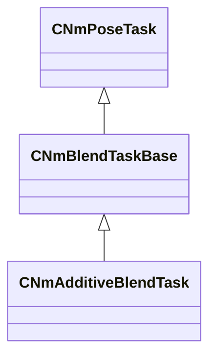

[Schemas](../../schemas.md) / [animlib](../animlib.md) / CNmAdditiveBlendTask

# CNmAdditiveBlendTask

**Kind:** class · **Size:** 256 bytes (`0x100`) · **Align:** 16 · **Module:** animlib

**Inherits from:** [CNmBlendTaskBase](../animlib/CNmBlendTaskBase.md)

**Relationships:**

