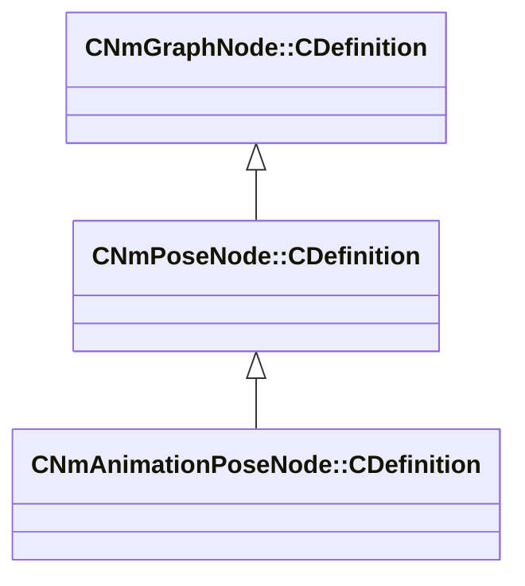

[Schemas](../../schemas.md) / [animlib](../animlib.md) / CNmAnimationPoseNode::CDefinition

# CNmAnimationPoseNode::CDefinition

> Source: **Build 25000182** · 2026-08-28 · `windows-x86_64` · schema `0.10.0`

**Kind:** class · **Size:** 40 bytes (`0x28`) · **Align:** 8 · **Module:** animlib

**Inherits from:** [CNmPoseNode::CDefinition](../animlib/CNmPoseNode.CDefinition.md)

**Relationships:**

## Memory layout

6 fields (5 declared here, 1 inherited). Offsets are absolute from the object base.

| Offset | Field | Type | From | Annotations |
|--------|-------|------|------|-------------|
| `0x8` | `m_nNodeIdx` | int16 | [CNmGraphNode::CDefinition](../animlib/CNmGraphNode.CDefinition.md) |  |
| `0x10` | `m_nPoseTimeValueNodeIdx` | int16 |  |  |
| `0x12` | `m_nDataSlotIdx` | int16 |  |  |
| `0x14` | `m_inputTimeRemapRange` | Range_t |  |  |
| `0x1c` | `m_flUserSpecifiedTime` | float32 |  |  |
| `0x20` | `m_bUseFramesAsInput` | bool |  |  |

KV3 class defaults

<pre>{
	&quot;_class&quot;: &quot;CNmAnimationPoseNode::CDefinition&quot;,
	&quot;m_nNodeIdx&quot;: -1,
	&quot;m_nPoseTimeValueNodeIdx&quot;: -1,
	&quot;m_nDataSlotIdx&quot;: -1,
	&quot;m_inputTimeRemapRange&quot;:
	{
		&quot;m_flMin&quot;: 0.000000,
		&quot;m_flMax&quot;: 1.000000
	},
	&quot;m_flUserSpecifiedTime&quot;: 0.000000,
	&quot;m_bUseFramesAsInput&quot;: false
}</pre>

