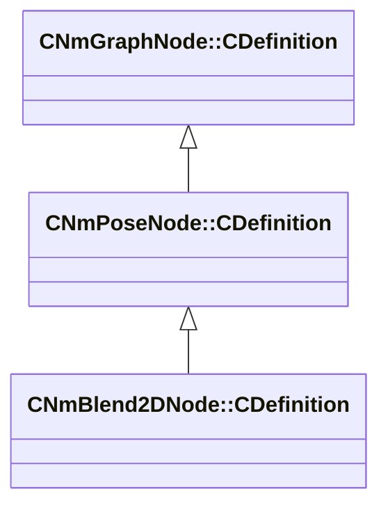

[Schemas](../../schemas.md) / [animlib](../animlib.md) / CNmBlend2DNode::CDefinition

# CNmBlend2DNode::CDefinition

> Source: **Build 25000182** · 2026-08-28 · `windows-x86_64` · schema `0.10.0`

**Kind:** class · **Size:** 200 bytes (`0xc8`) · **Align:** 8 · **Module:** animlib

**Inherits from:** [CNmPoseNode::CDefinition](../animlib/CNmPoseNode.CDefinition.md)

**Relationships:**

## Memory layout

8 fields (7 declared here, 1 inherited). Offsets are absolute from the object base.

| Offset | Field | Type | From | Annotations |
|--------|-------|------|------|-------------|
| `0x8` | `m_nNodeIdx` | int16 | [CNmGraphNode::CDefinition](../animlib/CNmGraphNode.CDefinition.md) |  |
| `0x10` | `m_sourceNodeIndices` | CUtlLeanVectorFixedGrowable< int16, 5 > |  |  |
| `0x28` | `m_values` | CUtlLeanVectorFixedGrowable< Vector2D, 10 > |  |  |
| `0x80` | `m_indices` | CUtlLeanVectorFixedGrowable< uint8, 30 > |  |  |
| `0xa8` | `m_hullIndices` | CUtlLeanVectorFixedGrowable< uint8, 10 > |  |  |
| `0xc0` | `m_nInputParameterNodeIdx0` | int16 |  |  |
| `0xc2` | `m_nInputParameterNodeIdx1` | int16 |  |  |
| `0xc4` | `m_bAllowLooping` | bool |  |  |

KV3 class defaults

<pre>{
	&quot;_class&quot;: &quot;CNmBlend2DNode::CDefinition&quot;,
	&quot;m_nNodeIdx&quot;: -1,
	&quot;m_sourceNodeIndices&quot;:
	[
	],
	&quot;m_values&quot;:
	[
	],
	&quot;m_indices&quot;:
	[
	],
	&quot;m_hullIndices&quot;:
	[
	],
	&quot;m_nInputParameterNodeIdx0&quot;: -1,
	&quot;m_nInputParameterNodeIdx1&quot;: -1,
	&quot;m_bAllowLooping&quot;: true
}</pre>

