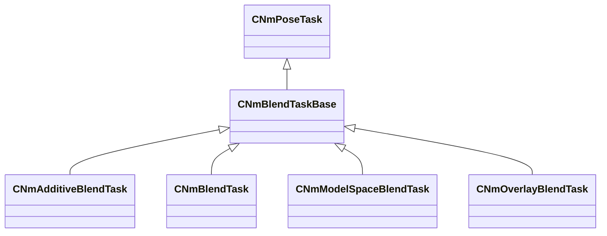

[Schemas](../../schemas.md) / [animlib](../animlib.md) / CNmBlendTaskBase

# CNmBlendTaskBase

**Kind:** class · **Size:** 256 bytes (`0x100`) · **Align:** 255 · **Module:** animlib

**Inherits from:** [CNmPoseTask](../animlib/CNmPoseTask.md)

**Derived by:** [CNmAdditiveBlendTask](../animlib/CNmAdditiveBlendTask.md), [CNmBlendTask](../animlib/CNmBlendTask.md), [CNmModelSpaceBlendTask](../animlib/CNmModelSpaceBlendTask.md), [CNmOverlayBlendTask](../animlib/CNmOverlayBlendTask.md)

**Relationships:**

