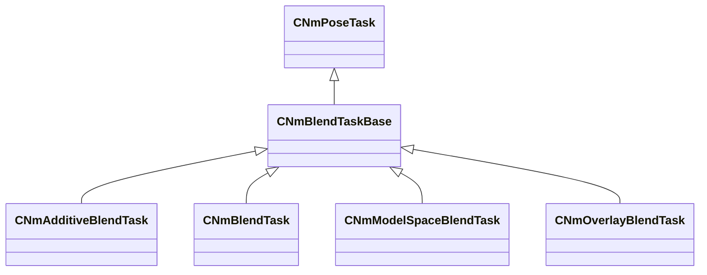

[Schemas](../../schemas.md) / [animlib](../animlib.md) / CNmBlendTaskBase

# CNmBlendTaskBase

> Source: **Build 25000182** · 2026-08-28 · `windows-x86_64` · schema `0.10.0`

**Kind:** class · **Size:** 256 bytes (`0x100`) · **Align:** n/a (unspecified) · **Module:** animlib

**Inherits from:** [CNmPoseTask](../animlib/CNmPoseTask.md)

**Derived by:** [CNmAdditiveBlendTask](../animlib/CNmAdditiveBlendTask.md), [CNmBlendTask](../animlib/CNmBlendTask.md), [CNmModelSpaceBlendTask](../animlib/CNmModelSpaceBlendTask.md), [CNmOverlayBlendTask](../animlib/CNmOverlayBlendTask.md)

**Relationships:**

## Memory layout

No schema-visible fields (256 bytes of opaque storage).
