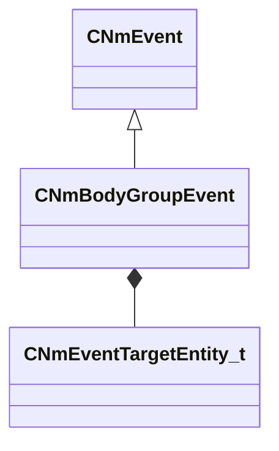

[Schemas](../../schemas.md) / [animlib](../animlib.md) / CNmBodyGroupEvent

# CNmBodyGroupEvent

> Source: **Build 25000182** · 2026-08-28 · `windows-x86_64` · schema `0.10.0`

**Kind:** class · **Size:** 48 bytes (`0x30`) · **Align:** 8 · **Module:** animlib

**Inherits from:** [CNmEvent](../animlib/CNmEvent.md)

**Relationships:**

## Memory layout

6 fields (3 declared here, 3 inherited). Offsets are absolute from the object base.

| Offset | Field | Type | From | Annotations |
|--------|-------|------|------|-------------|
| `0x8` | `m_flStartTime` | [NmPercent_t](../animlib/NmPercent_t.md) | [CNmEvent](../animlib/CNmEvent.md) |  |
| `0xc` | `m_flDuration` | [NmPercent_t](../animlib/NmPercent_t.md) | [CNmEvent](../animlib/CNmEvent.md) |  |
| `0x10` | `m_syncID` | CGlobalSymbol | [CNmEvent](../animlib/CNmEvent.md) |  |
| `0x18` | `m_target` | [CNmEventTargetEntity_t](../animlib/CNmEventTargetEntity_t.md) |  |  |
| `0x20` | `m_groupName` | CUtlString |  |  |
| `0x28` | `m_nGroupValue` | int32 |  |  |

KV3 class defaults

<pre>{
	&quot;_class&quot;: &quot;CNmBodyGroupEvent&quot;,
	&quot;m_flStartTime&quot;:
	{
		&quot;m_flValue&quot;: 0.000000
	},
	&quot;m_flDuration&quot;:
	{
		&quot;m_flValue&quot;: 0.000000
	},
	&quot;m_syncID&quot;: &quot;&quot;,
	&quot;m_target&quot;: &quot;Self&quot;,
	&quot;m_groupName&quot;: &quot;&quot;,
	&quot;m_nGroupValue&quot;: 0
}</pre>

