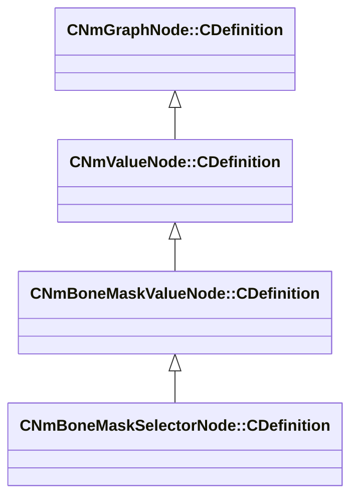

[Schemas](../../schemas.md) / [animlib](../animlib.md) / CNmBoneMaskSelectorNode::CDefinition

# CNmBoneMaskSelectorNode::CDefinition

> Source: **Build 25000182** · 2026-08-28 · `windows-x86_64` · schema `0.10.0`

**Kind:** class · **Size:** 120 bytes (`0x78`) · **Align:** 8 · **Module:** animlib

**Inherits from:** [CNmBoneMaskValueNode::CDefinition](../animlib/CNmBoneMaskValueNode.CDefinition.md)

**Relationships:**

## Memory layout

7 fields (6 declared here, 1 inherited). Offsets are absolute from the object base.

| Offset | Field | Type | From | Annotations |
|--------|-------|------|------|-------------|
| `0x8` | `m_nNodeIdx` | int16 | [CNmGraphNode::CDefinition](../animlib/CNmGraphNode.CDefinition.md) |  |
| `0x10` | `m_defaultMaskNodeIdx` | int16 |  |  |
| `0x12` | `m_parameterValueNodeIdx` | int16 |  |  |
| `0x14` | `m_bSwitchDynamically` | bool |  |  |
| `0x18` | `m_maskNodeIndices` | CUtlLeanVectorFixedGrowable< int16, 8 > |  |  |
| `0x30` | `m_parameterValues` | CUtlLeanVectorFixedGrowable< CGlobalSymbol, 7 > |  |  |
| `0x70` | `m_flBlendTimeSeconds` | float32 |  |  |

KV3 class defaults

<pre>{
	&quot;_class&quot;: &quot;CNmBoneMaskSelectorNode::CDefinition&quot;,
	&quot;m_nNodeIdx&quot;: -1,
	&quot;m_defaultMaskNodeIdx&quot;: -1,
	&quot;m_parameterValueNodeIdx&quot;: -1,
	&quot;m_bSwitchDynamically&quot;: false,
	&quot;m_maskNodeIndices&quot;:
	[
	],
	&quot;m_parameterValues&quot;:
	[
	],
	&quot;m_flBlendTimeSeconds&quot;: 0.100000
}</pre>

