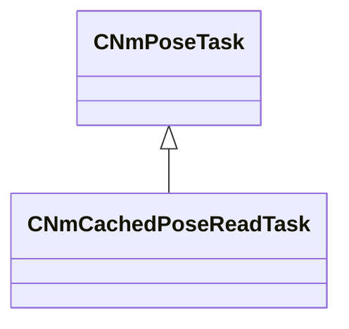

[Schemas](../../schemas.md) / [animlib](../animlib.md) / CNmCachedPoseReadTask

# CNmCachedPoseReadTask

**Kind:** class · **Size:** 128 bytes (`0x80`) · **Align:** 16 · **Module:** animlib

**Inherits from:** [CNmPoseTask](../animlib/CNmPoseTask.md)

**Relationships:**

