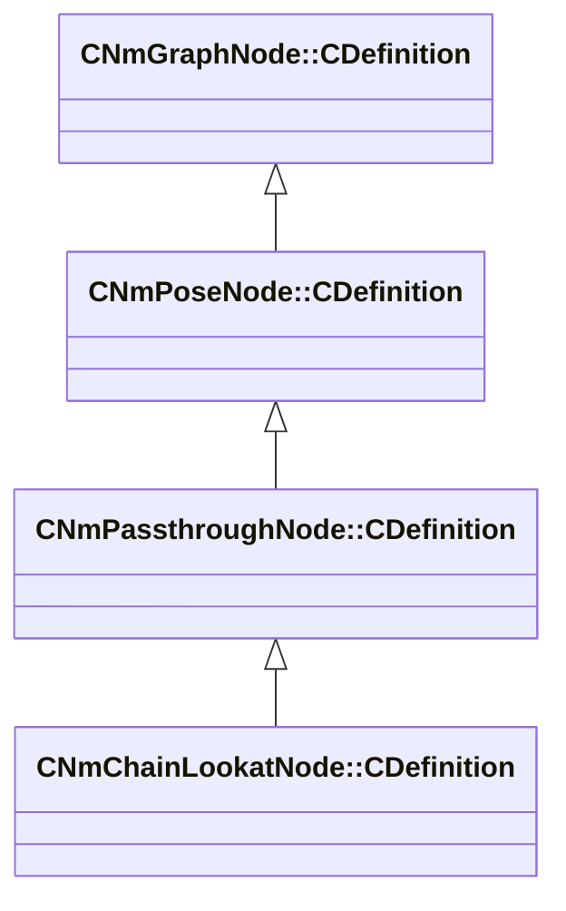

[Schemas](../../schemas.md) / [animlib](../animlib.md) / CNmChainLookatNode::CDefinition

# CNmChainLookatNode::CDefinition

> Source: **Build 25000182** · 2026-08-28 · `windows-x86_64` · schema `0.10.0`

**Kind:** class · **Size:** 120 bytes (`0x78`) · **Align:** 8 · **Module:** animlib

**Inherits from:** [CNmPassthroughNode::CDefinition](../animlib/CNmPassthroughNode.CDefinition.md)

**Relationships:**

## Memory layout

11 fields (9 declared here, 2 inherited). Offsets are absolute from the object base.

| Offset | Field | Type | From | Annotations |
|--------|-------|------|------|-------------|
| `0x8` | `m_nNodeIdx` | int16 | [CNmGraphNode::CDefinition](../animlib/CNmGraphNode.CDefinition.md) |  |
| `0x10` | `m_nChildNodeIdx` | int16 | [CNmPassthroughNode::CDefinition](../animlib/CNmPassthroughNode.CDefinition.md) |  |
| `0x18` | `m_endEffectorBoneID` | CGlobalSymbol |  |  |
| `0x20` | `m_endEffectorForwardAxis` | Vector |  |  |
| `0x2c` | `m_endEffectorOffset` | Vector |  |  |
| `0x38` | `m_nLookatTargetNodeIdx` | int16 |  |  |
| `0x3a` | `m_nEnabledNodeIdx` | int16 |  |  |
| `0x3c` | `m_flBlendTimeSeconds` | float32 |  |  |
| `0x40` | `m_chainWeights` | CUtlVectorFixedGrowable< float32, 5 > |  |  |
| `0x70` | `m_nChainLength` | uint8 |  |  |
| `0x71` | `m_bIsTargetInWorldSpace` | bool |  |  |

KV3 class defaults

<pre>{
	&quot;_class&quot;: &quot;CNmChainLookatNode::CDefinition&quot;,
	&quot;m_nNodeIdx&quot;: -1,
	&quot;m_nChildNodeIdx&quot;: -1,
	&quot;m_endEffectorBoneID&quot;: &quot;&quot;,
	&quot;m_endEffectorForwardAxis&quot;:
	[
		1.000000,
		0.000000,
		0.000000
	],
	&quot;m_endEffectorOffset&quot;:
	[
		1.000000,
		0.000000,
		0.000000
	],
	&quot;m_nLookatTargetNodeIdx&quot;: -1,
	&quot;m_nEnabledNodeIdx&quot;: -1,
	&quot;m_flBlendTimeSeconds&quot;: 0.000000,
	&quot;m_chainWeights&quot;:
	[
	],
	&quot;m_nChainLength&quot;: 2,
	&quot;m_bIsTargetInWorldSpace&quot;: false
}</pre>

