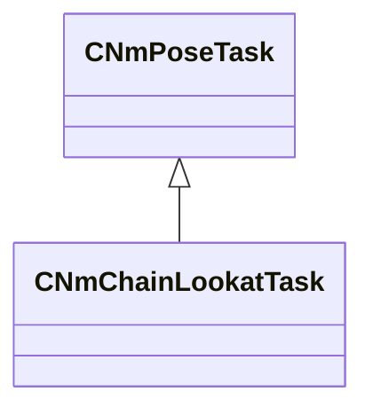

[Schemas](../../schemas.md) / [animlib](../animlib.md) / CNmChainLookatTask

# CNmChainLookatTask

**Kind:** class · **Size:** 288 bytes (`0x120`) · **Align:** 16 · **Module:** animlib

**Inherits from:** [CNmPoseTask](../animlib/CNmPoseTask.md)

**Relationships:**

