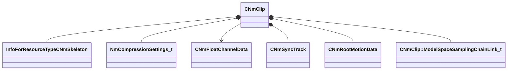

[Schemas](../../schemas.md) / [animlib](../animlib.md) / CNmClip

# CNmClip

> Source: **Build 25000182** · 2026-08-28 · `windows-x86_64` · schema `0.10.0`

**Kind:** class · **Size:** 512 bytes (`0x200`) · **Align:** 16 · **Module:** animlib

**Relationships:**

## Memory layout

13 fields (13 declared here, 0 inherited). Offsets are absolute from the object base.

| Offset | Field | Type | From | Annotations |
|--------|-------|------|------|-------------|
| `0x0` | `m_skeleton` | CStrongHandle< [InfoForResourceTypeCNmSkeleton](../resourcesystem/InfoForResourceTypeCNmSkeleton.md) > |  |  |
| `0x8` | `m_nNumFrames` | uint32 |  |  |
| `0xc` | `m_flDuration` | float32 |  |  |
| `0x10` | `m_compressedPoseData` | CUtlBinaryBlock |  |  |
| `0x20` | `m_trackCompressionSettings` | CUtlVector< [NmCompressionSettings_t](../animlib/NmCompressionSettings_t.md) > |  |  |
| `0x38` | `m_compressedPoseOffsets` | CUtlVector< uint32 > |  |  |
| `0x78` | `m_secondaryAnimations` | CUtlVectorFixedGrowable< [CNmClip](../animlib/CNmClip.md)*, 1 > |  |  |
| `0x98` | `m_floatChannelData` | CUtlVectorFixedGrowable< [CNmFloatChannelData](../animlib/CNmFloatChannelData.md)*, 2 > |  |  |
| `0xc0` | `m_syncTrack` | [CNmSyncTrack](../animlib/CNmSyncTrack.md) |  |  |
| `0x170` | `m_rootMotion` | [CNmRootMotionData](../animlib/CNmRootMotionData.md) |  |  |
| `0x1c0` | `m_bIsAdditive` | bool |  |  |
| `0x1c8` | `m_modelSpaceSamplingChain` | CUtlVector< [CNmClip::ModelSpaceSamplingChainLink_t](../animlib/CNmClip.ModelSpaceSamplingChainLink_t.md) > |  |  |
| `0x1e0` | `m_modelSpaceBoneSamplingIndices` | CUtlVector< int32 > |  |  |

KV3 class defaults

<pre>{
	&quot;m_skeleton&quot;: &quot;&quot;,
	&quot;m_nNumFrames&quot;: 0,
	&quot;m_flDuration&quot;: 0.000000,
	&quot;m_compressedPoseData&quot;: &quot;[BINARY BLOB]&quot;,
	&quot;m_trackCompressionSettings&quot;:
	[
	],
	&quot;m_compressedPoseOffsets&quot;:
	[
	],
	&quot;m_secondaryAnimations&quot;:
	[
	],
	&quot;m_floatChannelData&quot;:
	[
	],
	&quot;m_syncTrack&quot;:
	{
		&quot;m_syncEvents&quot;:
		[
			{
				&quot;m_ID&quot;: &lt;HIDDEN FOR DIFF&gt;,
				&quot;m_startTime&quot;:
				{
					&quot;m_flValue&quot;: 0.000000
				},
				&quot;m_duration&quot;:
				{
					&quot;m_flValue&quot;: 1.000000
				}
			}
		],
		&quot;m_nStartEventOffset&quot;: 0
	},
	&quot;m_rootMotion&quot;:
	{
		&quot;m_transforms&quot;:
		[
		],
		&quot;m_nNumFrames&quot;: 0,
		&quot;m_flAverageLinearVelocity&quot;: 0.000000,
		&quot;m_flAverageAngularVelocityRadians&quot;: 0.000000,
		&quot;m_totalDelta&quot;:
		[
			0.000000,
			0.000000,
			0.000000,
			0.000000,
			0.000000,
			0.000000,
			0.000000,
			0.000000
		]
	},
	&quot;m_bIsAdditive&quot;: false,
	&quot;m_modelSpaceSamplingChain&quot;:
	[
	],
	&quot;m_modelSpaceBoneSamplingIndices&quot;:
	[
	],
	&quot;m_events&quot;:
	[
	]
}</pre>

