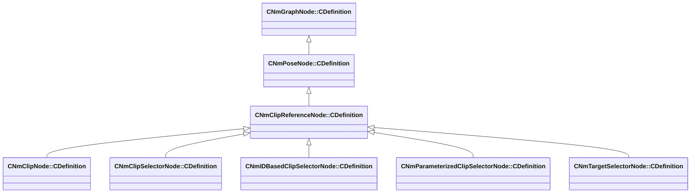

[Schemas](../../schemas.md) / [animlib](../animlib.md) / CNmClipReferenceNode::CDefinition

# CNmClipReferenceNode::CDefinition

> Source: **Build 25000182** · 2026-08-28 · `windows-x86_64` · schema `0.10.0`

**Kind:** class · **Size:** 16 bytes (`0x10`) · **Align:** n/a (unspecified) · **Module:** animlib

**Inherits from:** [CNmPoseNode::CDefinition](../animlib/CNmPoseNode.CDefinition.md)

**Derived by:** [CNmClipNode::CDefinition](../animlib/CNmClipNode.CDefinition.md), [CNmClipSelectorNode::CDefinition](../animlib/CNmClipSelectorNode.CDefinition.md), [CNmIDBasedClipSelectorNode::CDefinition](../animlib/CNmIDBasedClipSelectorNode.CDefinition.md), [CNmParameterizedClipSelectorNode::CDefinition](../animlib/CNmParameterizedClipSelectorNode.CDefinition.md), [CNmTargetSelectorNode::CDefinition](../animlib/CNmTargetSelectorNode.CDefinition.md)

**Relationships:**

## Memory layout

1 field (0 declared here, 1 inherited). Offsets are absolute from the object base.

| Offset | Field | Type | From | Annotations |
|--------|-------|------|------|-------------|
| `0x8` | `m_nNodeIdx` | int16 | [CNmGraphNode::CDefinition](../animlib/CNmGraphNode.CDefinition.md) |  |
