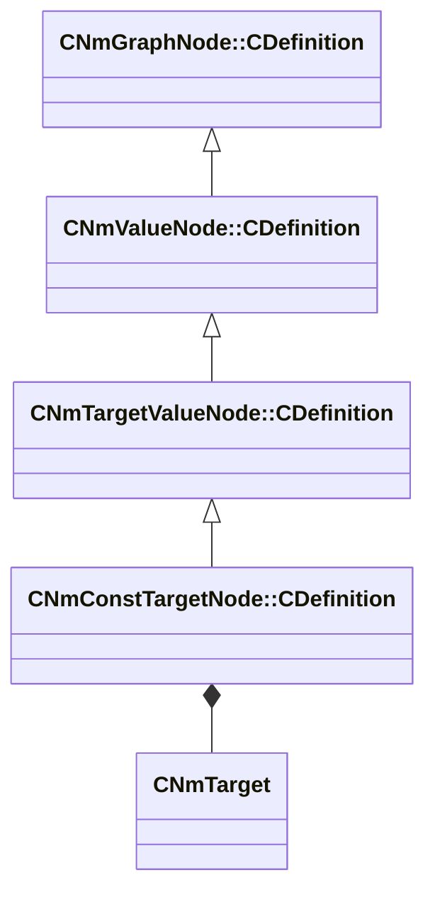

[Schemas](../../schemas.md) / [animlib](../animlib.md) / CNmConstTargetNode::CDefinition

# CNmConstTargetNode::CDefinition

> Source: **Build 25000182** · 2026-08-28 · `windows-x86_64` · schema `0.10.0`

**Kind:** class · **Size:** 64 bytes (`0x40`) · **Align:** 16 · **Module:** animlib

**Inherits from:** [CNmTargetValueNode::CDefinition](../animlib/CNmTargetValueNode.CDefinition.md)

**Relationships:**

## Memory layout

2 fields (1 declared here, 1 inherited). Offsets are absolute from the object base.

| Offset | Field | Type | From | Annotations |
|--------|-------|------|------|-------------|
| `0x8` | `m_nNodeIdx` | int16 | [CNmGraphNode::CDefinition](../animlib/CNmGraphNode.CDefinition.md) |  |
| `0x10` | `m_value` | [CNmTarget](../animlib/CNmTarget.md) |  |  |

KV3 class defaults

<pre>{
	&quot;_class&quot;: &quot;CNmConstTargetNode::CDefinition&quot;,
	&quot;m_nNodeIdx&quot;: -1,
	&quot;m_value&quot;:
	{
		&quot;m_transform&quot;:
		[
			0.000000,
			0.000000,
			0.000000,
			1.000000,
			0.000000,
			0.000000,
			0.000000,
			1.000000
		],
		&quot;m_boneID&quot;: &quot;&quot;,
		&quot;m_bIsBoneTarget&quot;: false,
		&quot;m_bIsUsingBoneSpaceOffsets&quot;: true,
		&quot;m_bHasOffsets&quot;: false,
		&quot;m_bIsSet&quot;: false
	}
}</pre>

