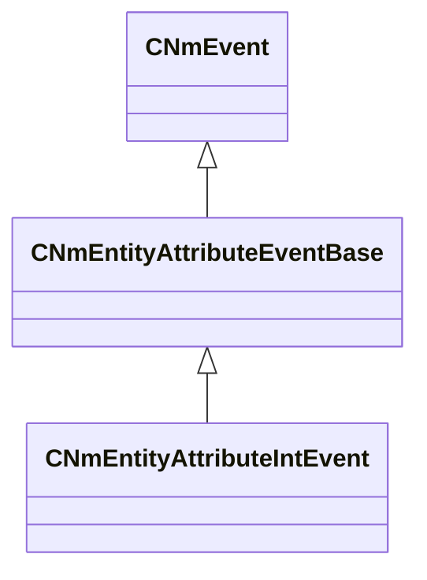

[Schemas](../../schemas.md) / [animlib](../animlib.md) / CNmEntityAttributeIntEvent

# CNmEntityAttributeIntEvent

**Kind:** class · **Size:** 64 bytes (`0x40`) · **Align:** 8 · **Module:** animlib

**Inherits from:** [CNmEntityAttributeEventBase](../animlib/CNmEntityAttributeEventBase.md)

**Relationships:**

## Memory layout

6 fields (1 declared here, 5 inherited). Offsets are absolute from the object base.

| Offset | Field | Type | From | Annotations |
|--------|-------|------|------|-------------|
| `0x8` | `m_flStartTime` | [NmPercent_t](../animlib/NmPercent_t.md) | [CNmEvent](../animlib/CNmEvent.md) |  |
| `0xc` | `m_flDuration` | [NmPercent_t](../animlib/NmPercent_t.md) | [CNmEvent](../animlib/CNmEvent.md) |  |
| `0x10` | `m_syncID` | CGlobalSymbol | [CNmEvent](../animlib/CNmEvent.md) |  |
| `0x18` | `m_target` | [CNmEventTargetEntity_t](../animlib/CNmEventTargetEntity_t.md) | [CNmEntityAttributeEventBase](../animlib/CNmEntityAttributeEventBase.md) |  |
| `0x20` | `m_attributeName` | CUtlString | [CNmEntityAttributeEventBase](../animlib/CNmEntityAttributeEventBase.md) |  |
| `0x38` | `m_nIntValue` | int32 |  |  |

KV3 class defaults

<pre>{
	&quot;_class&quot;: &quot;CNmEntityAttributeIntEvent&quot;,
	&quot;m_flStartTime&quot;:
	{
		&quot;m_flValue&quot;: 0.000000
	},
	&quot;m_flDuration&quot;:
	{
		&quot;m_flValue&quot;: 0.000000
	},
	&quot;m_syncID&quot;: &quot;&quot;,
	&quot;m_target&quot;: &quot;Self&quot;,
	&quot;m_attributeName&quot;: &quot;&quot;,
	&quot;m_nIntValue&quot;: 0
}</pre>

