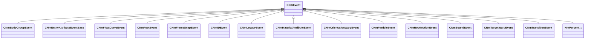

[Schemas](../../schemas.md) / [animlib](../animlib.md) / CNmEvent

# CNmEvent

> Source: **Build 25000182** · 2026-08-28 · `windows-x86_64` · schema `0.10.0`

**Kind:** class · **Size:** 24 bytes (`0x18`) · **Align:** n/a (unspecified) · **Module:** animlib

**Derived by:** [CNmBodyGroupEvent](../animlib/CNmBodyGroupEvent.md), [CNmEntityAttributeEventBase](../animlib/CNmEntityAttributeEventBase.md), [CNmFloatCurveEvent](../animlib/CNmFloatCurveEvent.md), [CNmFootEvent](../animlib/CNmFootEvent.md), [CNmFrameSnapEvent](../animlib/CNmFrameSnapEvent.md), [CNmIDEvent](../animlib/CNmIDEvent.md), [CNmLegacyEvent](../animlib/CNmLegacyEvent.md), [CNmMaterialAttributeEvent](../animlib/CNmMaterialAttributeEvent.md), [CNmOrientationWarpEvent](../animlib/CNmOrientationWarpEvent.md), [CNmParticleEvent](../animlib/CNmParticleEvent.md), [CNmRootMotionEvent](../animlib/CNmRootMotionEvent.md), [CNmSoundEvent](../animlib/CNmSoundEvent.md), [CNmTargetWarpEvent](../animlib/CNmTargetWarpEvent.md), [CNmTransitionEvent](../animlib/CNmTransitionEvent.md)

**Relationships:**

## Memory layout

3 fields (3 declared here, 0 inherited). Offsets are absolute from the object base.

| Offset | Field | Type | From | Annotations |
|--------|-------|------|------|-------------|
| `0x8` | `m_flStartTime` | [NmPercent_t](../animlib/NmPercent_t.md) |  |  |
| `0xc` | `m_flDuration` | [NmPercent_t](../animlib/NmPercent_t.md) |  |  |
| `0x10` | `m_syncID` | CGlobalSymbol |  |  |
